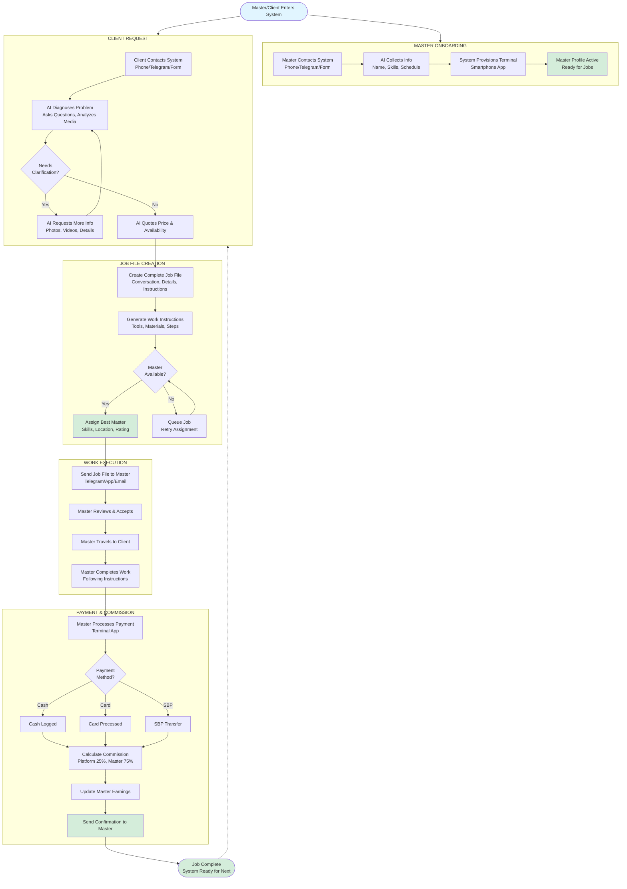

# Autonomous AI Service System - MVP Specification

## System Vision

Fully autonomous AI-powered service marketplace that operates WITHOUT any human operators. The entire business process - from master onboarding to client request handling, job execution, and payment processing - runs autonomously through artificial intelligence.

## Core Principle: Zero Human Operators

No call centers, no dispatchers, no manual processing. AI handles ALL communications, decisions, and operations. The system generates passive income by automating the complete service delivery workflow.

## Business Model

- Platform commission: 25% per completed job
- Master earnings: 75% of payment (after platform commission)
- Revenue: Automated passive income from transaction commissions

## Existing Foundation

**Current System Components**:
- Backend: FastAPI + SQLite (main.py, 2449 lines)
- Telegram bots: Client bot + Master bot
- Web interfaces: Client form, admin panel, master dashboard
- AI assistant: Conversation handling (ai_assistant.py)
- Price calculator: Automatic pricing (price_calculator.py)
- Integrations: Google Calendar, Google Tasks

**Deployment**:
- Production: https://app.balt-set.ru
- Auto-deploy: GitHub → Timeweb (2-3 minutes)
- Repository: https://github.com/Heallshoking/balt-set.ru

## Part 1: Master Onboarding - How Masters Join the System

### Multi-Channel Master Registration

A person wanting to work as a master (electrician, plumber, technician) can contact the system through ANY convenient method:

**Entry Points**:
- Phone call (AI voice assistant answers)
- Telegram message
- Website registration form
- Job site forms (HH.ru, Google Forms)
- Social media (VK, Instagram, Facebook)
- Avito listing contact

### AI-Driven Information Collection

The AI system conducts intelligent conversation to collect:

**Personal Information**:
- Full name
- Phone number
- Email (optional)
- City of operation

**Professional Details**:
- Specializations (electrical, plumbing, appliances, general handyman)
- Years of experience
- Certifications (if applicable)

**Availability Schedule**:

Master provides initial availability:
- "Tomorrow 8 AM - 8 PM"
- "This week Monday-Friday 9-6"
- "Weekends only"

**Continuous Schedule Management**:

System maintains real-time availability:
- Daily confirmation: "Working 8 AM - 8 PM today?"
- Master updates anytime: "Today 10 AM - 6 PM instead"
- System tracks availability for job assignment

### Payment Terminal Provisioning

**Option A - Smartphone Terminal** (Primary Method):
- System sends installation link to master's phone
- Master downloads terminal app or web access
- Terminal integrated into smartphone (like Yandex.Eats delivery app)
- Can accept card payments, cash logging, SBP transfers

**Option B - Physical Terminal** (Alternative):
- System provides pickup location (automated locker)
- Master retrieves physical payment device
- Activated and linked to master profile

### Master Profile Activation

Once onboarding complete, system has:
- Master profile with capabilities
- Real-time availability schedule
- Active payment terminal
- Ready to receive job assignments

## Part 2: Client Request Processing - How Clients Get Service

### Client Discovery and Contact

**How Clients Find the System**:
- Avito service listings
- Social media pages (Instagram, VK, Facebook)
- Website (app.balt-set.ru)
- Google search results
- Word of mouth recommendations

**Client Contact Methods**:

**Method 1 - Phone Call**:
- Client calls system phone number
- AI voice assistant answers immediately
- Natural language conversation about problem
- Voice-to-text recording for job file

**Method 2 - Messenger (Telegram, WhatsApp, Viber)**:
- Client writes: "Hello, I need an electrician"
- AI chatbot responds within seconds
- Text conversation with problem discussion
- Can request and analyze photos/videos

**Method 3 - Website Form**:
- Client fills Google Form on website
- Provides: problem description, address, contact info, preferred time
- Submits to system
- AI may follow up with questions if needed

### Intelligent AI Consultation Process

**Problem Diagnosis Through Conversation**:

The AI system actively engages to understand:

**Core Questions**:
- What is the problem? (client describes in own words)
- Where are you located? (full address)
- When do you need it done? (urgency)
- Can you show photos/videos? (visual documentation)

**AI Analysis Capabilities**:
- Analyzes text descriptions to identify actual technical issue
- Watches videos and examines photos to assess situation
- Categorizes work type (electrical, plumbing, appliance, etc.)
- Determines complexity and urgency level
- Identifies required tools and materials

**Clarification Process**:

If system needs more information:
- Asks follow-up questions during phone call
- Requests photos: "Can you send a photo of the outlet?"
- Sends message to form-provided number: "We received your form, have a few questions..."
- Continues dialogue until problem fully understood

**Price Quotation and Availability**:

System provides:
- Estimated cost: "Approximately 3000₽ for this repair"
- Timeline: "Work will take about 1-2 hours"
- Availability confirmation

**Availability Responses**:
- "Yes, we can send a master tomorrow at 2 PM"
- "All electricians busy today, earliest is Thursday 10 AM. Does that work?"
- "We can do today evening at 6 PM or tomorrow morning at 9 AM"

## Part 3: Job File Creation and Master Assignment

### Comprehensive Job File Generation

**After Client Conversation**, the AI system generates complete job package:

**Communication Record**:
- Full conversation transcript (Telegram, messenger, phone text)
- Audio recording of phone call (if applicable)
- Original Google Form + follow-up dialogue
- All photos and videos from client

**Client Information**:
- Client full name
- Client phone number
- Service address (complete with apartment/floor)
- Preferred service time

**Technical Problem Details**:
- AI-identified problem (diagnosis, not just symptoms)
- Work category (electrical/plumbing/appliance/general)
- Urgency classification (urgent/standard/flexible)
- Complexity assessment

**Financial Information**:
- Total price quoted to client
- Amount master will receive (after 25% commission)
- Payment method preferences

**Master Work Instructions**:

System generates detailed execution plan:

**Tools Required**:
- List of all tools needed (screwdriver, multimeter, pipe wrench, etc.)

**Consumable Materials**:
- Items that will be used up (wire, tape, sealant, etc.)

**Additional Parts**:
- Components to purchase or bring (outlet, switch, pipe fitting, etc.)

**Step-by-Step Instructions**:
- Complete procedure to solve the problem
- Safety precautions
- Testing/verification steps

This is a COMPLETE package - master has everything needed without any research.

### Real-Time Feasibility Check

**During Client Conversation**, system checks:
- Available masters with matching specialization
- Master schedules for requested time window
- Geographic coverage (same city)

**Immediate Client Response**:
- Can do: "Yes! Master available tomorrow 2 PM, cost 3000₽"
- Cannot do: "All electricians busy until Thursday. Thursday 10 AM works?"
- Partial: "Can't do morning, but available today evening at 6 PM"

### Automatic Master Assignment

**Selection Algorithm**:

System finds best master based on:
- Specialization match (electrical for electrical jobs)
- Geographic proximity (same city/district)
- Schedule availability (free at requested time)
- Master rating (higher rated preferred)
- Current workload (balance distribution)

**Job File Delivery**:

System sends complete package to assigned master via:
- Telegram message with file
- Terminal app push notification
- Email with PDF attachment
- SMS with download link

**Master Receives**:
- Complete job details
- Client contact info
- Work instructions and material lists
- Scheduled appointment time
- Navigation to address
- Earnings amount for this job

## Part 4: Work Execution and Payment Processing

### Master Performs the Work

**Master Journey**:
- Receives job file with complete details
- Reviews instructions and material list
- Travels to client address (has navigation)
- Knows exactly what to do and expected earnings

**Work Execution**:
- Follows AI-generated step-by-step instructions
- Uses provided tool list and materials guidance
- Completes repair or installation
- Client verifies work is satisfactory

### Payment Collection via Smartphone Terminal

**After Work Completion**:

Master uses terminal app:
- Opens terminal on smartphone
- Selects completed job
- Processes client payment

**Payment Methods Supported**:

**Cash**:
- Master inputs amount received
- Confirms cash collection
- System records transaction

**Card Payment**:
- Client taps or inserts card on phone terminal
- Payment processed through terminal
- Instant confirmation

**SBP (Faster Payment System)**:
- Client scans QR code from terminal
- Pays via their banking app
- Instant transfer confirmation

### Automatic Commission Calculation and Distribution

**Real-Time Financial Processing**:

System immediately upon payment:
- Receives payment confirmation from terminal
- Calculates commission split
- Records transaction in database
- Updates master earnings balance

**Commission Split Calculation**:

| Party | Amount (Example: 3000₽ job) | Calculation |
|-------|------------------------------|-------------|
| Client pays | 3000₽ | Total job cost |
| Payment processing fee | -60₽ (2%) | Payment gateway charge |
| Net amount | 2940₽ | After processing fee |
| Platform commission | -735₽ (25%) | Platform earnings |
| Master receives | 2205₽ (75%) | Master earnings (73.5% of total) |

**Instant Master Notification**:

System sends to master:
- "✅ Job completed successfully!"
- "💰 You earned 2205₽ for this job"
- "📊 Total earnings today: 8500₽"
- "💳 Payment will transfer to your account on Friday"

### End of Transaction Cycle

**Job Complete Status**:
- Client problem solved ✅
- Master paid for work ✅
- Platform earned commission ✅
- All data recorded in system ✅
- Master available for next assignment ✅

**System Ready for Next Job** - cycle repeats automatically.

## Part 5: Complete System Workflow Visualization

### End-to-End Process Flow



## MVP Implementation Requirements

### What Needs to Be Built

**Component 1: Enhanced AI Conversation System**

Expand existing ai_assistant.py to support:
- Multi-channel communication (voice, text, forms)
- Problem diagnosis with clarification questions
- Photo/video analysis capability
- Natural language understanding for master onboarding
- Schedule management dialogue

**Component 2: Comprehensive Job File Generator**

New module to create complete job packages:
- Conversation transcript compilation
- AI-generated work instructions
- Tool and material list generation
- Step-by-step procedure creation
- Multi-format export (PDF, Telegram message, app notification)

**Component 3: Smartphone Payment Terminal Integration**

Integrate payment processing:
- Terminal SDK integration (select provider: YooKassa, Tinkoff, Sberbank)
- Cash logging functionality
- Card payment processing
- SBP QR code generation
- Real-time payment confirmation

**Component 4: Master Assignment Algorithm Enhancement**

Improve existing find_available_master() function:
- Real-time schedule checking
- Multi-factor matching (skills + location + rating + availability)
- Queue management for unassigned jobs
- Retry logic with schedule updates

**Component 5: Automated Notification System**

Expand notification capabilities:
- Multi-channel delivery (Telegram, SMS, email)
- Template-based messages for each workflow stage
- Master job assignment notifications
- Client status update messages
- Payment confirmation notices

### New API Endpoints Required

**Master Onboarding**:
- `POST /api/v1/masters/onboard/start` - Initiate AI-driven onboarding conversation
- `PATCH /api/v1/masters/{id}/schedule` - Update master availability schedule
- `POST /api/v1/masters/{id}/terminal/provision` - Send terminal app link/instructions

**AI Conversation**:
- `POST /api/v1/ai/conversation/start` - Begin client conversation (any channel)
- `POST /api/v1/ai/conversation/{id}/message` - Continue conversation with AI
- `POST /api/v1/ai/conversation/{id}/media` - Upload photo/video for analysis
- `GET /api/v1/ai/conversation/{id}/transcript` - Retrieve full conversation history

**Job File Management**:
- `POST /api/v1/jobs/create-file` - Generate complete job package
- `GET /api/v1/jobs/{id}/instructions` - Retrieve work instructions
- `POST /api/v1/jobs/{id}/send-to-master` - Deliver job file to assigned master

**Payment Terminal**:
- `POST /api/v1/terminal/payment/initialize` - Start payment session
- `POST /api/v1/terminal/payment/cash` - Log cash payment
- `POST /api/v1/terminal/payment/card` - Process card payment
- `POST /api/v1/terminal/payment/sbp` - Generate SBP QR code
- `GET /api/v1/terminal/payment/{id}/status` - Check payment status

**Schedule Management**:
- `GET /api/v1/masters/{id}/schedule/today` - Check today's availability
- `POST /api/v1/masters/{id}/schedule/confirm` - Daily schedule confirmation
- `GET /api/v1/masters/available-now` - Get all currently available masters

### Technology Integration Points

**AI/ML Services** (Choose one or combine):
- OpenAI GPT-4 - Natural language understanding and generation
- Anthropic Claude - Conversation and analysis
- Yandex GPT - Russian language optimized
- Google Gemini - Multimodal (text, image, video) analysis

**Voice Integration** (For phone calls):
- Yandex SpeechKit - Russian voice recognition and synthesis
- Google Cloud Speech-to-Text + Text-to-Speech
- Custom Asterisk + DeepSpeech solution

**Payment Gateways** (For terminal):
- YooKassa - Best for Russian market, SBP support
- Tinkoff Acquiring - Good terminal SDK
- Sberbank - Wide acceptance
- CloudPayments - Easy integration

**Messaging Platforms**:
- Telegram Bot API - Primary channel (already implemented)
- WhatsApp Business API - Additional channel
- VK Bots - Social media integration

**Existing Integrations** (Keep and enhance):
- Google Calendar - Master schedule sync
- Google Tasks - Job tracking
- Google Forms - Web intake
- SQLite Database - Data persistence

## Key Decision Logic

### Master Assignment Algorithm

**Step 1: Extract Job Requirements**
- Service category (from AI diagnosis)
- Client city/address
- Requested time window

**Step 2: Query Available Masters**
```
FIND masters WHERE:
  - specializations CONTAINS job.category
  - city = job.city
  - is_active = TRUE
  - schedule_available_at(job.requested_time) = TRUE
```

**Step 3: Rank and Select**
```
SORT BY:
  1. Rating (DESC) - better rated masters first
  2. Distance (ASC) - closer masters first
  3. Current_workload (ASC) - less busy masters first
  
SELECT TOP 1
```

**Step 4: Assignment or Queue**
- If master found → Assign + Notify
- If no master → Queue job + Retry when schedule updates

### AI Pricing Decision Model

**Step 1: Problem Analysis**
- Parse problem description with AI
- Extract keywords: urgency, complexity, scope
- Identify required materials/parts

**Step 2: Base Price Calculation**
```
Base prices by category:
  Electrical: 1500₽
  Plumbing: 1800₽
  Appliance: 2000₽
  General: 1200₽
```

**Step 3: Apply Modifiers**
```
Urgency:
  "срочно"/"urgent" → × 1.3
  "сегодня"/"today" → × 1.2
  
Complexity:
  Long description (>200 chars) → × 1.2
  Multiple issues → × 1.5
  
Materials:
  Materials needed → + estimated_parts_cost
  
Time:
  Evening/weekend → × 1.1
```

**Step 4: Final Quote**
- Round to nearest 100₽
- Add range: "Approximately 2800-3200₽"
- Explain breakdown to client if asked

### Payment Processing Flow

**Master Terminal Interaction**:
```
1. Master completes work
2. Opens terminal app
3. Selects job from list
4. Taps "Collect Payment"
5. Enters final amount (if different from estimate)
6. Selects payment method
```

**Payment Method Processing**:

**Cash**:
```
- Master taps "Cash"
- Enters amount received
- Confirms "Payment Received"
- System logs transaction
```

**Card**:
```
- Master taps "Card"
- Client taps/inserts card on terminal
- Payment gateway processes
- Confirmation appears
```

**SBP**:
```
- Master taps "SBP"
- QR code appears on screen
- Client scans with banking app
- Transfer completes
- System receives webhook confirmation
```

**Automatic Commission Split**:
```
ON payment_confirmed:
  gateway_fee = amount × 0.02
  net = amount - gateway_fee
  platform_cut = net × 0.25
  master_cut = net × 0.75
  
  SAVE transaction(
    job_id,
    amount,
    gateway_fee,
    platform_cut,
    master_cut,
    payment_method
  )
  
  UPDATE masters SET total_earnings += master_cut
  UPDATE jobs SET status = 'completed'
  
  NOTIFY master: "You earned {master_cut}₽"
```

## MVP Development Priorities

### Phase 1: Core Autonomous Functions (Must Have)

**Priority 1.1 - AI Conversation System**:
- Enhance ai_assistant.py for multi-turn conversations
- Add problem diagnosis through question-answer flow
- Implement clarification request logic
- Support for both client and master onboarding dialogues

**Priority 1.2 - Job File Generation**:
- Create job_file_generator.py module
- AI generates work instructions from problem diagnosis
- Tool and material list creation
- Export job package in multiple formats

**Priority 1.3 - Payment Terminal Integration**:
- Select payment provider (recommend YooKassa for Russia)
- Integrate terminal SDK
- Build terminal UI in master dashboard
- Implement cash logging, card processing, SBP support

**Priority 1.4 - Enhanced Master Assignment**:
- Improve find_available_master() with schedule checking
- Add queue management for unassigned jobs
- Implement retry logic when masters become available
- Real-time availability tracking

**Priority 1.5 - Automated Notifications**:
- Template system for all workflow stages
- Multi-channel delivery (Telegram, SMS, email)
- Job assignment notifications to masters
- Status update messages to clients
- Payment confirmations

### Phase 2: Intelligence Enhancements (Should Have)

**Priority 2.1 - Visual Problem Analysis**:
- Integrate image/video analysis AI (Gemini multimodal)
- Process client photos/videos for better diagnosis
- Generate visual work instructions if needed

**Priority 2.2 - Voice Call Support**:
- Integrate Yandex SpeechKit or similar
- Voice-to-text for phone calls
- AI voice assistant for client conversations
- Call recording and transcription

**Priority 2.3 - Smart Scheduling**:
- Daily schedule confirmation automation
- Predictive availability based on patterns
- Optimal job distribution across masters
- Calendar conflict detection

**Priority 2.4 - Advanced Pricing**:
- Enhance price_calculator.py with AI
- Material cost estimation
- Time-based pricing (rush jobs)
- Geographic price adjustments

### Phase 3: Business Optimization (Nice to Have)

**Priority 3.1 - Performance Analytics**:
- Real-time dashboard metrics
- Master performance tracking
- Revenue analytics and forecasting
- Client satisfaction scoring

**Priority 3.2 - Fraud Detection**:
- Unusual activity pattern recognition
- Duplicate request detection
- Payment anomaly alerts
- Master behavior monitoring

**Priority 3.3 - Multi-City Expansion**:
- Geographic expansion framework
- City-specific pricing and availability
- Regional master pools
- Localized marketing integrations

## Database Schema Updates Needed

### Masters Table - Add Fields

```
ADD COLUMN schedule_json TEXT
  -- Stores daily availability as JSON
  -- Example: {"2025-12-13": {"start": "08:00", "end": "20:00", "available": true}}
  
ADD COLUMN terminal_type TEXT DEFAULT 'smartphone'
  -- Values: 'smartphone' or 'physical'
  
ADD COLUMN terminal_id TEXT
  -- Terminal device/app identifier
  
ADD COLUMN onboarding_conversation_id TEXT
  -- Link to initial AI conversation
  
ADD COLUMN last_schedule_confirmation TIMESTAMP
  -- When master last confirmed schedule
```

### Jobs Table - Add Fields

```
ADD COLUMN conversation_id TEXT
  -- Link to client AI conversation
  
ADD COLUMN ai_diagnosis TEXT
  -- AI-identified problem (technical diagnosis)
  
ADD COLUMN work_instructions_json TEXT
  -- Complete instructions, tools, materials as JSON
  
ADD COLUMN job_file_url TEXT
  -- Link to complete job package PDF/file
  
ADD COLUMN media_urls TEXT
  -- JSON array of client photo/video URLs
  
ADD COLUMN estimated_duration INTEGER
  -- Expected job duration in minutes
  
ADD COLUMN urgency_level TEXT DEFAULT 'standard'
  -- Values: 'urgent', 'standard', 'flexible'
```

### New Table: Conversations

```
CREATE TABLE conversations (
  id TEXT PRIMARY KEY,
  type TEXT NOT NULL,
    -- 'client_request' or 'master_onboarding'
  channel TEXT NOT NULL,
    -- 'phone', 'telegram', 'whatsapp', 'form'
  participant_name TEXT,
  participant_phone TEXT,
  messages_json TEXT,
    -- Array of messages with timestamps
  transcript TEXT,
    -- Full text transcript
  audio_url TEXT,
    -- Call recording URL if phone
  status TEXT DEFAULT 'active',
    -- 'active', 'completed', 'abandoned'
  created_at TIMESTAMP DEFAULT CURRENT_TIMESTAMP,
  completed_at TIMESTAMP
)
```

### New Table: Work Instructions

```
CREATE TABLE work_instructions (
  id INTEGER PRIMARY KEY AUTOINCREMENT,
  job_id INTEGER NOT NULL,
  problem_diagnosis TEXT NOT NULL,
  tools_required TEXT,
    -- JSON array of tools
  consumables_required TEXT,
    -- JSON array of consumable materials
  parts_required TEXT,
    -- JSON array of parts to purchase
  step_by_step TEXT,
    -- Detailed procedure
  safety_notes TEXT,
  estimated_time INTEGER,
    -- Minutes
  difficulty_level TEXT,
    -- 'easy', 'medium', 'hard'
  generated_at TIMESTAMP DEFAULT CURRENT_TIMESTAMP,
  FOREIGN KEY (job_id) REFERENCES jobs(id)
)
```

### Transactions Table - Add Fields

```
ADD COLUMN terminal_id TEXT
  -- Which terminal processed payment
  
ADD COLUMN payment_gateway_response TEXT
  -- JSON response from payment provider
  
ADD COLUMN commission_breakdown_json TEXT
  -- Detailed split calculation
```

## Files to Create or Modify

### New Files to Create

**1. /ai-service-platform/conversation_manager.py**
- Manages AI conversations for both clients and masters
- Multi-turn dialogue with context retention
- Problem diagnosis through Q&A
- Clarification request logic
- Conversation transcript generation

**2. /ai-service-platform/job_file_generator.py**
- Generates complete job packages
- AI creates work instructions from diagnosis
- Tool/material list generation
- PDF/document export
- Multi-channel delivery (Telegram, email, app)

**3. /ai-service-platform/schedule_manager.py**
- Master availability tracking
- Daily schedule confirmation automation
- Conflict detection
- Availability queries for assignment
- Calendar integration enhancement

**4. /ai-service-platform/payment_terminal.py**
- Payment terminal SDK wrapper
- Cash logging interface
- Card payment processing
- SBP QR generation and verification
- Commission calculation integration

**5. /ai-service-platform/notification_service.py**
- Multi-channel notification delivery
- Template management
- Event-triggered messaging
- Delivery status tracking
- Fallback channel logic

**6. /ai-service-platform/master_assignment_enhanced.py**
- Advanced master matching algorithm
- Schedule-aware assignment
- Queue management
- Retry logic
- Load balancing across masters

### Existing Files to Enhance

**1. /ai-service-platform/main.py**
- Add new API endpoints (conversation, job files, payment, schedule)
- Integrate new modules
- Enhanced error handling
- Webhook endpoints for payment gateway

**2. /ai-service-platform/ai_assistant.py**
- Expand conversation capabilities
- Add problem diagnosis logic
- Master onboarding dialogue
- Media analysis integration

**3. /ai-service-platform/price_calculator.py**
- AI-enhanced pricing
- Material cost estimation
- Urgency modifiers
- Time-based pricing

**4. /static/master-dashboard.html**
- Integrate terminal UI
- Job file display with instructions
- Payment processing interface
- Schedule management controls

**5. /static/admin.html**
- Real-time conversation monitoring
- Queue management interface
- Payment tracking dashboard
- Master schedule overview

**6. /telegram_master_bot.py**
- Job file delivery
- Schedule confirmation prompts
- Payment notifications
- Enhanced terminal integration

**7. /telegram_client_bot.py**
- Conversational problem diagnosis
- Photo/video upload handling
- Real-time status updates
- Payment confirmation messages

## External Service Configuration

### Required Service Accounts and API Keys

**AI/LLM Provider** (Choose one):
- OpenAI API key for GPT-4
- Anthropic API key for Claude
- Yandex Cloud API for YandexGPT
- Google Cloud API for Gemini

**Voice Services** (If implementing phone support):
- Yandex SpeechKit API credentials
- OR Google Cloud Speech API key
- Phone number with SIP/API access (Twilio, Zadarma, etc.)

**Payment Gateway** (Required for terminal):
- YooKassa account + API keys (recommended)
- OR Tinkoff Acquiring merchant ID + keys
- OR Sberbank acquiring credentials
- Test environment credentials for development

**Messaging** (Already configured):
- Telegram Bot Token (existing)
- WhatsApp Business API (optional)
- VK Bot token (optional)

**Storage** (For media files):
- Cloud storage for photos/videos (Yandex Object Storage, S3)
- OR use local storage with backup

**Maps/Geolocation** (Optional):
- Yandex Maps API for routing
- OR Google Maps API

### Environment Variables to Add

```
# AI Service
AI_PROVIDER=openai|anthropic|yandex|google
OPENAI_API_KEY=sk-...
ANTHROPIC_API_KEY=sk-ant-...
YANDEX_GPT_API_KEY=...
GOOGLE_AI_API_KEY=...

# Voice (if enabled)
YANDEX_SPEECHKIT_KEY=...
PHONE_SIP_ACCOUNT=...
PHONE_SIP_PASSWORD=...

# Payment Gateway
PAYMENT_PROVIDER=yookassa|tinkoff|sberbank
YOOKASSA_SHOP_ID=...
YOOKASSA_SECRET_KEY=...
PAYMENT_TEST_MODE=true|false

# Storage
STORAGE_PROVIDER=local|yandex|s3
STORAGE_BUCKET=...
STORAGE_ACCESS_KEY=...
STORAGE_SECRET_KEY=...

# Notifications
SMS_PROVIDER=none|smsru|twilio
SMS_API_KEY=...
EMAIL_SMTP_HOST=...
EMAIL_SMTP_USER=...
EMAIL_SMTP_PASSWORD=...
```

## Testing Strategy for MVP

### Testing Phases

**Phase 1: Component Testing**

Test each module independently:
- AI conversation flow (client and master scenarios)
- Job file generation (various problem types)
- Payment terminal (all payment methods)
- Master assignment algorithm (different availability scenarios)
- Notification delivery (all channels)

**Phase 2: Integration Testing**

Test complete workflows:
- Master onboarding end-to-end
- Client request to job assignment
- Job execution to payment
- Error scenarios and recovery

**Phase 3: User Acceptance Testing**

Test with real users:
- 2-3 test masters (actual electricians/plumbers)
- 5-10 test clients (simulated problems)
- Monitor conversations and outcomes
- Collect feedback and iterate

### Test Scenarios

**Master Onboarding Tests**:
1. Master calls phone number - AI onboards successfully
2. Master fills Telegram form - gets terminal link
3. Master submits Google Form - receives follow-up questions
4. Schedule confirmation - daily automation works

**Client Request Tests**:
1. Simple electrical problem - quick diagnosis and pricing
2. Complex issue - AI asks clarifying questions
3. Photo upload - AI analyzes and adjusts estimate
4. Urgent request - pricing multiplier applied

**Assignment Tests**:
1. Perfect match available - immediate assignment
2. Multiple masters available - best one selected
3. No master available - job queued, retry works
4. Master becomes available - queued job assigned

**Payment Tests**:
1. Cash payment - logged correctly, commission calculated
2. Card payment - terminal processes, confirmation sent
3. SBP payment - QR code works, webhook received
4. Payment failure - retry logic activates

### Success Metrics for MVP

**Functionality**:
- 90%+ of conversations complete without errors
- 85%+ of jobs assigned automatically
- 98%+ of payments process successfully
- 100% commission calculations accurate

**Performance**:
- AI response time < 3 seconds
- Master assignment < 30 seconds
- Payment processing < 10 seconds
- System uptime > 99%

**User Experience**:
- Master satisfaction > 4/5
- Client satisfaction > 4/5
- Less than 5% conversation abandonment
- Zero payment disputes

## MVP Deployment Plan

### Development Approach

Build MVP in iterations using existing infrastructure:

**Iteration 1: Conversations (Week 1)**
- Enhance ai_assistant.py for multi-turn dialogue
- Create conversation_manager.py
- Add conversation API endpoints
- Test with master onboarding and client requests

**Iteration 2: Job Files (Week 2)**
- Build job_file_generator.py
- AI instruction generation
- Tool/material list creation
- PDF export and delivery
- Test with sample problems

**Iteration 3: Payment Terminal (Week 3)**
- Select and integrate payment provider
- Build payment_terminal.py
- Add terminal UI to master dashboard
- Test all payment methods
- Commission calculation verification

**Iteration 4: Enhanced Assignment (Week 4)**
- Build schedule_manager.py
- Enhance master assignment logic
- Queue management implementation
- Retry automation
- Load balancing

**Iteration 5: Notifications (Week 5)**
- Build notification_service.py
- Template system
- Multi-channel delivery
- Event triggers
- Test all notification scenarios

**Iteration 6: Integration & Testing (Week 6)**
- Connect all components
- End-to-end workflow testing
- User acceptance testing
- Bug fixes and optimization
- Documentation

### Deployment to Production

**Preparation**:
1. Update database schema (migrations)
2. Configure environment variables
3. Set up payment gateway (test mode first)
4. Configure AI service credentials
5. Test on staging environment

**Deployment Process**:
1. Merge to `dev` branch
2. Test on https://app.balt-set.ru
3. Verify all functions work
4. Merge `dev` to `main`
5. Auto-deploy to production (2-3 minutes)
6. Run health checks
7. Monitor for 24 hours

**Rollback Plan**:
- Keep previous version for 7 days
- Instant rollback via Git revert
- Database backup before deployment
- Feature flags to disable new modules if needed

### Go-Live Checklist

**Technical**:
- [ ] All API endpoints working
- [ ] Database migrations applied
- [ ] Payment gateway in live mode
- [ ] AI service configured and tested
- [ ] Notifications delivering correctly
- [ ] Error monitoring active
- [ ] Backup systems operational

**Business**:
- [ ] At least 3 masters onboarded
- [ ] Test transactions successful
- [ ] Commission calculations verified
- [ ] Legal compliance checked
- [ ] Terms of service updated
- [ ] Privacy policy current

**Marketing**:
- [ ] Website updated with new capabilities
- [ ] Social media posts prepared
- [ ] Avito listings refreshed
- [ ] Contact methods verified
- [ ] Analytics tracking active

### Post-Launch Monitoring

**First 24 Hours**:
- Monitor all transactions manually
- Watch error logs continuously
- Track conversation success rate
- Verify payment processing
- Check notification delivery

**First Week**:
- Daily metrics review
- User feedback collection
- Bug prioritization and fixes
- Performance optimization
- AI conversation refinement

**First Month**:
- Weekly performance reports
- Master satisfaction survey
- Client feedback analysis
- Revenue tracking
- Feature prioritization for Phase 2

## Next Steps

Once MVP requirements confirmed, implementation can begin immediately using existing codebase as foundation and deploying through established GitHub → Timeweb workflow.
