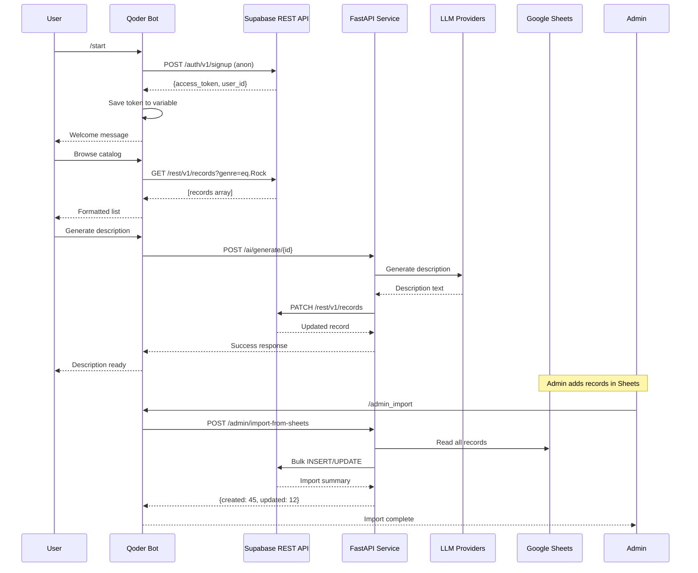
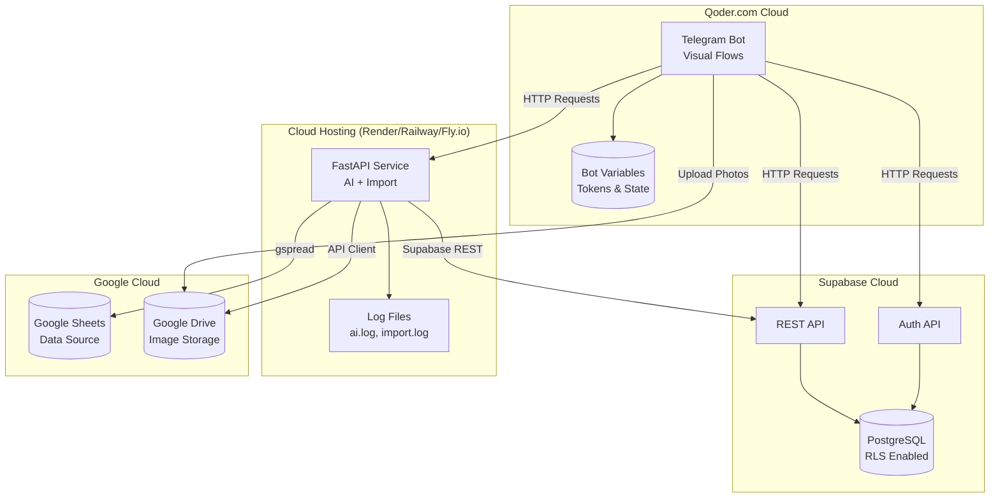
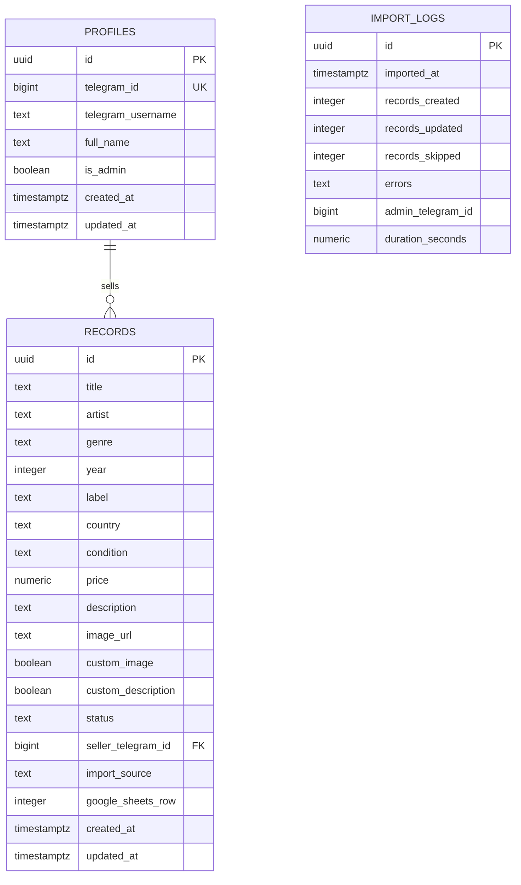

# Qoder.com Low-Code Architecture: Supabase Integration Design

## Overview

This design document outlines the architecture for a vinyl marketplace Telegram bot built on **Qoder.com** (low-code platform), integrating with external services: Supabase (data storage), FastAPI (AI microservice), Google Sheets (admin import), and Google Drive (image storage).

**Key Constraint:** Qoder.com does not support custom Python code, file system access, or direct database connections. All logic is implemented through:
- Visual flow blocks
- HTTP requests to external APIs
- Bot variables for state management

**Current Architecture:**
```
Telegram Bot (Qoder) → FastAPI → Google Sheets → LLM API → AI Descriptions → Google Drive
```

**Target Architecture (Low-Code Orchestration):**
```
Telegram Bot (Qoder.com) ──→ Supabase REST API (CRUD)
         │                    ↓
         │                  PostgreSQL Database
         │
         ├──→ FastAPI Microservice ──→ LLM Providers (Qwen/OpenAI)
         │
         ├──→ Google Sheets API (Admin Import)
         │
         └──→ Google Drive API (Image Upload)
```

**Architecture Principle:** Qoder acts as **orchestrator**, not backend. All "smart" operations (filtering, authentication, AI generation) are delegated to external HTTP APIs.

## Design Objectives

1. **Qoder Bot as Orchestrator:** Telegram bot handles user interaction, delegates processing to external APIs
2. **Supabase as External Storage:** All CRUD operations via Supabase REST API (no direct DB connection)
3. **Token-Based Authentication:** Emulate JWT behavior through Supabase Auth API + bot variable storage
4. **Smart Filtering via URL Parameters:** Catalog filtering through GET request parameters to Supabase REST API
5. **FastAPI AI Microservice:** Separate service for LLM description generation (already implemented)
6. **Google Sheets as Admin Tool:** Import endpoint triggers FastAPI service to sync Sheets → Supabase
7. **Stateless Bot Design:** Minimal state in Qoder variables, maximum delegation to APIs

---

## System Architecture

## System Architecture

### Component Roles and Responsibilities

**1. Qoder.com Telegram Bot (Orchestrator)**
- Receives user commands and messages
- Stores user state in bot variables (telegram_id, access_token, current_filters)
- Makes HTTP requests to external APIs
- Formats and sends responses to users
- **Does NOT:** Execute business logic, query databases directly, generate AI content

**2. Supabase (Data Storage Layer)**
- Provides REST API for CRUD operations
- Handles authentication via Auth API
- Enforces Row-Level Security policies
- Stores: user profiles, vinyl records, import logs
- **Accessed via:** HTTP requests with Authorization header

**3. FastAPI Microservice (AI & Import Service)**
- **Endpoint:** `https://your-fastapi-service.com`
- Generates AI descriptions using LLM providers (existing implementation)
- Executes Google Sheets → Supabase import
- **Called from:** Qoder bot via HTTP POST/GET

**4. Google Sheets (Admin Data Source)**
- Manual data entry by admin
- Bulk record editing
- **Synced to Supabase via:** FastAPI import endpoint

**5. Google Drive (Image Storage)**
- Stores uploaded vinyl photos
- Generates public URLs
- **Accessed via:** Existing drive_client.py (integrated in FastAPI service)

### Component Interaction Flow



### HTTP Request Patterns from Qoder

**Pattern 1: Authentication (User Login)**
```http
POST https://<project>.supabase.co/auth/v1/signup
Headers:
  apikey: <SUPABASE_ANON_KEY>
  Content-Type: application/json

Body:
{
  "email": "user_<telegram_id>@temp.bot",
  "password": "<generated_random_password>"
}

Response:
{
  "access_token": "eyJhbGciOiJIUzI1NiIsInR5cCI6IkpXVCJ9...",
  "user": {"id": "uuid-here"},
  "expires_in": 3600
}
```

**Pattern 2: Fetch Filtered Records**
```http
GET https://<project>.supabase.co/rest/v1/records?genre=eq.Rock&year=gte.1970&year=lte.1980&status=eq.available&limit=20
Headers:
  apikey: <SUPABASE_ANON_KEY>
  Authorization: Bearer <access_token>

Response:
[
  {"id": "uuid", "title": "...", "artist": "...", "price": 4500},
  ...
]
```

**Pattern 3: Update Record (Admin)**
```http
PATCH https://<project>.supabase.co/rest/v1/records?id=eq.<record_id>
Headers:
  apikey: <SUPABASE_ANON_KEY>
  Authorization: Bearer <admin_access_token>
  Content-Type: application/json

Body:
{
  "custom_image": true,
  "image_url": "https://drive.google.com/uc?id=NEW_IMAGE"
}

Response:
[{"id": "uuid", "custom_image": true, "updated_at": "..."}]
```

**Pattern 4: Trigger AI Description Generation**
```http
POST https://your-fastapi-service.com/ai/generate-description/<record_id>
Headers:
  Authorization: Bearer <admin_access_token>
  Content-Type: application/json

Body:
{
  "force_regenerate": false
}

Response:
{
  "status": "completed",
  "description": "Generated text...",
  "llm_provider": "qwen"
}
```

**Pattern 5: Import from Google Sheets**
```http
POST https://your-fastapi-service.com/admin/import-from-sheets
Headers:
  Authorization: Bearer <admin_access_token>
  Content-Type: application/json

Body:
{
  "sheet_name": "Справочник",
  "update_existing": false,
  "preserve_custom_fields": true
}

Response:
{
  "status": "completed",
  "summary": {
    "created": 45,
    "updated": 12,
    "skipped": 193,
    "errors": 0
  }
}
```

---

## Authentication in Qoder (Without Custom Code)

### Challenge

Qoder does not support:
- JWT library imports (pyjwt)
- Custom token generation logic
- Secure token storage in database

### Solution: Supabase Auth API + Bot Variables

**Approach:** Use Supabase's built-in authentication via REST API, store tokens in Qoder bot variables.

### Implementation Steps

**Step 1: User Registration/Login (on /start)**

**Qoder Flow Block Sequence:**

1. **Trigger:** User sends `/start` command
2. **Extract Variable:** `telegram_id = {{message.from.id}}`
3. **Check Existing Token:**
   - **Condition:** If bot variable `user_{{telegram_id}}_token` exists
   - **Action if True:** Skip to Step 5
   - **Action if False:** Continue to Step 4

4. **Create Supabase User (HTTP Request Block):**
   ```yaml
   Method: POST
   URL: https://<project>.supabase.co/auth/v1/signup
   Headers:
     apikey: {{env.SUPABASE_ANON_KEY}}
     Content-Type: application/json
   Body:
     {
       "email": "user_{{telegram_id}}@vinylbot.temp",
       "password": "{{generate_random_password()}}"
     }
   Save Response To: signup_response
   ```

5. **Store Token in Bot Variable:**
   ```yaml
   Variable Name: user_{{telegram_id}}_token
   Value: {{signup_response.access_token}}
   Expiration: 3600 seconds (1 hour)
   ```

6. **Store User ID:**
   ```yaml
   Variable Name: user_{{telegram_id}}_uuid
   Value: {{signup_response.user.id}}
   ```

7. **Create Profile Record (Link telegram_id to Supabase user):**
   ```yaml
   Method: POST
   URL: https://<project>.supabase.co/rest/v1/profiles
   Headers:
     apikey: {{env.SUPABASE_ANON_KEY}}
     Authorization: Bearer {{user_{{telegram_id}}_token}}
     Content-Type: application/json
   Body:
     {
       "id": "{{signup_response.user.id}}",
       "telegram_id": {{telegram_id}},
       "telegram_username": "{{message.from.username}}",
       "full_name": "{{message.from.first_name}} {{message.from.last_name}}"
     }
   ```

8. **Send Welcome Message:**
   ```
   Добро пожаловать! Вы успешно зарегистрированы.
   Используйте /catalog для просмотра пластинок.
   ```

### Token Management Strategy

**Token Storage:**
- **Where:** Qoder bot variables (key-value store)
- **Key Format:** `user_{{telegram_id}}_token`
- **Lifetime:** 1 hour (Supabase default)
- **Refresh Logic:** On token expiration error (401), re-authenticate user

**Token Refresh Flow:**

1. **Qoder makes API request** (e.g., GET /records)
2. **Receives 401 Unauthorized** from Supabase
3. **Trigger Re-authentication:**
   - Delete expired token from bot variable
   - Call `/auth/v1/signup` again (creates new session)
   - Store new token
   - Retry original request

**Qoder Error Handling Block:**
```yaml
On HTTP Error 401:
  - Delete Variable: user_{{telegram_id}}_token
  - Redirect to: Authentication Flow
  - After Success: Retry Failed Request
```

### Admin Authentication

**Problem:** Need to distinguish admin users from regular users.

**Solution:** Pre-create admin user in Supabase, hardcode admin token in Qoder environment variable.

**Setup:**

1. **Manually create admin in Supabase Dashboard:**
   - Email: `admin@vinylbot.com`
   - Password: `<secure_password>`
   - Set `is_admin = true` in profiles table

2. **Get Admin Token:**
   ```bash
   curl -X POST https://<project>.supabase.co/auth/v1/token?grant_type=password \
     -H "apikey: <SUPABASE_ANON_KEY>" \
     -H "Content-Type: application/json" \
     -d '{"email": "admin@vinylbot.com", "password": "<password>"}'
   ```

3. **Store in Qoder Environment Variable:**
   ```
   ADMIN_ACCESS_TOKEN=<admin_token_from_step_2>
   ```

4. **Check Admin Privileges in Bot:**
   ```yaml
   Condition: If telegram_id == {{env.ADMIN_TELEGRAM_ID}}
   Action: Use {{env.ADMIN_ACCESS_TOKEN}} for requests
   ```

### Security Considerations

**Limitations in Qoder:**
- Tokens stored in bot variables (not encrypted at rest)
- No HTTPS enforcement in bot logic (relies on Qoder platform)
- Admin token is static (manual rotation required)

**Mitigations:**
- Short token expiration (1 hour)
- Supabase RLS policies enforce permissions even with leaked tokens
- Admin token only used for admin telegram_id
- Regular token rotation via re-authentication

---

## Database Schema Design

### Supabase Tables

#### Table: `profiles`

**Purpose:** User account management linked to Telegram IDs

| Column | Type | Constraints | Description |
|--------|------|-------------|-------------|
| id | uuid | PRIMARY KEY, references auth.users | Supabase auth user ID |
| telegram_id | bigint | UNIQUE, NOT NULL | Telegram user identifier |
| telegram_username | text | NULLABLE | Telegram username |
| full_name | text | NULLABLE | User's display name |
| is_admin | boolean | DEFAULT false | Admin privileges flag |
| created_at | timestamptz | DEFAULT now() | Account creation timestamp |
| updated_at | timestamptz | DEFAULT now() | Last update timestamp |

**Row-Level Security Policy:**
- Public read access (users can view all profiles)
- Users can update only their own profile
- Only admins can set `is_admin` flag

#### Table: `records`

**Purpose:** Vinyl record catalog with metadata and status tracking

| Column | Type | Constraints | Description |
|--------|------|-------------|-------------|
| id | uuid | PRIMARY KEY, DEFAULT uuid_generate_v4() | Unique record identifier |
| title | text | NOT NULL | Album or record title |
| artist | text | NOT NULL | Artist or band name |
| genre | text | NOT NULL | Music genre |
| year | integer | CHECK (year >= 1900 AND year <= 2100) | Release year |
| label | text | NULLABLE | Record label name |
| country | text | NOT NULL | Country of manufacture |
| condition | text | NOT NULL | Physical condition (Mint, NM, VG+, etc.) |
| price | numeric(10,2) | NOT NULL, CHECK (price >= 0) | Price in rubles |
| description | text | NULLABLE | AI-generated or manual description |
| image_url | text | NULLABLE | Google Drive or external image URL |
| custom_image | boolean | DEFAULT false | Flag indicating manual image override |
| custom_description | boolean | DEFAULT false | Flag indicating manual description override |
| status | text | DEFAULT 'available' | Record status (available, reserved, sold) |
| seller_telegram_id | bigint | NULLABLE | Telegram ID of seller (if applicable) |
| import_source | text | DEFAULT 'manual' | Source of record (manual, sheets_import) |
| google_sheets_row | integer | NULLABLE | Original row number in Google Sheets |
| created_at | timestamptz | DEFAULT now() | Record creation timestamp |
| updated_at | timestamptz | DEFAULT now() | Last modification timestamp |

**Indexes:**
- `idx_records_genre` ON genre (for filtering)
- `idx_records_year` ON year (for range queries)
- `idx_records_status` ON status (for availability filtering)
- `idx_records_artist` ON artist (for search)
- `idx_records_title` ON title (for search)
- Composite index on (genre, year, status) for common query patterns

**Row-Level Security Policy:**
- Public read access for all records where status = 'available'
- Authenticated users can read all records
- Only admin can INSERT, UPDATE, DELETE records
- Exception: Users can update `custom_image` and `custom_description` for their own records (where seller_telegram_id matches)

#### Table: `import_logs`

**Purpose:** Audit trail for Google Sheets import operations

| Column | Type | Constraints | Description |
|--------|------|-------------|-------------|
| id | uuid | PRIMARY KEY | Log entry identifier |
| imported_at | timestamptz | DEFAULT now() | Import execution timestamp |
| records_created | integer | DEFAULT 0 | Count of new records created |
| records_updated | integer | DEFAULT 0 | Count of existing records updated |
| records_skipped | integer | DEFAULT 0 | Count of records skipped |
| errors | text | NULLABLE | Error messages if any |
| admin_telegram_id | bigint | NOT NULL | Admin who triggered import |
| duration_seconds | numeric | NULLABLE | Import operation duration |

---

## API Endpoints Specification

### Authentication Endpoints

#### `POST /auth/telegram`

**Purpose:** Authenticate user via Telegram ID and issue JWT token

**Request Body:**
```json
{
  "telegram_id": 123456789,
  "telegram_username": "john_doe",
  "full_name": "John Doe"
}
```

**Response (200 OK):**
```json
{
  "access_token": "eyJhbGciOiJIUzI1NiIsInR5cCI6IkpXVCJ9...",
  "token_type": "bearer",
  "user_id": "a1b2c3d4-e5f6-7890-abcd-ef1234567890",
  "expires_in": 2592000
}
```

**Response (400 Bad Request):**
```json
{
  "detail": "Invalid telegram_id format"
}
```

**Response (500 Internal Server Error):**
```json
{
  "detail": "Authentication service unavailable"
}
```

**Authentication Logic:**
- No existing authentication required
- Validates telegram_id is positive integer
- Creates user if not exists
- Returns JWT containing user_id and telegram_id claims

## Catalog Filtering via Supabase REST API

### Challenge

Qoder cannot execute SQL queries or build complex filters programmatically.

### Solution: Supabase REST API Query Parameters

Supabase REST API supports filtering via URL parameters using PostgREST syntax.

### Filter Syntax Reference

| Filter Type | Supabase Parameter | Example |
|-------------|-------------------|----------|
| Exact match | `column=eq.value` | `genre=eq.Rock` |
| Greater than | `column=gt.value` | `year=gt.1970` |
| Greater or equal | `column=gte.value` | `price=gte.1000` |
| Less than | `column=lt.value` | `year=lt.2000` |
| Less or equal | `column=lte.value` | `price=lte.5000` |
| Pattern match | `column=like.*value*` | `title=like.*Floyd*` |
| Case-insensitive | `column=ilike.*value*` | `artist=ilike.*pink*` |
| Multiple values | `column=in.(val1,val2)` | `status=in.(available,reserved)` |
| Sorting | `order=column.asc` | `order=year.desc` |
| Limit | `limit=N` | `limit=20` |
| Offset | `offset=N` | `offset=40` |

### Qoder Implementation: Catalog Command

**User Command:** `/catalog`

**Qoder Flow Blocks:**

**Block 1: Show Filter Options**
```yaml
Type: Send Message
Text: |
  🎵 Каталог виниловых пластинок
  
  Выберите фильтр:
Inline Keyboard:
  - [🎸 Жанр] [callback: filter_genre]
  - [📅 Год] [callback: filter_year]
  - [💰 Цена] [callback: filter_price]
  - [🔍 Поиск] [callback: filter_search]
  - [✅ Показать все] [callback: show_all]
```

**Block 2: Handle Genre Filter**
```yaml
Trigger: Callback filter_genre
Type: Send Message
Text: "Введите жанр (Rock, Jazz, Classical...):"
Next Action: Wait for text message
Save Response To: user_filter_genre
Then: Redirect to Block 5 (Build Query)
```

**Block 3: Handle Year Range Filter**
```yaml
Trigger: Callback filter_year
Type: Send Message
Text: "Введите диапазон лет (например: 1970-1980):"
Next Action: Wait for text message
Save Response To: user_filter_year_range
Parse: Split by "-" into year_min and year_max
Then: Redirect to Block 5
```

**Block 4: Handle Price Filter**
```yaml
Trigger: Callback filter_price
Type: Send Message
Text: "Максимальная цена (рубли):"
Next Action: Wait for text message
Save Response To: user_filter_price_max
Then: Redirect to Block 5
```

**Block 5: Build Query URL**
```yaml
Type: Variable Assignment
Variable: query_url
Value: https://<project>.supabase.co/rest/v1/records?

Conditional Append:
  - If user_filter_genre exists: genre=ilike.*{{user_filter_genre}}*&
  - If year_min exists: year=gte.{{year_min}}&
  - If year_max exists: year=lte.{{year_max}}&
  - If user_filter_price_max exists: price=lte.{{user_filter_price_max}}&
  - Always append: status=eq.available&limit=20&order=year.desc

Final URL Example:
https://xyz.supabase.co/rest/v1/records?genre=ilike.*Rock*&year=gte.1970&year=lte.1980&status=eq.available&limit=20&order=year.desc
```

**Block 6: Fetch Records from Supabase**
```yaml
Type: HTTP Request
Method: GET
URL: {{query_url}}
Headers:
  apikey: {{env.SUPABASE_ANON_KEY}}
  Authorization: Bearer {{user_{{telegram_id}}_token}}
Save Response To: catalog_results
```

**Block 7: Format and Send Results**
```yaml
Type: Loop (For Each)
Loop Over: {{catalog_results}}
Item Variable: record

Message Template:
🎵 {{record.title}} - {{record.artist}}
🎸 Жанр: {{record.genre}}
📅 Год: {{record.year}}
💿 Состояние: {{record.condition}}
💰 Цена: {{record.price}} руб.

Inline Keyboard:
  - [🖼️ Фото] [url: {{record.image_url}}]
  - [📝 Описание] [callback: show_desc_{{record.id}}]
  - [🛒 Забронировать] [callback: reserve_{{record.id}}]

Send: One message per record (up to 20)
```

### Search Functionality

**User Command:** `/search <query>`

**Qoder Flow:**

1. **Extract Search Term:**
   ```yaml
   Variable: search_term
   Value: {{message.text.replace("/search ", "")}}
   ```

2. **Build Search Query:**
   ```yaml
   URL: https://<project>.supabase.co/rest/v1/records?or=(title.ilike.*{{search_term}}*,artist.ilike.*{{search_term}}*)&status=eq.available&limit=20
   ```
   
   **Explanation:** `or=()` combines conditions, searches in both `title` and `artist` columns.

3. **Execute Request and Display Results** (same as Block 6-7 above)

### Advanced Filtering: Multiple Conditions

**Example: Rock records from 1970-1980 under 5000 rubles**

**Qoder URL Builder:**
```yaml
URL: https://<project>.supabase.co/rest/v1/records?
Parameters:
  genre=ilike.*Rock*&
  year=gte.1970&
  year=lte.1980&
  price=lte.5000&
  status=eq.available&
  order=price.asc&
  limit=20
```

**Result:** Supabase executes SQL:
```sql
SELECT * FROM records
WHERE genre ILIKE '%Rock%'
  AND year >= 1970
  AND year <= 1980
  AND price <= 5000
  AND status = 'available'
ORDER BY price ASC
LIMIT 20;
```

### Pagination Implementation

**Qoder Flow for "Next Page" Button:**

```yaml
Variable: current_offset (default: 0)

On "Next Page" Callback:
  - Increment: current_offset += 20
  - Append to URL: &offset={{current_offset}}
  - Fetch Records (same HTTP request)
  - Update Inline Keyboard:
    - [« Prev] [callback: prev_page] (if offset > 0)
    - [Next »] [callback: next_page]
```

**Example Paginated URL:**
```
Page 1: ...&limit=20&offset=0
Page 2: ...&limit=20&offset=20
Page 3: ...&limit=20&offset=40
```

## Record Management Operations

### Update Record (Admin Only)

**Use Case:** Admin wants to manually update description or image URL.

**Qoder Command:** `/admin_edit <record_id>`

**Flow Blocks:**

**Block 1: Verify Admin**
```yaml
Condition: telegram_id == {{env.ADMIN_TELEGRAM_ID}}
If False:
  Send Message: "⛔ Доступ запрещён."
  Exit Flow
```

**Block 2: Fetch Current Record**
```yaml
HTTP Request:
  Method: GET
  URL: https://<project>.supabase.co/rest/v1/records?id=eq.{{record_id}}
  Headers:
    apikey: {{env.SUPABASE_ANON_KEY}}
    Authorization: Bearer {{env.ADMIN_ACCESS_TOKEN}}
  Save To: current_record
```

**Block 3: Show Edit Menu**
```yaml
Send Message:
  Text: |
    💿 {{current_record[0].title}} - {{current_record[0].artist}}
    
    Что хотите изменить?
  Inline Keyboard:
    - [🖼️ Изображение] [callback: edit_image_{{record_id}}]
    - [📝 Описание] [callback: edit_desc_{{record_id}}]
    - [💰 Цена] [callback: edit_price_{{record_id}}]
```

**Block 4: Handle Image Update**
```yaml
Trigger: Callback edit_image_{{record_id}}

Send Message: "🖼️ Отправьте новое фото или URL:"
Wait For: Photo or Text Message

If Photo Received:
  - Upload to Google Drive (via existing integration)
  - Get public URL
  - Save to: new_image_url

If Text (URL) Received:
  - Save to: new_image_url

HTTP Request:
  Method: PATCH
  URL: https://<project>.supabase.co/rest/v1/records?id=eq.{{record_id}}
  Headers:
    apikey: {{env.SUPABASE_ANON_KEY}}
    Authorization: Bearer {{env.ADMIN_ACCESS_TOKEN}}
    Content-Type: application/json
    Prefer: return=representation
  Body:
    {
      "image_url": "{{new_image_url}}",
      "custom_image": true
    }
  
Send Message: "✅ Изображение обновлено!"
```

**Block 5: Handle Description Update**
```yaml
Trigger: Callback edit_desc_{{record_id}}

Send Message: "📝 Введите новое описание:"
Wait For: Text Message
Save To: new_description

HTTP Request:
  Method: PATCH
  URL: https://<project>.supabase.co/rest/v1/records?id=eq.{{record_id}}
  Headers:
    apikey: {{env.SUPABASE_ANON_KEY}}
    Authorization: Bearer {{env.ADMIN_ACCESS_TOKEN}}
    Content-Type: application/json
  Body:
    {
      "description": "{{new_description}}",
      "custom_description": true
    }

Send Message: "✅ Описание обновлено!"
```

### AI Description Generation

**Use Case:** Generate description using existing FastAPI microservice.

**Qoder Command:** `/generate_desc <record_id>` (admin only)

**Flow Blocks:**

**Block 1: Verify Admin Access**
```yaml
Condition: telegram_id == {{env.ADMIN_TELEGRAM_ID}}
If False: Exit with error message
```

**Block 2: Call FastAPI AI Endpoint**
```yaml
HTTP Request:
  Method: POST
  URL: https://your-fastapi-service.com/ai/generate-description/{{record_id}}
  Headers:
    Authorization: Bearer {{env.ADMIN_ACCESS_TOKEN}}
    Content-Type: application/json
  Body:
    {
      "force_regenerate": false
    }
  Timeout: 60 seconds
  Save To: ai_response
```

**Block 3: Handle Response**
```yaml
If HTTP Status 200:
  Send Message: |
    ✨ Описание сгенерировано!
    
    {{ai_response.description}}
    
    🤖 Провайдер: {{ai_response.llm_provider}}

If HTTP Status 400:
  Send Message: "⚠️ Описание уже существует. Используйте force_regenerate=true."

If HTTP Status 500:
  Send Message: "🔧 Ошибка генерации. Повторите позже."
```

**Important:** FastAPI service already handles:
- LLM provider selection and fallback
- Updating Supabase record with generated description
- Logging to ai.log
- Token consumption tracking

Qoder only triggers the generation and displays result.

## Google Sheets Import Integration

### Architecture Overview

**Data Flow:**
```
Admin (Qoder) → Trigger Import Command
     ↓
HTTP POST to FastAPI
     ↓
FastAPI Service:
  - Reads Google Sheets via gspread
  - Transforms data to Supabase schema
  - Inserts/Updates records in Supabase via REST API
  - Returns summary to Qoder
     ↓
Qoder displays result to Admin
```

**Rationale:** Google Sheets integration requires Python libraries (gspread, google-auth) which Qoder doesn't support. FastAPI service acts as middleware.

### FastAPI Import Endpoint (Already Implemented)

**Endpoint:** `POST /admin/import-from-sheets`

**Functionality:**
- Connects to Google Sheets using existing SheetsClient
- Reads all records from "Справочник" worksheet
- For each row:
  - Checks if record exists in Supabase (by title + artist + year)
  - If new: INSERT into Supabase
  - If exists and `update_existing=true`: UPDATE metadata
  - If exists and `preserve_custom_fields=true`: Skip custom_image/custom_description fields
- Logs operation to import_logs table
- Returns summary: {created, updated, skipped, errors}

### Qoder Implementation

**Admin Command:** `/admin_import`

**Flow Blocks:**

**Block 1: Admin Verification**
```yaml
Condition: telegram_id == {{env.ADMIN_TELEGRAM_ID}}
If False:
  Send Message: "⛔ Только для администратора."
  Exit
```

**Block 2: Confirm Import**
```yaml
Send Message:
  Text: |
    📂 Импорт из Google Sheets
    
    Это синхронизирует данные из таблицы в Supabase.
    Продолжить?
  Inline Keyboard:
    - [✅ Да, импортировать] [callback: confirm_import]
    - [❌ Отмена] [callback: cancel_import]
```

**Block 3: Execute Import (on confirm_import callback)**
```yaml
Send Message: "⏳ Импорт запущен... Это может занять 30-60 секунд."

HTTP Request:
  Method: POST
  URL: https://your-fastapi-service.com/admin/import-from-sheets
  Headers:
    Authorization: Bearer {{env.ADMIN_ACCESS_TOKEN}}
    Content-Type: application/json
  Body:
    {
      "sheet_name": "Справочник",
      "update_existing": false,
      "preserve_custom_fields": true
    }
  Timeout: 120 seconds
  Save To: import_result
```

**Block 4: Display Results**
```yaml
If HTTP Status 200:
  Send Message: |
    ✅ Импорт завершён!
    
    🆕 Создано: {{import_result.summary.created}}
    🔄 Обновлено: {{import_result.summary.updated}}
    ⏩ Пропущено: {{import_result.summary.skipped}}
    ⚠️ Ошибок: {{import_result.summary.errors}}
    
    ⏱️ Время: {{import_result.duration_seconds}} сек.

If HTTP Status 401:
  Send Message: "🔒 Ошибка аутентификации. Проверьте токен."

If HTTP Status 500:
  Send Message: |
    ❌ Ошибка импорта:
    {{import_result.error}}
    
    Повторите позже или проверьте Google Sheets.
```

### Import Configuration Options

**Option 1: Update Existing Records**

Change body parameter:
```json
{
  "sheet_name": "Справочник",
  "update_existing": true,  // <-- Enable updates
  "preserve_custom_fields": true
}
```

**Behavior:**
- Existing records will be updated with new data from Sheets
- Custom fields (custom_image, custom_description) are preserved if set to true

**Option 2: Allow Overwriting Custom Fields**

```json
{
  "sheet_name": "Справочник",
  "update_existing": true,
  "preserve_custom_fields": false  // <-- Allow overwrite
}
```

**Behavior:**
- All fields updated from Sheets, including manually edited images/descriptions
- Use with caution!

### Error Handling

**Common Errors:**

1. **Google Sheets Timeout:**
   - FastAPI returns 500 with error message
   - Qoder displays: "Проверьте подключение к Google Sheets"
   - Admin should verify GOOGLE_CREDENTIALS_FILE and SPREADSHEET_URL

2. **Supabase Connection Failed:**
   - FastAPI returns 500
   - Qoder displays: "Ошибка подключения к базе данных"

3. **Invalid Data Format:**
   - FastAPI logs errors to import.log
   - Returns summary with errors count
   - Qoder shows: "Импорт завершён с 5 ошибками. Проверьте лог."

4. **Admin Token Expired:**
   - FastAPI returns 401
   - Qoder displays: "Токен истёк. Обновите ADMIN_ACCESS_TOKEN."

### Scheduling Automatic Import (Future Enhancement)

**Option 1: Cron Job (if Qoder supports scheduling)**
```yaml
Schedule: Daily at 03:00 AM
Action: Execute /admin_import flow
Notify Admin: Send summary to admin telegram_id
```

**Option 2: External Scheduler (Google Cloud Scheduler)**
```bash
curl -X POST https://your-fastapi-service.com/admin/import-from-sheets \
  -H "Authorization: Bearer <ADMIN_TOKEN>" \
  -H "Content-Type: application/json" \
  -d '{"sheet_name": "Справочник", "update_existing": false}'
```

**Option 3: Webhook from Google Sheets (via Apps Script)**
- When admin edits Sheet, trigger webhook to FastAPI
- FastAPI executes import
- Sends result notification to Qoder bot

## Qoder Bot Variable Management

### Required Bot Variables

**User-Specific Variables (per telegram_id):**

| Variable Name | Type | Example Value | TTL | Description |
|---------------|------|---------------|-----|-------------|
| `user_{{telegram_id}}_token` | string | `eyJhbGciOiJIUzI1NiIs...` | 3600s | Supabase access token |
| `user_{{telegram_id}}_uuid` | string | `a1b2c3d4-e5f6-7890...` | permanent | Supabase user UUID |
| `user_{{telegram_id}}_filters` | JSON | `{"genre": "Rock", "year_min": 1970}` | 600s | Current catalog filters |
| `user_{{telegram_id}}_page` | integer | `2` | 300s | Catalog pagination offset |

**Global Variables (Environment Config):**

| Variable Name | Type | Example Value | Description |
|---------------|------|---------------|-------------|
| `SUPABASE_URL` | string | `https://xyz.supabase.co` | Supabase project URL |
| `SUPABASE_ANON_KEY` | string | `eyJhbGciOiJIUzI1NiIs...` | Public API key |
| `ADMIN_TELEGRAM_ID` | integer | `123456789` | Admin's telegram ID |
| `ADMIN_ACCESS_TOKEN` | string | `eyJhbGciOiJIUzI1NiIs...` | Pre-generated admin token |
| `FASTAPI_BASE_URL` | string | `https://api.vinylbot.com` | FastAPI microservice URL |

### Variable Lifecycle Management

**Token Refresh Logic:**

```yaml
Flow: On Any API Request Error 401

Step 1: Detect Expired Token
  If response.status == 401:
    - Log: "Token expired for user {{telegram_id}}"
    - Delete: user_{{telegram_id}}_token
    - Delete: user_{{telegram_id}}_uuid

Step 2: Re-authenticate
  - Call: Supabase Auth API (signup/signin)
  - Save new token to: user_{{telegram_id}}_token
  - Save new uuid to: user_{{telegram_id}}_uuid

Step 3: Retry Original Request
  - Use new token
  - If success: continue flow
  - If fail again: notify user "Service unavailable"
```

**Filter State Persistence:**

```yaml
When User Sets Filter:
  Variable: user_{{telegram_id}}_filters
  Value: {
    "genre": "{{selected_genre}}",
    "year_min": {{year_min}},
    "year_max": {{year_max}},
    "price_max": {{price_max}}
  }
  TTL: 600 seconds (10 minutes)

When User Requests Catalog:
  - Read: user_{{telegram_id}}_filters
  - Build URL from saved filters
  - If expired: use default filters (all available)
```

**Pagination State:**

```yaml
Initial Catalog View:
  Set: user_{{telegram_id}}_page = 0

On "Next Page" Callback:
  - Get: current_page = user_{{telegram_id}}_page
  - Set: user_{{telegram_id}}_page = current_page + 1
  - Calculate offset: offset = page * 20

On "Previous Page" Callback:
  - Get: current_page = user_{{telegram_id}}_page
  - Set: user_{{telegram_id}}_page = max(0, current_page - 1)

On New Filter Applied:
  - Reset: user_{{telegram_id}}_page = 0
```

### Security Best Practices in Qoder

**Token Storage:**
- ✅ Use bot variables (Qoder's built-in key-value store)
- ❌ Never send tokens in messages to users
- ❌ Never log tokens in visible messages
- ✅ Set TTL to match Supabase token expiration (3600s)

**Admin Token Management:**
- ✅ Store `ADMIN_ACCESS_TOKEN` in environment variables (not user variables)
- ✅ Only use when `telegram_id == ADMIN_TELEGRAM_ID`
- ❌ Never expose admin token in error messages
- ✅ Rotate admin token monthly (manual process)

**Input Validation:**
```yaml
Before Using User Input in HTTP Requests:

Validate Year:
  If not (1900 <= year <= 2100):
    Send Error: "Некорректный год"
    Exit

Validate Price:
  If not (0 <= price <= 1000000):
    Send Error: "Некорректная цена"
    Exit

Sanitize Search Query:
  - Remove special characters: & = ? #
  - Limit length: max 100 characters
  - URL encode before inserting in query string
```

---

## Complete Bot Flow Examples

### Example 1: User Registration and First Catalog View

**User Action:** Sends `/start` to bot

**Qoder Flow Execution:**

```yaml
Step 1: Receive /start Command
  Trigger: Message text = "/start"
  Extract: telegram_id = {{message.from.id}}

Step 2: Check Existing User Token
  Variable Check: user_{{telegram_id}}_token exists?
  
  If NOT exists (new user):
    
    Step 2a: Generate Random Password
      Variable: temp_password
      Value: {{random_string(16)}}  # Qoder function
    
    Step 2b: Create Supabase User
      HTTP POST: https://xyz.supabase.co/auth/v1/signup
      Headers:
        apikey: {{env.SUPABASE_ANON_KEY}}
        Content-Type: application/json
      Body:
        {
          "email": "user_{{telegram_id}}@vinylbot.temp",
          "password": "{{temp_password}}"
        }
      Save Response: auth_response
    
    Step 2c: Store Token
      Set Variable: user_{{telegram_id}}_token
      Value: {{auth_response.access_token}}
      TTL: 3600
    
    Step 2d: Store User UUID
      Set Variable: user_{{telegram_id}}_uuid
      Value: {{auth_response.user.id}}
    
    Step 2e: Create Profile Record
      HTTP POST: https://xyz.supabase.co/rest/v1/profiles
      Headers:
        apikey: {{env.SUPABASE_ANON_KEY}}
        Authorization: Bearer {{user_{{telegram_id}}_token}}
        Content-Type: application/json
      Body:
        {
          "id": "{{auth_response.user.id}}",
          "telegram_id": {{telegram_id}},
          "telegram_username": "{{message.from.username}}",
          "full_name": "{{message.from.first_name}}"
        }

Step 3: Send Welcome Message
  Send Message:
    Text: |
      👋 Добро пожаловать в магазин винила!
      
      💿 Используйте /catalog для просмотра каталога
      🔍 /search <запрос> для поиска
      ❓ /help для справки

Step 4: User Sends /catalog
  Trigger: Message text = "/catalog"
  
  Step 4a: Build Query URL
    Variable: catalog_url
    Value: https://xyz.supabase.co/rest/v1/records?status=eq.available&limit=20&order=created_at.desc
  
  Step 4b: Fetch Records
    HTTP GET: {{catalog_url}}
    Headers:
      apikey: {{env.SUPABASE_ANON_KEY}}
      Authorization: Bearer {{user_{{telegram_id}}_token}}
    Save: catalog_records
  
  Step 4c: Display First 3 Records
    Loop: For each record in catalog_records (max 3)
      Send Message:
        Text: |
          🎵 {{record.title}}
          🎸 {{record.artist}}
          🏗️ {{record.genre}} | {{record.year}}
          💰 {{record.price}} руб.
        
        Inline Keyboard:
          - [🖼️ Фото] [url: {{record.image_url}}]
          - [📝 Описание] [callback: desc_{{record.id}}]
  
  Step 4d: Add Navigation
    Send Message:
      Text: "📊 Показано 3 из {{catalog_records.length}}"
      Inline Keyboard:
        - [🔍 Фильтры] [callback: show_filters]
        - [Next »] [callback: next_page]
```

### Example 2: Filtering by Genre and Year

**User Action:** Clicks "Filters" button, selects genre "Rock", year range "1970-1980"

**Qoder Flow:**

```yaml
Step 1: Show Filter Menu
  Trigger: Callback "show_filters"
  Send Message:
    Text: "🎸 Выберите фильтр:"
    Inline Keyboard:
      - [🎸 Жанр] [callback: filter_genre]
      - [📅 Год] [callback: filter_year]
      - [✅ Применить] [callback: apply_filters]

Step 2: User Clicks "Genre"
  Trigger: Callback "filter_genre"
  Send Message:
    Text: "Введите жанр (Rock, Jazz, Classical...):"
  Wait For: Text message
  Save To: temp_genre
  
  Set Variable: user_{{telegram_id}}_filters
  Value: {"genre": "{{temp_genre}}"}
  
  Send Message: "✅ Жанр: {{temp_genre}}"
  Redirect To: Step 1 (Show Filter Menu)

Step 3: User Clicks "Year"
  Trigger: Callback "filter_year"
  Send Message:
    Text: "Введите диапазон (1970-1980):"
  Wait For: Text message
  Save To: temp_year_range
  
  Parse:
    Split temp_year_range by "-"
    year_min = part[0]
    year_max = part[1]
  
  Update Variable: user_{{telegram_id}}_filters
  Merge: {"year_min": {{year_min}}, "year_max": {{year_max}}}
  
  Send Message: "✅ Годы: {{year_min}}-{{year_max}}"
  Redirect To: Step 1

Step 4: User Clicks "Apply Filters"
  Trigger: Callback "apply_filters"
  
  Step 4a: Get Saved Filters
    Get Variable: user_{{telegram_id}}_filters
    Example value: {"genre": "Rock", "year_min": 1970, "year_max": 1980}
  
  Step 4b: Build URL
    Base: https://xyz.supabase.co/rest/v1/records?
    Append: genre=ilike.*{{filters.genre}}*&
    Append: year=gte.{{filters.year_min}}&
    Append: year=lte.{{filters.year_max}}&
    Append: status=eq.available&limit=20
    
    Final URL: https://xyz.supabase.co/rest/v1/records?genre=ilike.*Rock*&year=gte.1970&year=lte.1980&status=eq.available&limit=20
  
  Step 4c: Execute Query
    HTTP GET: {{final_url}}
    Headers:
      apikey: {{env.SUPABASE_ANON_KEY}}
      Authorization: Bearer {{user_{{telegram_id}}_token}}
    Save: filtered_records
  
  Step 4d: Display Results
    Send Message: "🎸 Найдено: {{filtered_records.length}} записей"
    
    Loop: For each record in filtered_records
      Send formatted record (as in Example 1)
```

### Example 3: Admin Import from Google Sheets

**Admin Action:** Sends `/admin_import`

**Qoder Flow:**

```yaml
Step 1: Verify Admin
  Extract: telegram_id = {{message.from.id}}
  
  Condition: telegram_id == {{env.ADMIN_TELEGRAM_ID}}
  If False:
    Send Message: "⛔ Доступ только для администратора."
    Exit Flow

Step 2: Confirm Import
  Send Message:
    Text: |
      📂 Импорт из Google Sheets в Supabase
      
      Это синхронизирует все записи из таблицы.
      Продолжить?
    Inline Keyboard:
      - [✅ Да] [callback: confirm_import]
      - [❌ Отмена] [callback: cancel]

Step 3: Execute Import (on confirm)
  Trigger: Callback "confirm_import"
  
  Send Message: "⏳ Импорт запущен... Подождите 30-60 секунд."
  
  HTTP Request:
    Method: POST
    URL: {{env.FASTAPI_BASE_URL}}/admin/import-from-sheets
    Headers:
      Authorization: Bearer {{env.ADMIN_ACCESS_TOKEN}}
      Content-Type: application/json
    Body:
      {
        "sheet_name": "Справочник",
        "update_existing": false,
        "preserve_custom_fields": true
      }
    Timeout: 120 seconds
    Save: import_result

Step 4: Handle Success
  If HTTP Status 200:
    Send Message: |
      ✅ Импорт завершён!
      
      🆕 Создано: {{import_result.summary.created}}
      🔄 Обновлено: {{import_result.summary.updated}}
      ⏩ Пропущено: {{import_result.summary.skipped}}
      ⚠️ Ошибок: {{import_result.summary.errors}}
      
      ⏱️ Время: {{import_result.duration_seconds}} сек.

Step 5: Handle Errors
  If HTTP Status 401:
    Send Message: "🔒 Ошибка аутентификации. Проверьте ADMIN_ACCESS_TOKEN."
  
  If HTTP Status 500:
    Send Message: |
      ❌ Ошибка импорта:
      {{import_result.error}}
      
      Повторите позже или проверьте подключение к Google Sheets.
  
  If HTTP Timeout:
    Send Message: "⏱️ Таймаут. Импорт занял слишком много времени. Проверьте логи FastAPI."
```

### Example 4: Generate AI Description

**Admin Action:** Sends `/generate_desc <record_id>`

**Qoder Flow:**

```yaml
Step 1: Parse Command
  Extract: record_id = {{message.text.split(" ")[1]}}
  
  Validate:
    If record_id is empty or invalid UUID:
      Send Message: "⚠️ Использование: /generate_desc <record_id>"
      Exit

Step 2: Verify Admin
  Condition: telegram_id == {{env.ADMIN_TELEGRAM_ID}}
  If False: Exit with error

Step 3: Notify User
  Send Message: "⏳ Генерирую описание... Это может занять 10-30 секунд."

Step 4: Call FastAPI AI Endpoint
  HTTP Request:
    Method: POST
    URL: {{env.FASTAPI_BASE_URL}}/ai/generate-description/{{record_id}}
    Headers:
      Authorization: Bearer {{env.ADMIN_ACCESS_TOKEN}}
      Content-Type: application/json
    Body:
      {"force_regenerate": false}
    Timeout: 60 seconds
    Save: ai_response

Step 5: Display Result
  If HTTP Status 200:
    Send Message: |
      ✨ Описание сгенерировано!
      
      {{ai_response.description}}
      
      🤖 AI: {{ai_response.llm_provider}}
      🔢 Tokens: {{ai_response.tokens_used}}
  
  If HTTP Status 400:
    Send Message: "⚠️ Описание уже существует. Используйте force_regenerate для перегенерации."
  
  If HTTP Status 404:
    Send Message: "❌ Запись не найдена. Проверьте record_id."
  
  If HTTP Status 500:
    Send Message: |
      🔧 Ошибка генерации:
      {{ai_response.error}}
      
      Fallback: {{ai_response.fallback_used}}
```

## Data Migration Strategy

### Phase 1: Supabase Setup (External, No Qoder Involvement)

**Objective:** Prepare Supabase database and FastAPI service.

**Actions:**

1. **Create Supabase Project:**
   - Sign up at supabase.com
   - Create new project
   - Note: Project URL and API keys (anon key, service role key)

2. **Execute Schema SQL:**
   - Open Supabase SQL Editor
   - Run complete schema from Appendix (profiles, records, import_logs tables)
   - Verify tables created
   - Test RLS policies

3. **Configure FastAPI Service:**
   - Deploy existing FastAPI backend to cloud (Render, Railway, Fly.io)
   - Set environment variables:
     ```
     SUPABASE_URL=https://xyz.supabase.co
     SUPABASE_SERVICE_ROLE_KEY=<key>
     GOOGLE_CREDENTIALS_FILE=credentials.json
     SPREADSHEET_URL=https://docs.google.com/...
     LLM_PROVIDER=qwen
     QWEN_API_KEY=<key>
     ```
   - Test endpoints:
     - `GET /health` → 200 OK
     - `POST /admin/import-from-sheets` → Executes import
     - `POST /ai/generate-description/{id}` → Generates description

4. **Create Admin User in Supabase:**
   - Use Supabase Dashboard Authentication
   - Create user: `admin@vinylbot.com`
   - Get access token via curl:
     ```bash
     curl -X POST https://xyz.supabase.co/auth/v1/token?grant_type=password \
       -H "apikey: <ANON_KEY>" \
       -d '{"email":"admin@vinylbot.com","password":"<password>"}'
     ```
   - Update profiles table: `UPDATE profiles SET is_admin = true WHERE email = 'admin@vinylbot.com'`
   - Save token for Qoder environment variable

### Phase 2: Qoder Bot Configuration

**Objective:** Configure Qoder environment and test authentication.

**Actions:**

1. **Set Qoder Environment Variables:**
   - Navigate to Qoder.com bot settings → Environment Variables
   - Add:
     ```
     SUPABASE_URL = https://xyz.supabase.co
     SUPABASE_ANON_KEY = <anon_key>
     ADMIN_TELEGRAM_ID = 123456789
     ADMIN_ACCESS_TOKEN = <admin_token_from_phase1>
     FASTAPI_BASE_URL = https://your-fastapi.onrender.com
     ```

2. **Test Authentication Flow:**
   - Create simple `/test_auth` command in Qoder
   - Make POST request to Supabase signup endpoint
   - Verify token returned and saved to variable
   - Verify profile record created in Supabase

3. **Test Catalog Query:**
   - Create `/test_catalog` command
   - Build URL: `{{env.SUPABASE_URL}}/rest/v1/records?limit=5`
   - Make GET request with anon key
   - Verify records returned (may be empty initially)

### Phase 3: Initial Data Import

**Objective:** Migrate existing Google Sheets data to Supabase.

**Actions:**

1. **Prepare Google Sheets:**
   - Ensure "Справочник" worksheet has all columns:
     - Название, Исполнитель, Жанр, Год, Лейбл, Страна, Состояние, Цена, ФОТО_URL, Статус, Описание
   - Clean data: remove empty rows, fix formatting
   - Verify prices are numeric
   - Verify years are integers

2. **Execute Import via FastAPI:**
   - Call via curl (or Qoder `/admin_import` command):
     ```bash
     curl -X POST https://your-fastapi.onrender.com/admin/import-from-sheets \
       -H "Authorization: Bearer <ADMIN_TOKEN>" \
       -H "Content-Type: application/json" \
       -d '{"sheet_name":"Справочник","update_existing":false}'
     ```
   - Monitor response for summary
   - Check Supabase table for imported records

3. **Verify Data:**
   - Query Supabase: `SELECT COUNT(*) FROM records;`
   - Spot-check 10 random records for accuracy
   - Verify image URLs are accessible
   - Test filtering: `SELECT * FROM records WHERE genre ILIKE '%Rock%';`

### Phase 4: Qoder Bot Flow Implementation

**Objective:** Build complete bot flows in Qoder visual editor.

**Implementation Order:**

1. **Authentication Flows:**
   - `/start` command → User registration
   - Token refresh on 401 errors
   - Admin verification logic

2. **Catalog Flows:**
   - `/catalog` command → List all available records
   - Filter menu with genre, year, price options
   - Search command: `/search <query>`
   - Pagination (next/previous page)

3. **Admin Flows:**
   - `/admin_import` → Trigger Google Sheets import
   - `/admin_edit <id>` → Update record fields
   - `/generate_desc <id>` → AI description generation

4. **User Flows:**
   - View record details (inline button callback)
   - Reserve record (future enhancement)
   - View own reservations (future enhancement)

5. **Error Handling:**
   - HTTP 401 → Token refresh
   - HTTP 404 → "Record not found"
   - HTTP 500 → "Service unavailable"
   - Timeout → "Request timeout, retry"

### Phase 5: Testing and Validation

**Test Scenarios:**

1. **New User Registration:**
   - Send `/start` from new Telegram account
   - Verify token saved in bot variables
   - Verify profile created in Supabase
   - Check profiles table for telegram_id

2. **Catalog Filtering:**
   - Apply genre filter → Verify correct URL built
   - Apply year range → Verify query parameters
   - Combine multiple filters → Test AND logic
   - Search by artist name → Test OR logic

3. **Admin Import:**
   - Add 5 new records to Google Sheets
   - Run `/admin_import`
   - Verify 5 new records in Supabase
   - Check import_logs table for entry

4. **AI Description:**
   - Find record without description
   - Run `/generate_desc <id>`
   - Verify description saved to Supabase
   - Check ai.log for LLM provider used

5. **Token Expiration:**
   - Wait 1 hour (token TTL)
   - Make catalog request
   - Verify automatic re-authentication
   - Verify request succeeds after refresh

6. **Pagination:**
   - View catalog page 1
   - Click "Next" button
   - Verify offset=20 in query
   - Click "Previous" → Verify offset=0

7. **Admin Edit:**
   - Update record image URL
   - Verify custom_image=true in Supabase
   - Generate AI description for same record
   - Verify image URL NOT overwritten

**Validation Criteria:**
- All flows execute without errors
- Response times < 3 seconds for catalog queries
- Token refresh happens automatically
- Admin commands only work for admin telegram_id
- Import handles 100+ records without timeout
- AI generation completes within 30 seconds

---

## Deployment Architecture

### Component Deployment Locations



### Service Dependencies

| Service | Depends On | Critical? | Fallback |
|---------|-----------|-----------|----------|
| Qoder Bot | Supabase REST API | Yes | Show "Service unavailable" |
| Qoder Bot | FastAPI Service | Partial | AI generation and import unavailable |
| FastAPI | Supabase REST API | Yes | Return 500 errors |
| FastAPI | Google Sheets | Partial | Import fails, other features work |
| FastAPI | LLM Providers | Partial | Use fallback chain or template |
| Supabase | PostgreSQL | Yes | Service downtime (rare) |

### Environment Variables Summary

**Qoder Bot Environment:**
```bash
SUPABASE_URL=https://xyz.supabase.co
SUPABASE_ANON_KEY=eyJhbGciOiJIUzI1NiIs...
ADMIN_TELEGRAM_ID=123456789
ADMIN_ACCESS_TOKEN=eyJhbGciOiJIUzI1NiIs... (pre-generated)
FASTAPI_BASE_URL=https://your-service.onrender.com
```

**FastAPI Service Environment:**
```bash
# Supabase
SUPABASE_URL=https://xyz.supabase.co
SUPABASE_SERVICE_ROLE_KEY=<service_role_key>
SUPABASE_ANON_KEY=<anon_key>

# Google Services
GOOGLE_CREDENTIALS_FILE=credentials.json
SPREADSHEET_URL=https://docs.google.com/spreadsheets/d/...
DRIVE_FOLDER_ID=<folder_id>

# LLM Providers
LLM_PROVIDER=qwen
LLM_FALLBACK_PROVIDER=openai
QWEN_API_KEY=<key>
OPENAI_API_KEY=<key>

# Server
API_HOST=0.0.0.0
API_PORT=8000
```

### URL Structure Reference

**Supabase REST API Patterns:**

| Operation | URL Pattern | Example |
|-----------|-------------|----------|
| Select all | `/rest/v1/{table}` | `/rest/v1/records` |
| Select filtered | `/rest/v1/{table}?{filters}` | `/rest/v1/records?genre=eq.Rock` |
| Select by ID | `/rest/v1/{table}?id=eq.{uuid}` | `/rest/v1/records?id=eq.abc123` |
| Insert | `POST /rest/v1/{table}` | `POST /rest/v1/profiles` |
| Update | `PATCH /rest/v1/{table}?{filter}` | `PATCH /rest/v1/records?id=eq.abc123` |
| Delete | `DELETE /rest/v1/{table}?{filter}` | `DELETE /rest/v1/records?id=eq.abc123` |

**Supabase Auth API:**

| Operation | URL | Method |
|-----------|-----|--------|
| Sign Up | `/auth/v1/signup` | POST |
| Sign In | `/auth/v1/token?grant_type=password` | POST |
| Refresh Token | `/auth/v1/token?grant_type=refresh_token` | POST |
| Sign Out | `/auth/v1/logout` | POST |

**FastAPI Endpoints:**

| Endpoint | Purpose | Called From |
|----------|---------|-------------|
| `POST /admin/import-from-sheets` | Import Google Sheets data | Qoder `/admin_import` |
| `POST /ai/generate-description/{id}` | Generate AI description | Qoder `/generate_desc` |
| `GET /health` | Service health check | Monitoring |
| `GET /metrics` | System metrics | Admin dashboard |

### Required Headers for HTTP Requests

**To Supabase REST API:**
```yaml
apikey: <SUPABASE_ANON_KEY>  # Required for all requests
Authorization: Bearer <access_token>  # Required for authenticated requests
Content-Type: application/json  # For POST/PATCH
Prefer: return=representation  # Optional: return updated object
```

**To Supabase Auth API:**
```yaml
apikey: <SUPABASE_ANON_KEY>  # Required
Content-Type: application/json  # Required
```

**To FastAPI Service:**
```yaml
Authorization: Bearer <ADMIN_ACCESS_TOKEN>  # For admin endpoints
Content-Type: application/json  # For POST requests
```

## Google Sheets Integration (Preserved)

### Continued Role of Google Sheets

**Primary Function:** Import source and admin data management tool

**Use Cases:**
1. **Bulk Data Entry:** Admin can add multiple records quickly in familiar spreadsheet interface
2. **Data Correction:** Quick edits to metadata before import
3. **Backup and Export:** Manual backup of catalog data
4. **Legacy Compatibility:** Existing workflows continue without disruption

**Integration Points:**

**Import Flow:**
```
Admin edits Google Sheets → Triggers /admin_import in Qoder
     ↓
Qoder sends HTTP POST to FastAPI
     ↓
FastAPI Service:
  - Reads Sheet via gspread (SheetsClient)
  - Transforms data to Supabase schema
  - Inserts/updates records via Supabase REST API
  - Returns summary
     ↓
Qoder displays result to Admin
```

**Not Migrated to Supabase (Remains in Sheets):**
- User balances tracking (Балансы sheet)
- Photo hash deduplication (photo_hashes sheet) - optional migration
- Historical reports (Отчёты sheet) - archive purpose

**Sheet Structure (Unchanged):**

| Column | Header | Type | Maps To Supabase |
|--------|--------|------|------------------|
| A | Название | text | records.title |
| B | Исполнитель | text | records.artist |
| C | Жанр | text | records.genre |
| D | Год | integer | records.year |
| E | Лейбл | text | records.label |
| F | Страна | text | records.country |
| G | Состояние | text | records.condition |
| H | Цена | numeric | records.price |
| I | ФОТО_URL | text | records.image_url |
| J | Продавец (TG ID) | bigint | records.seller_telegram_id |
| K | Статус | text | records.status |
| L | Описание | text | records.description |

---

## Google Drive Integration (Unchanged)

### Image Storage Strategy

**Current Functionality:** Remains exactly as implemented

**Integration Flow:**
1. User uploads photo to Telegram bot (Qoder)
2. Qoder downloads photo to temporary storage
3. Qoder calls Google Drive API (or FastAPI proxy)
4. Photo uploaded to Google Drive
5. Public URL generated
6. URL saved to Supabase `records.image_url`

**No Code Changes Required:**
- `utils/drive_client.py` remains unchanged
- Upload and delete methods continue to work
- Public URL generation same as before

**Qoder Implementation Options:**

**Option 1: Direct Upload (if Qoder supports Google Drive integration)**
```yaml
On Photo Received:
  - Download photo from Telegram
  - Upload to Google Drive (Qoder Google Drive block)
  - Get public URL
  - Save URL to Supabase via HTTP PATCH
```

**Option 2: Proxy via FastAPI (recommended)**
```yaml
On Photo Received:
  - Download photo from Telegram
  - Send to FastAPI endpoint: POST /admin/upload-photo
  - FastAPI uses existing DriveClient to upload
  - Returns public URL
  - Qoder saves URL to Supabase
```

**FastAPI Upload Endpoint (new):**
```yaml
Endpoint: POST /admin/upload-photo
Body: Multipart form data with photo file
Response: {"image_url": "https://drive.google.com/uc?id=..."}
Implementation: Uses existing drive_client.upload_photo()
```

**Future Enhancement Consideration:**
- Optionally migrate to Supabase Storage for unified platform
- Not required for MVP, can be deferred
- Would require updating all existing image URLs

---

---

## Security Implementation

### Multi-Layer Security Approach

#### Layer 1: Row-Level Security (RLS)

**Supabase RLS Policies:**
- Enforced at database level
- Cannot be bypassed even with service role key when using anon key
- Policies defined in schema setup phase

**Example Policies:**

**profiles table:**
```sql
-- Public can read all profiles
CREATE POLICY "public_read" ON profiles
  FOR SELECT USING (true);

-- Users can update their own profile
CREATE POLICY "user_update_own" ON profiles
  FOR UPDATE USING (auth.uid() = id);

-- Admins can do anything
CREATE POLICY "admin_all" ON profiles
  FOR ALL USING (
    EXISTS (
      SELECT 1 FROM profiles
      WHERE id = auth.uid() AND is_admin = true
    )
  );
```

**records table:**
```sql
-- Public can read available records
CREATE POLICY "public_read_available" ON records
  FOR SELECT USING (status = 'available');

-- Authenticated users can read all
CREATE POLICY "authenticated_read_all" ON records
  FOR SELECT USING (auth.role() = 'authenticated');

-- Only admins can insert/delete
CREATE POLICY "admin_write" ON records
  FOR INSERT WITH CHECK (
    EXISTS (
      SELECT 1 FROM profiles
      WHERE id = auth.uid() AND is_admin = true
    )
  );

-- Owners can update custom fields
CREATE POLICY "owner_update_custom" ON records
  FOR UPDATE USING (
    seller_telegram_id IN (
      SELECT telegram_id FROM profiles WHERE id = auth.uid()
    )
  );
```

#### Layer 2: JWT Authentication

**Token Structure:**
```json
{
  "user_id": "uuid-here",
  "telegram_id": 123456789,
  "is_admin": false,
  "iat": 1705320000,
  "exp": 1707912000
}
```

**Token Validation Process:**
1. Extract token from `Authorization: Bearer <token>` header
2. Verify signature using JWT_SECRET
3. Check expiration timestamp
4. Extract user claims for permission checks
5. Reject request if validation fails

**Token Security:**
- Secret key minimum 32 characters, stored in environment variable
- Algorithm: HS256 (HMAC with SHA-256)
- Tokens transmitted only over HTTPS in production
- No token storage in logs or client-side storage (Telegram bot uses in-memory cache)

#### Layer 3: API-Level Authorization

**Admin Endpoints Protection:**
- Check JWT token validity
- Verify `is_admin` claim in token
- Cross-reference with profiles table
- Return 403 Forbidden if not admin

**Record Update Protection:**
- For PATCH `/records/{record_id}`:
  - If user is admin: allow all updates
  - If user is owner (seller_telegram_id matches): allow custom field updates only
  - Otherwise: return 403 Forbidden

**Rate Limiting (Future Enhancement):**
- Implement using FastAPI middleware or nginx
- Limits per endpoint:
  - `/auth/telegram`: 5 requests/minute per IP
  - `/records`: 100 requests/minute per IP
  - `/admin/*`: 10 requests/minute per authenticated user

#### Layer 4: CORS Configuration

**Purpose:** Control which web domains can access the API

**Configuration:**
```python
app.add_middleware(
    CORSMiddleware,
    allow_origins=[
        "http://localhost:3000",  # Development frontend
        "https://your-vinyl-store.com",  # Production domain
    ],
    allow_credentials=True,
    allow_methods=["GET", "POST", "PATCH", "DELETE"],
    allow_headers=["Authorization", "Content-Type"],
)
```

**Security Principles:**
- Whitelist specific origins (no wildcard in production)
- Allow credentials for cookie-based auth (future)
- Restrict HTTP methods to necessary ones
- Limit allowed headers

---

## Logging and Monitoring

### Structured Logging System

**Log Files:**
| File | Purpose | Content |
|------|---------|---------|
| backend.log | General API operations | Request/response, errors, performance metrics |
| auth.log | Authentication events | Login attempts, token generation, permission checks |
| import.log | Data import operations | Import summaries, row counts, errors |
| ai.log | LLM operations | Description generation, provider usage, token consumption |

**Log Format:**
```
[TIMESTAMP] [LEVEL] [MODULE] - MESSAGE
Example:
[2024-01-15 10:30:00] [INFO] [auth_service] - User 123456789 authenticated successfully
[2024-01-15 10:30:15] [ERROR] [import_service] - Failed to import row 45: Invalid year format
[2024-01-15 10:30:45] [INFO] [ai_service] - Description generated for record a1b2c3d4 using qwen (420 tokens)
```

**Logging Levels:**
- **DEBUG:** Detailed diagnostic information (disabled in production)
- **INFO:** Routine operations and milestones
- **WARNING:** Unexpected but handled situations (e.g., fallback provider used)
- **ERROR:** Failures requiring attention (e.g., database connection lost)
- **CRITICAL:** System-level failures (e.g., configuration missing)

**Key Events to Log:**

**Authentication (auth.log):**
- User registration (new Telegram ID)
- User login (existing user)
- Token generation
- Token validation failures
- Admin privilege checks

**Import Operations (import.log):**
- Import start and completion
- Row counts (created, updated, skipped, errors)
- Individual row errors with details
- Duration of import operation

**AI Description Generation (ai.log):**
- Description generation requests
- LLM provider used (primary or fallback)
- Token consumption
- Generation failures and fallback chain
- Description save to database

**API Operations (backend.log):**
- HTTP request method and endpoint
- Response status code
- Response time (milliseconds)
- User ID from JWT (if authenticated)
- Validation errors
- Database query errors

### Monitoring Metrics (Future Enhancement)

**Performance Metrics:**
- Average response time per endpoint
- 95th percentile response time
- Database query execution time
- Cache hit/miss ratio

**Business Metrics:**
- Number of active users (by telegram_id)
- Records added per day
- AI descriptions generated per day
- Import operations per week

**Error Metrics:**
- Error rate per endpoint (percentage)
- LLM provider failure rate
- Database connection failures
- Authentication failures

**Monitoring Tools (Recommendations):**
- Sentry for error tracking
- Prometheus + Grafana for metrics visualization
- Supabase built-in analytics for database performance
- Custom dashboard for business metrics

---

## CORS and API Documentation

### CORS Configuration for Web Frontend

**Objective:** Allow future web application to consume REST API

**Development Configuration:**
```python
allow_origins=[
    "http://localhost:3000",    # React/Vue/Next.js dev server
    "http://127.0.0.1:3000",    # Alternative localhost
]
```

**Production Configuration:**
```python
allow_origins=[
    "https://vinyl-store.example.com",  # Main production domain
    "https://www.vinyl-store.example.com",  # WWW subdomain
]
```

**Security Best Practices:**
- Never use `allow_origins=["*"]` in production
- Specify exact origins including protocol and port
- Enable `allow_credentials=True` only if using cookies
- Restrict `allow_methods` to needed HTTP verbs
- Keep `allow_headers` minimal (Authorization, Content-Type)

**Preflight Request Handling:**
- OPTIONS requests automatically handled by CORSMiddleware
- Browser sends OPTIONS before actual request
- Server responds with allowed methods, headers, origins
- Actual request proceeds if preflight succeeds

---

### OpenAPI Documentation

**FastAPI Automatic Documentation:**
- Swagger UI available at `/docs`
- ReDoc available at `/redoc`
- OpenAPI schema at `/openapi.json`

**Enhanced Documentation Configuration:**
```python
app = FastAPI(
    title="Vinyl Marketplace API",
    description="""
    REST API for vinyl record marketplace with intelligent filtering,
    AI-powered descriptions, and Telegram authentication.
    
    ## Features
    - Telegram ID-based authentication with JWT
    - Advanced catalog filtering (genre, year, price, condition)
    - AI description generation using multiple LLM providers
    - Google Sheets import for bulk data management
    - Image storage via Google Drive
    
    ## Authentication
    Most endpoints require authentication via JWT token.
    Obtain token from `/auth/telegram` endpoint.
    Include in requests as `Authorization: Bearer <token>`.
    """,
    version="2.0.0",
    contact={
        "name": "Vinyl Marketplace Support",
        "email": "support@example.com"
    },
    license_info={
        "name": "Proprietary"
    }
)
```

**Endpoint Tags:**
- `Authentication` - Auth endpoints
- `Catalog` - Record listing and retrieval
- `Admin` - Administrative operations
- `AI` - AI description generation
- `Health` - Health checks and metrics

**Security Schemes:**
```python
from fastapi.security import HTTPBearer

security = HTTPBearer()

@app.get("/records", dependencies=[Depends(security)])
async def get_records(...):
    # Endpoint automatically shows lock icon in docs
    pass
```

**Example Response Documentation:**
```python
@app.get(
    "/records/{record_id}",
    response_model=RecordResponse,
    responses={
        200: {
            "description": "Record found and returned",
            "content": {
                "application/json": {
                    "example": {
                        "id": "a1b2c3d4-e5f6-7890-abcd-ef1234567890",
                        "title": "The Dark Side of the Moon",
                        "artist": "Pink Floyd",
                        ...
                    }
                }
            }
        },
        404: {
            "description": "Record not found",
            "content": {
                "application/json": {
                    "example": {"detail": "Record not found"}
                }
            }
        }
    }
)
```

---

## Environment Configuration

### Updated `.env` File Structure

```bash
# ============================================
# Telegram Bot Configuration
# ============================================
TELEGRAM_BOT_TOKEN=your_bot_token_here
ADMIN_TELEGRAM_ID=123456789

# ============================================
# Supabase Configuration
# ============================================
SUPABASE_URL=https://your-project.supabase.co
SUPABASE_SERVICE_ROLE_KEY=your-service-role-key-here
SUPABASE_ANON_KEY=your-anon-key-here

# ============================================
# JWT Authentication
# ============================================
JWT_SECRET=your-very-long-random-secret-key-min-32-chars
JWT_ALGORITHM=HS256
JWT_EXPIRATION_DAYS=30

# ============================================
# Google Sheets Configuration (Import Source)
# ============================================
GOOGLE_CREDENTIALS_FILE=credentials.json
SPREADSHEET_URL=https://docs.google.com/spreadsheets/d/YOUR_SHEET_ID

# ============================================
# Google Drive Configuration (Image Storage)
# ============================================
DRIVE_FOLDER_ID=your_drive_folder_id_here

# ============================================
# LLM Provider Configuration
# ============================================
LLM_PROVIDER=qwen
LLM_FALLBACK_PROVIDER=openai
LLM_TEMPERATURE=0.7
LLM_MAX_TOKENS=500
LLM_TIMEOUT=30
LLM_RETRY_ATTEMPTS=3

# Qwen Max API
QWEN_API_KEY=your_qwen_api_key_here
QWEN_API_ENDPOINT=https://dashscope.aliyuncs.com/api/v1/services/aigc/text-generation/generation
QWEN_MODEL=qwen-max

# OpenAI API (Fallback)
OPENAI_API_KEY=your_openai_key_here
OPENAI_MODEL=gpt-4o-mini

# Claude API (Optional)
CLAUDE_API_KEY=your_claude_key_here
CLAUDE_MODEL=claude-3-haiku-20240307

# YandexGPT API (Optional)
YANDEX_API_KEY=your_yandex_key_here
YANDEX_FOLDER_ID=your_folder_id_here

# Custom LLM Endpoint (Optional)
CUSTOM_LLM_ENDPOINT=https://your-llm-api.com/v1/generate
CUSTOM_API_KEY=your_custom_key_here

# ============================================
# FastAPI Configuration
# ============================================
API_HOST=0.0.0.0
API_PORT=8000

# ============================================
# Cache Configuration
# ============================================
CACHE_TTL=300

# ============================================
# Admin Authentication (Temporary for MVP)
# ============================================
ADMIN_API_KEY=temporary-admin-key-replace-in-production

# ============================================
# Logging Configuration
# ============================================
LOG_LEVEL=INFO
LOG_FILE_PATH=./logs/
```

### Configuration Validation

**Startup Checks:**
1. Validate all required environment variables are set
2. Test Supabase connection
3. Test Google Sheets connection (warn if fails, don't crash)
4. Test Google Drive connection (warn if fails)
5. Validate JWT_SECRET length (minimum 32 characters)
6. Test LLM provider connectivity (warn if fails)

**Validation Function:**
```python
def validate_configuration():
    required_vars = [
        'SUPABASE_URL',
        'SUPABASE_SERVICE_ROLE_KEY',
        'JWT_SECRET',
        'TELEGRAM_BOT_TOKEN',
    ]
    
    missing = [var for var in required_vars if not os.getenv(var)]
    
    if missing:
        raise ValueError(f"Missing required environment variables: {', '.join(missing)}")
    
    if len(os.getenv('JWT_SECRET', '')) < 32:
        raise ValueError("JWT_SECRET must be at least 32 characters")
    
    # Test connections
    try:
        supabase_client.health_check()
    except Exception as e:
        raise RuntimeError(f"Supabase connection failed: {e}")
    
    # Warn but don't fail for optional services
    try:
        sheets_client.health_check()
    except Exception as e:
        logger.warning(f"Google Sheets connection failed: {e}")
```

---

## Deployment Considerations

### Infrastructure Requirements

**Minimum System Specifications:**
- CPU: 2 cores
- RAM: 2 GB
- Storage: 20 GB (primarily for logs)
- Network: Stable connection to Supabase, Google APIs

**Recommended for Production:**
- CPU: 4 cores
- RAM: 4 GB
- Storage: 50 GB
- Load balancer for horizontal scaling
- Redis instance for distributed caching

### Deployment Steps

1. **Supabase Project Setup:**
   - Create project in Supabase dashboard
   - Execute schema SQL scripts
   - Configure RLS policies
   - Note credentials (URL, keys)

2. **Environment Configuration:**
   - Create `.env` file from template
   - Populate all required values
   - Validate configuration with startup script

3. **Dependencies Installation:**
   - Install Python 3.11+
   - Create virtual environment
   - Install requirements: `pip install -r requirements.txt`

4. **Database Migration:**
   - Run initial import from Google Sheets: `POST /admin/import-from-sheets`
   - Verify data integrity
   - Test filtering and search

5. **Service Startup:**
   - Start FastAPI with uvicorn: `uvicorn main:app --host 0.0.0.0 --port 8000`
   - Verify health endpoint: `GET /health`
   - Check logs for errors

6. **Telegram Bot Integration:**
   - Update bot to use new authentication endpoint
   - Test user registration flow
   - Test record retrieval with JWT token

7. **Monitoring Setup:**
   - Configure log rotation
   - Set up error alerting (email/Telegram notifications)
   - Create monitoring dashboard

### Rollback Plan

**In Case of Critical Failure:**

1. **Keep Google Sheets Active:**
   - Sheets remain untouched during migration
   - Can revert to pure Sheets-based system if needed

2. **Database Backup:**
   - Supabase automatic backups enabled
   - Manual export before major changes
   - Point-in-time recovery available

3. **Code Rollback:**
   - Git tag before deployment
   - Quick revert to previous version if issues arise
   - Feature flags to disable Supabase and use Sheets

**Rollback Trigger Conditions:**
- Data loss detected
- Performance degradation >500ms average response time
- Error rate >5% of requests
- Supabase unavailability >15 minutes

---

## Future Enhancements

### Post-MVP Improvements

**Phase 2 Features:**

1. **User Registration and Profiles:**
   - Allow users to create full profiles (not just Telegram-based)
   - Email verification for web users
   - User preferences and saved searches

2. **Advanced Search:**
   - Full-text search with PostgreSQL `tsvector`
   - Fuzzy matching for artist/title typos
   - Search suggestions and autocomplete

3. **Favorites and Watchlists:**
   - Users can bookmark records
   - Price drop notifications
   - New arrival alerts by genre

4. **Transaction Management:**
   - Complete purchase flow in database
   - Order history
   - Payment integration (Stripe/PayPal)

5. **Analytics Dashboard:**
   - Sales metrics
   - Popular genres and artists
   - User engagement statistics

6. **Image Optimization:**
   - Migrate from Google Drive to Supabase Storage
   - Automatic image resizing and compression
   - Multiple image sizes (thumbnail, medium, full)

7. **Review and Rating System:**
   - Users can rate records and sellers
   - Review moderation
   - Seller reputation scores

8. **Real-Time Features:**
   - WebSocket support for live updates
   - Real-time availability status
   - Chat between buyer and seller

### Technical Debt Considerations

**Current Simplifications for MVP:**

1. **Admin Authentication:**
   - Using simple API key (`ADMIN_API_KEY`)
   - Should be replaced with proper admin role-based access control
   - Implement admin user management interface

2. **Caching Strategy:**
   - In-memory cache (aiocache)
   - Should migrate to Redis for distributed caching
   - Implement cache invalidation webhooks

3. **Error Handling:**
   - Basic try-catch blocks
   - Should implement custom exception classes
   - Structured error responses with error codes

4. **Testing Coverage:**
   - Manual testing for MVP
   - Should implement:
     - Unit tests (pytest)
     - Integration tests (API endpoints)
     - End-to-end tests (user flows)
     - Load testing (locust)

5. **Rate Limiting:**
   - No rate limiting in MVP
   - Should implement per-endpoint rate limits
   - DDoS protection via nginx or CloudFlare

---

## Risk Assessment and Mitigation

### Identified Risks

| Risk | Probability | Impact | Mitigation Strategy |
|------|-------------|--------|---------------------|
| Supabase service downtime | Low | High | Keep Google Sheets fallback, implement circuit breaker pattern |
| Data migration errors | Medium | High | Extensive testing, rollback plan, manual verification |
| LLM provider rate limits | Medium | Medium | Maintain fallback chain, implement request queuing |
| JWT token leakage | Low | High | Short expiration time, HTTPS only, secure storage in bot |
| Performance degradation with large datasets | Medium | Medium | Database indexing, query optimization, pagination |
| CORS misconfiguration | Low | Medium | Strict origin whitelisting, testing with actual frontend |
| Import conflicts | High | Low | Clear conflict resolution logic, preserve custom fields |
| Admin key exposure | Medium | High | Rotate keys regularly, move to role-based auth post-MVP |

### Mitigation Strategies

**Supabase Downtime:**
- Implement health check endpoint that monitors Supabase connectivity
- Circuit breaker pattern: after 3 failed attempts, switch to read-only mode from cache
- Display maintenance message to users
- Automatic recovery when service restored

**Data Migration:**
- Import in batches of 100 records
- Validate each batch before proceeding
- Log all conflicts and errors for manual review
- Provide dry-run mode for testing import logic

**Performance Optimization:**
- Index all filterable columns (genre, year, status)
- Implement query result caching with 5-minute TTL
- Use database connection pooling
- Monitor slow query log and optimize

**Security Hardening:**
- Regular security audits of RLS policies
- Automated dependency vulnerability scanning
- Rate limiting per IP and per user
- Input validation and sanitization on all endpoints

---

## Success Criteria

### Functional Requirements

- [ ] Users can authenticate via Telegram ID and receive JWT token
- [ ] Catalog endpoint returns filtered results in <500ms
- [ ] Admin can import Google Sheets data without data loss
- [ ] AI descriptions generate successfully with fallback chain
- [ ] Custom fields (image, description) are preserved during import
- [ ] Record updates respect ownership and admin permissions
- [ ] CORS allows localhost:3000 and production domain

### Non-Functional Requirements

- [ ] API uptime: 99.5% (excluding Supabase maintenance)
- [ ] Average response time: <300ms for catalog queries
- [ ] Import speed: >10 records per second
- [ ] Zero data corruption during migration
- [ ] All sensitive data encrypted in transit (HTTPS)
- [ ] Logs contain no PII or sensitive tokens

### Business Requirements

- [ ] Existing Telegram bot functionality unaffected
- [ ] Google Sheets workflow still usable for admins
- [ ] System ready for web frontend integration
- [ ] MVP deployed within 2-week development cycle
- [ ] Documentation complete for frontend developers

### Testing Checklist

- [ ] Unit tests for all new modules (auth, import, supabase_client)
- [ ] Integration tests for all endpoints
- [ ] Load test with 1000 concurrent users
- [ ] Security test for RLS policy bypass attempts
- [ ] Manual test of complete user journey (registration → browse → update)
- [ ] Import test with real Google Sheets data (500+ records)
- [ ] Frontend integration test with actual React/Vue app

---

## Appendix

### Database Schema SQL

**Complete SQL for Supabase schema creation:**

```sql
-- Enable UUID extension
CREATE EXTENSION IF NOT EXISTS "uuid-ossp";

-- Profiles table
CREATE TABLE profiles (
    id UUID PRIMARY KEY REFERENCES auth.users ON DELETE CASCADE,
    telegram_id BIGINT UNIQUE NOT NULL,
    telegram_username TEXT,
    full_name TEXT,
    is_admin BOOLEAN DEFAULT FALSE,
    created_at TIMESTAMPTZ DEFAULT NOW(),
    updated_at TIMESTAMPTZ DEFAULT NOW()
);

-- Records table
CREATE TABLE records (
    id UUID PRIMARY KEY DEFAULT uuid_generate_v4(),
    title TEXT NOT NULL,
    artist TEXT NOT NULL,
    genre TEXT NOT NULL,
    year INTEGER NOT NULL CHECK (year >= 1900 AND year <= 2100),
    label TEXT,
    country TEXT NOT NULL,
    condition TEXT NOT NULL,
    price NUMERIC(10,2) NOT NULL CHECK (price >= 0),
    description TEXT,
    image_url TEXT,
    custom_image BOOLEAN DEFAULT FALSE,
    custom_description BOOLEAN DEFAULT FALSE,
    status TEXT DEFAULT 'available',
    seller_telegram_id BIGINT,
    import_source TEXT DEFAULT 'manual',
    google_sheets_row INTEGER,
    created_at TIMESTAMPTZ DEFAULT NOW(),
    updated_at TIMESTAMPTZ DEFAULT NOW()
);

-- Import logs table
CREATE TABLE import_logs (
    id UUID PRIMARY KEY DEFAULT uuid_generate_v4(),
    imported_at TIMESTAMPTZ DEFAULT NOW(),
    records_created INTEGER DEFAULT 0,
    records_updated INTEGER DEFAULT 0,
    records_skipped INTEGER DEFAULT 0,
    errors TEXT,
    admin_telegram_id BIGINT NOT NULL,
    duration_seconds NUMERIC
);

-- Indexes
CREATE INDEX idx_records_genre ON records(genre);
CREATE INDEX idx_records_year ON records(year);
CREATE INDEX idx_records_status ON records(status);
CREATE INDEX idx_records_artist ON records(artist);
CREATE INDEX idx_records_title ON records(title);
CREATE INDEX idx_records_composite ON records(genre, year, status);
CREATE INDEX idx_profiles_telegram_id ON profiles(telegram_id);

-- Updated_at trigger function
CREATE OR REPLACE FUNCTION update_updated_at_column()
RETURNS TRIGGER AS $$
BEGIN
    NEW.updated_at = NOW();
    RETURN NEW;
END;
$$ LANGUAGE plpgsql;

-- Apply trigger to tables
CREATE TRIGGER update_profiles_updated_at
    BEFORE UPDATE ON profiles
    FOR EACH ROW
    EXECUTE FUNCTION update_updated_at_column();

CREATE TRIGGER update_records_updated_at
    BEFORE UPDATE ON records
    FOR EACH ROW
    EXECUTE FUNCTION update_updated_at_column();

-- Row-Level Security Policies

-- Enable RLS
ALTER TABLE profiles ENABLE ROW LEVEL SECURITY;
ALTER TABLE records ENABLE ROW LEVEL SECURITY;
ALTER TABLE import_logs ENABLE ROW LEVEL SECURITY;

-- Profiles policies
CREATE POLICY "public_read_profiles" ON profiles
    FOR SELECT USING (true);

CREATE POLICY "user_update_own_profile" ON profiles
    FOR UPDATE USING (auth.uid() = id);

CREATE POLICY "admin_all_profiles" ON profiles
    FOR ALL USING (
        EXISTS (
            SELECT 1 FROM profiles
            WHERE id = auth.uid() AND is_admin = true
        )
    );

-- Records policies
CREATE POLICY "public_read_available_records" ON records
    FOR SELECT USING (status = 'available');

CREATE POLICY "authenticated_read_all_records" ON records
    FOR SELECT USING (auth.role() = 'authenticated');

CREATE POLICY "admin_insert_records" ON records
    FOR INSERT WITH CHECK (
        EXISTS (
            SELECT 1 FROM profiles
            WHERE id = auth.uid() AND is_admin = true
        )
    );

CREATE POLICY "admin_update_records" ON records
    FOR UPDATE USING (
        EXISTS (
            SELECT 1 FROM profiles
            WHERE id = auth.uid() AND is_admin = true
        )
    );

CREATE POLICY "owner_update_custom_fields" ON records
    FOR UPDATE USING (
        seller_telegram_id IN (
            SELECT telegram_id FROM profiles WHERE id = auth.uid()
        )
    );

CREATE POLICY "admin_delete_records" ON records
    FOR DELETE USING (
        EXISTS (
            SELECT 1 FROM profiles
            WHERE id = auth.uid() AND is_admin = true
        )
    );

-- Import logs policies (admin only)
CREATE POLICY "admin_all_import_logs" ON import_logs
    FOR ALL USING (
        EXISTS (
            SELECT 1 FROM profiles
            WHERE id = auth.uid() AND is_admin = true
        )
    );
```

### Data Model Diagram



### API Endpoint Summary Table

| Endpoint | Method | Auth Required | Admin Only | Purpose |
|----------|--------|---------------|------------|---------|
| `/auth/telegram` | POST | No | No | Authenticate via Telegram ID |
| `/records` | GET | No | No | List filtered vinyl records |
| `/records/{id}` | GET | No | No | Get single record details |
| `/records/{id}` | PATCH | Yes | Admin/Owner | Update record fields |
| `/admin/import-from-sheets` | POST | Yes | Yes | Import from Google Sheets |
| `/ai/generate-description/{id}` | POST | Yes | Admin/Owner | Generate AI description |
| `/health` | GET | No | No | Service health check |
| `/metrics` | GET | No | No | System metrics |

### Technology Stack Summary

| Component | Technology | Purpose |
|-----------|-----------|---------|
| Backend Framework | FastAPI 0.104+ | REST API server |
| Database | Supabase (PostgreSQL) | Primary data storage |
| Authentication | JWT + Supabase Auth | User authentication |
| Cache | aiocache (in-memory) | Query result caching |
| Telegram Bot | python-telegram-bot 20.7+ | User interface |
| Google Sheets | gspread 5.12+ | Data import source |
| Google Drive | google-api-python-client | Image storage |
| LLM Providers | Qwen, OpenAI, Claude, Yandex | AI description generation |
| Logging | Python logging | Operational monitoring |
| Documentation | FastAPI OpenAPI | API documentation |

---

## Implementation Timeline

### Week 1: Foundation

**Days 1-2: Supabase Setup**
- Create Supabase project
- Execute schema SQL
- Configure RLS policies
- Test database connectivity

**Days 3-4: Authentication Module**
- Implement `auth_service.py`
- Create `/auth/telegram` endpoint
- Test JWT generation and validation
- Integration test with Telegram bot

**Days 5-7: Supabase Client Module**
- Implement `supabase_client.py`
- Create CRUD methods for records
- Test filtering and pagination
- Performance testing with sample data

### Week 2: Migration and Integration

**Days 8-9: Import Service**
- Implement `import_service.py`
- Create `/admin/import-from-sheets` endpoint
- Test conflict resolution logic
- Execute first production import

**Days 10-11: Catalog Endpoints**
- Update `GET /records` to use Supabase
- Implement `PATCH /records/{id}`
- Update AI description endpoint
- Cache implementation

**Days 12-13: Testing and Documentation**
- Integration testing all endpoints
- Security testing (RLS bypass attempts)
- Update OpenAPI documentation
- Create frontend integration guide

**Day 14: Deployment**
- Production environment setup
- Final data migration
- Telegram bot integration
- Monitoring and logging verification

---

## Conclusion

This design document provides a comprehensive blueprint for modernizing the FastAPI backend while preserving existing functionality. The hybrid architecture leverages Supabase for scalability and performance while maintaining Google Sheets as a valuable import tool and fallback mechanism.

**Key Outcomes:**
- Telegram-based authentication ready for web frontend
- Intelligent catalog filtering with SQL-powered queries
- Preserved LLM description generation pipeline
- Admin-friendly import workflow
- Production-ready security with RLS and JWT
- Comprehensive logging and monitoring

**Design Principles Followed:**
- Backward compatibility with existing systems
- Incremental migration with rollback capability
- Security-first approach with multiple layers
- Performance optimization through indexing and caching
- Clear separation of concerns across modules
- Extensive documentation for future development
