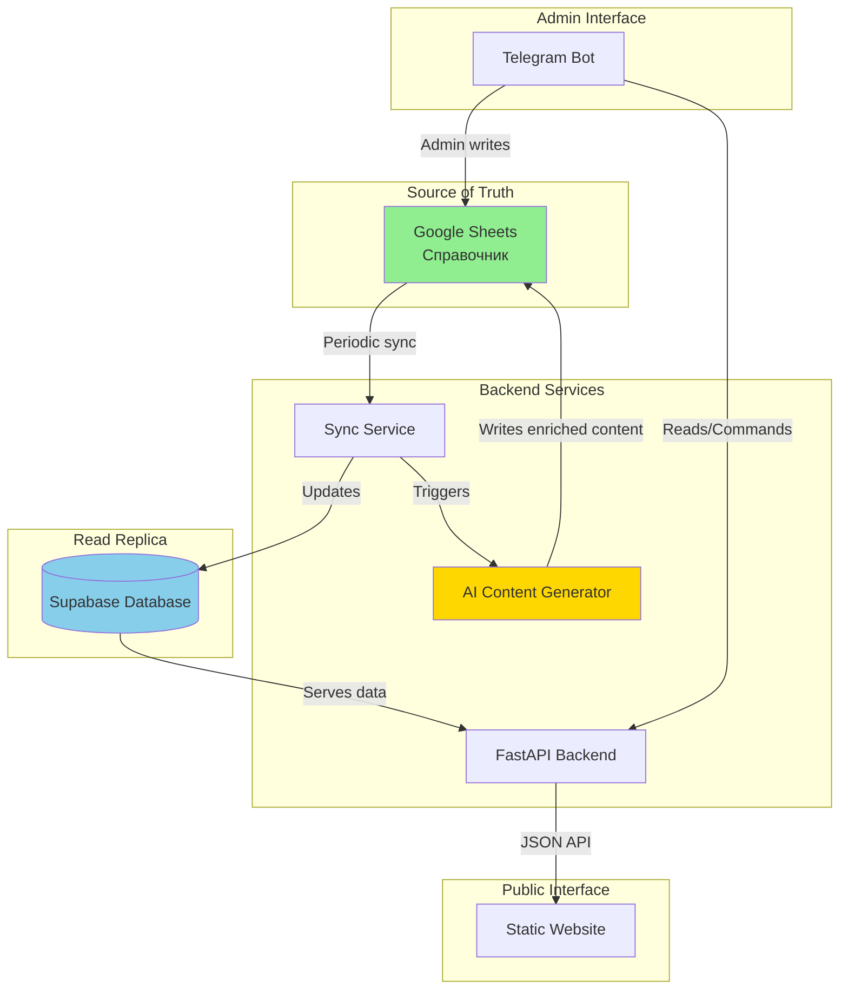
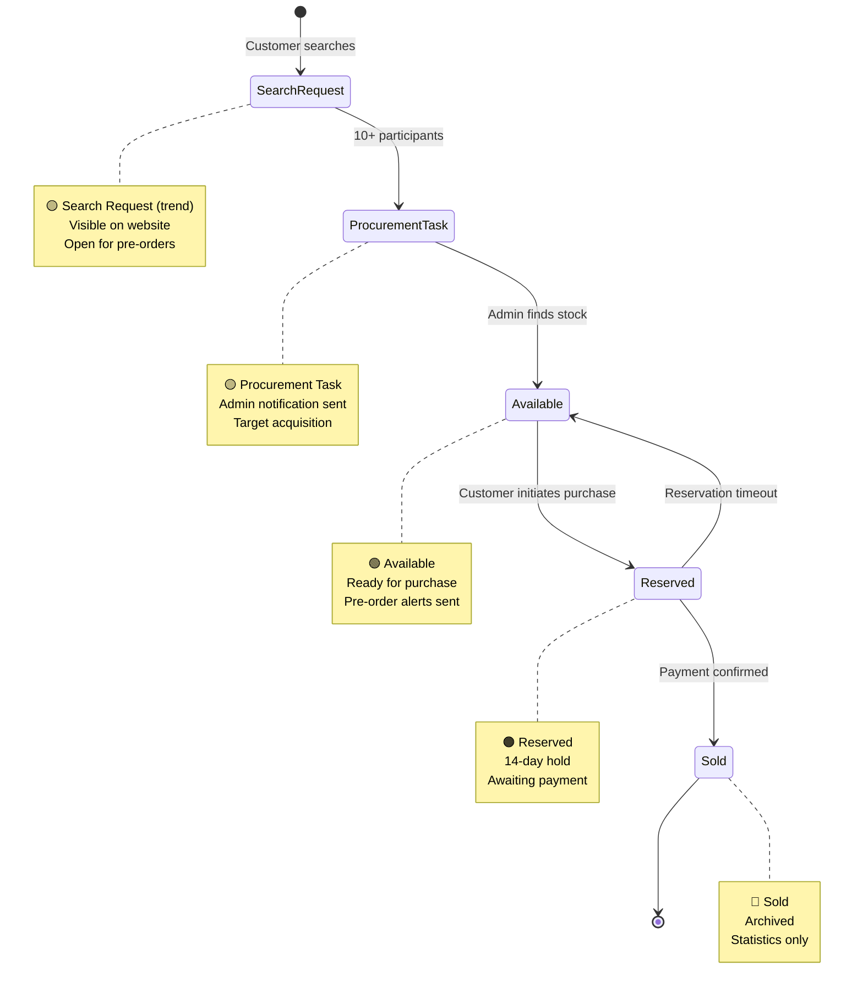
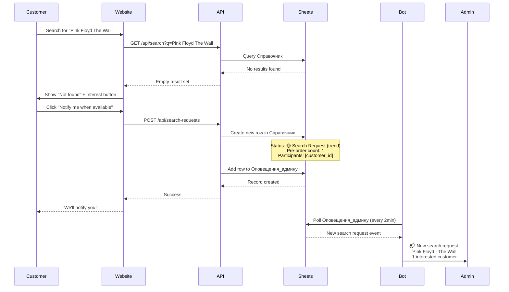
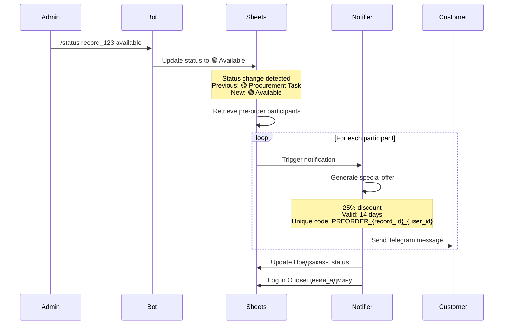
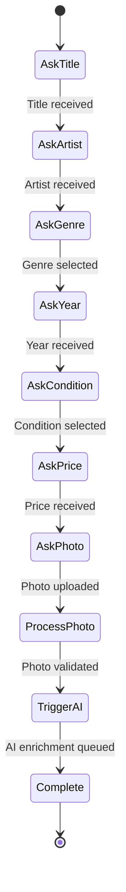
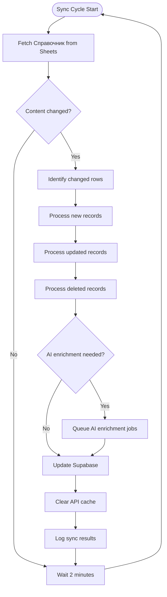
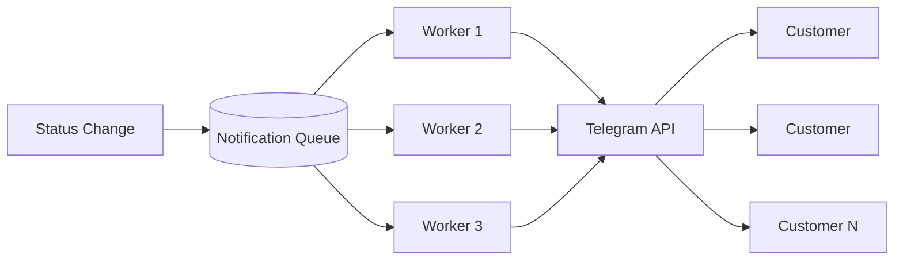

# MVP Backend Design: Online Vinyl Store

## Project Context

This design outlines the MVP backend for an online vinyl record store with a unique competitive advantage: AI-generated compelling content for each record. The system enables automated catalog population, intelligent search capabilities, and a demand-driven pre-order notification mechanism.

The backend builds upon existing experimental projects (vinyl_bot.py, promo_bot.py) by refactoring proven patterns into a production-ready architecture.

## Strategic Vision

### Business Model

The store operates as a single-administrator marketplace where:

- Admin manages inventory through Telegram chatbot interface
- Customers browse records via static website with SEO-optimized pages
- AI musicologist generates engaging Russian-language descriptions automatically
- Pre-order notification system creates urgency and drives sales with time-limited offers
- Google Sheets serves as the transparent business dashboard

### Unique Value Proposition

When a customer searches for a record not yet in the catalog, the system automatically:

1. Creates a search request entry with status "🟡 Search Request (trend)"
2. Notifies admin of customer interest
3. Tracks demand through participation counter
4. Triggers procurement task when threshold reached (10+ interested customers)
5. Sends exclusive 25% discount offer to pre-order participants when stock arrives

This transforms passive browsing into active demand aggregation.

## Architecture Overview

### Data Flow Strategy

The system employs a **hybrid source-of-truth architecture**:


```mermaid
graph TB
    subgraph Admin_Interface["Admin Interface"]
        TG[Telegram Bot]
    end
    
    subgraph Source_of_Truth["Source of Truth"]
        GS[Google Sheets<br/>Справочник]
    end
    
    subgraph Backend_Services["Backend Services"]
        API[FastAPI Backend]
        SYNC[Sync Service]
        AI[AI Content Generator]
    end
    
    subgraph Read_Replica["Read Replica"]
        SB[(Supabase Database)]
    end
    
    subgraph Public_Interface["Public Interface"]
        WEB[Static Website]
    end
    
    TG -->|Admin writes| GS
    GS -->|Periodic sync| SYNC
    SYNC -->|Updates| SB
    SYNC -->|Triggers| AI
    AI -->|Writes enriched content| GS
    SB -->|Serves data| API
    API -->|JSON API| WEB
    TG -->|Reads/Commands| API
    
    style GS fill:#90EE90
    style SB fill:#87CEEB
    style AI fill:#FFD700
```

### Rationale for Hybrid Architecture

**Why Google Sheets as Source of Truth:**
- Admin gains transparent visual dashboard of entire business
- Natural spreadsheet interface for bulk operations
- Easy status management through emoji-based statuses
- Built-in history and audit trail
- No code deployment required for admin workflow changes

**Why Supabase as Read Replica:**
- Fast SQL-based filtering for website search
- Built-in authentication for future customer features
- Row-level security for data protection
- REST API generation out of the box
- Scalable for website traffic without impacting admin operations

**Synchronization Strategy:**
- Admin writes directly to Google Sheets
- Background sync service polls Sheets every 2 minutes
- Detected changes propagate to Supabase
- AI enrichment triggers for new entries
- Conflict resolution: Sheets always wins

## Core Domain Model

### Catalog Record Structure

Each vinyl record in the system contains:

| Field | Type | Source | Purpose |
|-------|------|--------|----------|
| Title | Text | Manual/Search | Album name |
| Artist | Text | Manual/Search | Performer name |
| Genre | Text | Manual/AI | Musical category |
| Year | Integer | Manual/AI | Release year |
| Label | Text | AI Auto-fill | Record label |
| Country | Text | AI Auto-fill | Production country |
| Condition | Text | Manual | Physical state |
| Price | Decimal | Manual | Selling price (RUB) |
| Photo URL | URL | Manual | Cover image |
| Status | Enum | Manual/Auto | Availability state |
| Description | Text | AI Generated | Engaging narrative |
| SEO Title | Text | AI Generated | Search-optimized title |
| SEO Description | Text | AI Generated | Meta description |
| SEO Keywords | Text | AI Generated | Relevant search terms |
| Pre-order Minimum | Integer | System | Threshold for procurement |
| Pre-order Count | Integer | Auto | Current interest level |
| Pre-order Participants | Array | Auto | List of interested user IDs |
| Last Interest Timestamp | DateTime | Auto | Latest demand signal |

### Record Status Lifecycle


```mermaid
stateDiagram-v2
    [*] --> SearchRequest: Customer searches
    SearchRequest --> ProcurementTask: 10+ participants
    ProcurementTask --> Available: Admin finds stock
    Available --> Reserved: Customer initiates purchase
    Reserved --> Sold: Payment confirmed
    Reserved --> Available: Reservation timeout
    Sold --> [*]
    
    note right of SearchRequest
        🟡 Search Request (trend)
        Visible on website
        Open for pre-orders
    end note
    
    note right of ProcurementTask
        🟡 Procurement Task
        Admin notification sent
        Target acquisition
    end note
    
    note right of Available
        🟢 Available
        Ready for purchase
        Pre-order alerts sent
    end note
    
    note right of Reserved
        🟠 Reserved
        14-day hold
        Awaiting payment
    end note
    
    note right of Sold
        🔴 Sold
        Archived
        Statistics only
    end note
```

### Google Sheets Schema

**Worksheet: Справочник (Catalog)**

| Column | Header | Data Type | Validation |
|--------|--------|-----------|------------|
| A | Название | Text | Required, 3-200 chars |
| B | Исполнитель | Text | Required, 2-100 chars |
| C | Жанр | Text | Required |
| D | Год | Number | 1900-2025 |
| E | Лейбл | Text | Optional |
| F | Страна | Text | Optional |
| G | Состояние | Text | Required |
| H | Цена | Number | Required, ≥0 |
| I | ФОТО_URL | URL | Optional |
| J | Продавец_TG_ID | Number | Auto-filled |
| K | Статус | Text | Emoji + text |
| L | Описание | Text | AI-generated |
| M | SEO_Заголовок | Text | AI-generated |
| N | SEO_Описание | Text | AI-generated |
| O | SEO_Ключевые_слова | Text | AI-generated |
| P | Минимум_предзаказов | Number | Default: 10 |
| Q | Предзаказы_счётчик | Number | Auto-increment |
| R | Предзаказы_участники | Text | JSON array |
| S | Последний_интерес | DateTime | Auto-update |

**Worksheet: Оповещения_админу (Admin Notifications)**

| Column | Header | Purpose |
|--------|--------|----------|
| A | Дата/Время | Event timestamp |
| B | Тип_события | Event category |
| C | Пластинка | Record identifier |
| D | Детали | Additional context |
| E | Действие_требуется | Admin task |
| F | Статус_задачи | Task completion |

**Worksheet: Предзаказы (Pre-orders)**

| Column | Header | Purpose |
|--------|--------|----------|
| A | Дата/Время | Registration time |
| B | Пользователь_ID | Customer identifier |
| C | Пластинка_ID | Record reference |
| D | Контакт | Customer contact |
| E | Статус | Active/Notified/Converted |
| F | Уведомлён | Notification sent flag |
| G | Спецпредложение | Offer details |
| H | Истекает | Offer expiration |

**Worksheet: Настройки_уведомлений (Notification Templates)**

| Column | Header | Purpose |
|--------|--------|----------|
| A | Тип_уведомления | Template identifier |
| B | Заголовок | Message title |
| C | Текст_шаблона | Message body template |
| D | Активно | Enable/disable flag |

Admin can edit notification texts directly in this sheet, enabling non-technical content management.

## AI Content Generation System

### Automatic Data Enrichment

When a new record is added to the catalog, the AI system performs three-stage enrichment:

#### Stage 1: Data Auto-completion

The AI analyzes provided fields (Title, Artist, Year) and attempts to auto-fill missing information:

**Process Flow:**
1. Receive record metadata
2. Query AI with structured prompt requesting missing data
3. Parse AI response for Label, Country (if empty)
4. Validate extracted data for plausibility
5. Update Google Sheets with auto-filled values
6. Mark fields with metadata flag indicating AI-sourced data

**Prompt Template for Auto-completion:**

```
Analyze this vinyl record and provide factual metadata:

Album: {title}
Artist: {artist}
Year: {year}
Genre: {genre}

Provide ONLY the following in JSON format:
{
  "label": "<record label name>",
  "country": "<country of production>"
}

If information is unknown, use null.
```

#### Stage 2: Engaging Description Generation

The AI generates a compelling narrative description tailored for Russian vinyl collectors:

**Content Requirements:**
- Length: 300-500 words
- Tone: Enthusiastic musicologist
- Language: Russian, rich vocabulary
- Focus: Historical context, musical significance, collectability
- Target audience: Russian vinyl enthusiasts aged 30-60

**Prompt Template for Description:**

```
You are an expert Russian vinyl record expert writing for passionate collectors.

Create an engaging, authentic description for:

Album: {title}
Artist: {artist}
Year: {year}
Genre: {genre}
Label: {label}
Country: {country}

Requirements:
- Write in Russian language
- 300-500 words
- Emphasize historical context and musical significance
- Mention notable tracks if this is a famous album
- Include collectability factors (original press, rarity, condition importance)
- Use passionate but authentic tone
- Avoid generic marketing language
- Make the reader feel the value of owning this record

Generate ONLY the description text, no prefixes or explanations.
```

#### Stage 3: SEO Optimization

The AI generates search-optimized metadata for the static website:

**SEO Title Requirements:**
- Length: 50-60 characters
- Include: Artist, Album, Year
- Format: "Купить винил {Artist} - {Album} ({Year}) | Виниловые пластинки"

**SEO Description Requirements:**
- Length: 150-160 characters
- Include: Key selling points, condition, genre
- Call to action

**SEO Keywords Requirements:**
- 5-10 relevant terms
- Include: Artist name, album name, genre, era, collectibility terms

**Prompt Template for SEO:**

```
Generate SEO metadata for this vinyl record listing:

Album: {title}
Artist: {artist}
Year: {year}
Genre: {genre}
Condition: {condition}
Price: {price} RUB

Provide in JSON format:
{
  "seo_title": "<50-60 char optimized title>",
  "seo_description": "<150-160 char compelling description>",
  "seo_keywords": "<comma-separated keywords>"
}

Focus on Russian vinyl collector search intent.
```

### LLM Provider Configuration

The system uses the existing modular LLM factory pattern with fallback capability:

**Primary Provider:** Configured via `LLM_PROVIDER` environment variable
- Supported: Qwen, OpenAI, Claude, YandexGPT, Custom

**Fallback Provider:** Configured via `LLM_FALLBACK_PROVIDER`
- Activates when primary fails or is rate-limited

**Template Fallback:** If both providers fail
- Generates basic description using structured template
- Uses record metadata to fill placeholders
- Ensures system reliability without AI dependency

## Pre-order and Notification System

### Search Request Creation Flow


```mermaid
sequenceDiagram
    participant Customer
    participant Website
    participant API
    participant Sheets
    participant Bot
    participant Admin
    
    Customer->>Website: Search for "Pink Floyd The Wall"
    Website->>API: GET /api/search?q=Pink Floyd The Wall
    API->>Sheets: Query Справочник
    Sheets-->>API: No results found
    API-->>Website: Empty result set
    Website->>Customer: Show "Not found" + Interest button
    Customer->>Website: Click "Notify me when available"
    Website->>API: POST /api/search-requests
    API->>Sheets: Create new row in Справочник
    Note over Sheets: Status: 🟡 Search Request (trend)<br/>Pre-order count: 1<br/>Participants: [customer_id]
    API->>Sheets: Add row to Оповещения_админу
    Sheets-->>API: Record created
    API-->>Website: Success
    Website-->>Customer: "We'll notify you!"
    Bot->>Sheets: Poll Оповещения_админу (every 2min)
    Sheets-->>Bot: New search request event
    Bot->>Admin: 📬 New search request:<br/>Pink Floyd - The Wall<br/>1 interested customer
```

### Pre-order Threshold Trigger

When pre-order counter reaches the minimum threshold:

**Automatic Actions:**
1. Update status from "🟡 Search Request (trend)" to "🟡 Procurement Task"
2. Create high-priority notification for admin
3. Log event with participant count and timestamps

**Admin Notification Content:**
```
🎯 PROCUREMENT TASK

Record: {Artist} - {Title}
Demand: {count} customers waiting
Estimated revenue: {count × price × 0.75} RUB

Action required: Find and add this record to inventory

View details: /record_{id}
```

### Availability Notification Flow


```mermaid
sequenceDiagram
    participant Admin
    participant Bot
    participant Sheets
    participant Notifier
    participant Customer
    
    Admin->>Bot: /status record_123 available
    Bot->>Sheets: Update status to 🟢 Available
    Note over Sheets: Status change detected<br/>Previous: 🟡 Procurement Task<br/>New: 🟢 Available
    Sheets->>Sheets: Retrieve pre-order participants
    loop For each participant
        Sheets->>Notifier: Trigger notification
        Notifier->>Notifier: Generate special offer
        Note over Notifier: 25% discount<br/>Valid: 14 days<br/>Unique code: PREORDER_{record_id}_{user_id}
        Notifier->>Customer: Send Telegram message
    end
    Notifier->>Sheets: Update Предзаказы status
    Notifier->>Sheets: Log in Оповещения_админу
```

### Special Offer Notification Template

Retrieved from Настройки_уведомлений worksheet:

**Template Variables:**
- `{artist}` - Artist name
- `{title}` - Album title  
- `{original_price}` - Full price
- `{discount_price}` - Price with 25% off
- `{discount_code}` - Unique promo code
- `{expires_date}` - Offer expiration (14 days)
- `{record_url}` - Direct link to record page

**Example Template:**
```
🎉 ЭКСКЛЮЗИВНОЕ ПРЕДЛОЖЕНИЕ

{artist} — {title}

Вы одним из первых проявили интерес к этой пластинке!
Теперь она в наличии, и для вас — специальная цена:

~~{original_price} ₽~~ → {discount_price} ₽ (-25%)

⏰ Предложение действует до {expires_date}
🔑 Промокод: {discount_code}

[Купить сейчас]({record_url})

Предложение эксклюзивно для вас и истекает через 14 дней!
```

### Notification State Management

The system tracks notification delivery and customer responses:

**Pre-order Record States:**
- **Active**: Customer expressed interest, awaiting stock
- **Notified**: Special offer sent, awaiting response  
- **Converted**: Customer completed purchase
- **Expired**: Offer period elapsed without purchase
- **Cancelled**: Customer opted out of notifications

## Telegram Bot Admin Interface

### Conversational Mode vs Command Mode

The bot implements intent recognition to distinguish between casual conversation and administrative commands:

**Conversational Triggers:**
- Greetings: "привет", "здравствуй", "добрый день"
- Questions: "как дела?", "что нового?"
- Casual chat without keywords

**Response:** Friendly acknowledgment + quick action menu

**Command Triggers:**
- Action verbs: "добавить", "изменить", "посмотреть", "статистика"
- Record references: "пластинка", "винил", "запись"
- Status mentions: "доступна", "продана", "зарезервирована"

**Response:** Immediate workflow initiation

### Main Menu Structure

```
🎵 ADMIN PANEL

[➕ Add Record]  [📊 Statistics]
[🔍 Search]      [📬 Notifications]
[⚙️ Settings]   [📈 Analytics]
```

**Button Actions:**

| Button | Action | Workflow |
|--------|--------|----------|
| Add Record | Initiate record addition | Multi-step conversation |
| Statistics | Show dashboard | Inline metrics display |
| Search | Find records | Search interface |
| Notifications | View pending tasks | List admin tasks |
| Settings | Configure templates | Edit notification texts |
| Analytics | Business metrics | Charts and insights |

### Record Addition Workflow

**Multi-step Guided Process:**


```mermaid
stateDiagram-v2
    [*] --> AskTitle
    AskTitle --> AskArtist: Title received
    AskArtist --> AskGenre: Artist received
    AskGenre --> AskYear: Genre selected
    AskYear --> AskCondition: Year received
    AskCondition --> AskPrice: Condition selected
    AskPrice --> AskPhoto: Price received
    AskPhoto --> ProcessPhoto: Photo uploaded
    ProcessPhoto --> TriggerAI: Photo validated
    TriggerAI --> Complete: AI enrichment queued
    Complete --> [*]
```

**Visual Feedback at Each Step:**
- Progress indicator: "Step 3/7"
- Visual progress bar: `[███░░░░░░░] 30%`
- Confirmation of received data
- Example/hint for next input
- Skip option for optional fields

**Photo Processing Steps:**
1. Validate format (JPG/PNG)
2. Check file size (max 10MB)
3. Calculate perceptual hash
4. Check for duplicates in photo_hashes worksheet
5. Upload to Google Drive
6. Store public URL in Справочник
7. Log hash to prevent future duplicates

### Status Management Commands

**Quick Status Change:**
```
Admin: /status 123 available
Bot: ✅ Record #123 status → 🟢 Available
     Pre-order notifications: 7 sent
```

**Bulk Status Update:**
```
Admin: /bulk_status sold 101,102,103
Bot: 🔄 Processing...
     ✅ #101 → 🔴 Sold
     ✅ #102 → 🔴 Sold  
     ✅ #103 → 🔴 Sold
     
     3 records updated
```

### Notification Management

**Pending Tasks View:**
```
📬 PENDING NOTIFICATIONS (5)

🎯 Procurement Tasks (2)
  • Pink Floyd - The Wall (12 waiting)
  • Beatles - Abbey Road (10 waiting)
  
🔔 Pre-order Alerts Ready (3)
  • Led Zeppelin IV → 8 customers
  • Nirvana - Nevermind → 15 customers
  • Queen - A Night at the Opera → 6 customers
  
[Send Pre-order Alerts] [Dismiss]
```

### Statistics Dashboard

**Real-time Metrics:**
```
📊 BUSINESS DASHBOARD

📦 Inventory:
  🟢 Available: 47 records
  🟡 Procurement: 8 tasks
  🔴 Sold this month: 23
  
💰 Revenue:
  This week: 34,500 ₽
  This month: 127,800 ₽
  Average check: 5,556 ₽
  
👥 Customer Engagement:
  Active pre-orders: 156
  Conversion rate: 18.5%
  Top demand: Progressive Rock
  
🔥 Hot Requests:
  1. Pink Floyd - The Wall (12)
  2. Beatles - Abbey Road (10)
  3. Radiohead - OK Computer (9)
```

## Backend API Design

### Technology Stack

**Framework:** FastAPI (existing codebase)
- Async request handling
- Automatic OpenAPI documentation  
- Built-in validation via Pydantic

**Database:** Supabase (PostgreSQL)
- Read-only for website queries
- Updated by sync service
- RLS policies for security

**Caching:** In-memory cache with TTL
- Reduces database load
- Configured via `CACHE_TTL` environment variable

**Authentication:** Telegram ID-based
- No passwords required
- Telegram auth widget for website
- JWT tokens via Supabase Auth

### API Endpoints

#### Public Endpoints (Website)

**GET /api/records**

Retrieve paginated catalog with filtering and smart sorting.

**Query Parameters:**

| Parameter | Type | Description | Default |
|-----------|------|-------------|----------|
| search | string | Search in title/artist | - |
| genre | string | Filter by genre | - |
| year_min | integer | Minimum year | - |
| year_max | integer | Maximum year | - |
| price_min | decimal | Minimum price | - |
| price_max | decimal | Maximum price | - |
| status | string | Filter by status | available |
| limit | integer | Results per page | 50 |
| offset | integer | Pagination offset | 0 |

**Response Structure:**
```json
{
  "total": 147,
  "records": [
    {
      "id": "uuid-here",
      "title": "The Dark Side of the Moon",
      "artist": "Pink Floyd",
      "year": 1973,
      "genre": "Progressive Rock",
      "price": 4500.00,
      "image_url": "https://...",
      "description": "Легендарный альбом...",
      "seo_title": "Купить винил Pink Floyd - The Dark Side...",
      "seo_description": "Оригинальный пресс 1973 года...",
      "seo_keywords": "pink floyd, прогрессивный рок, винил 70-х",
      "status": "available",
      "condition": "Near Mint"
    }
  ]
}
```

**Sorting Logic:**

Records are ranked by priority score combining:
- Status weight (Available > Search Request > Sold)
- Recency (newer entries ranked higher)
- Demand signal (pre-order count)
- Rarity indicators (original press, mint condition)

**GET /api/records/{id}**

Retrieve single record with full details.

**Response includes:**
- All record fields
- Related metadata
- Pre-order statistics (if applicable)

**POST /api/search-requests**

Create a search request when customer doesn't find a record.

**Request Body:**
```json
{
  "title": "The Wall",
  "artist": "Pink Floyd",
  "customer_id": "telegram_user_id_or_session",
  "contact": "@username or email"
}
```

**Response:**
```json
{
  "status": "created",
  "record_id": "uuid",
  "message": "Мы уведомим вас, когда пластинка появится в наличии!",
  "pre_order_count": 1
}
```

**Workflow:**
1. Search existing records for match
2. If found but status ≠ available, add to pre-order list
3. If not found, create new row in Справочник with status "🟡 Search Request"
4. Initialize pre-order counter to 1
5. Add participant to tracking list
6. Create admin notification
7. Trigger background sync to Supabase

#### Admin Endpoints (Bot)

**POST /api/admin/records**

Create new record (from bot workflow).

**Request Body:**
```json
{
  "title": "Abbey Road",
  "artist": "The Beatles",
  "genre": "Rock",
  "year": 1969,
  "condition": "Near Mint",
  "price": 5500.00,
  "photo_url": "https://drive.google.com/...",
  "seller_telegram_id": 123456789
}
```

**Response:**
```json
{
  "status": "created",
  "record_id": "uuid",
  "row_number": 145,
  "ai_enrichment_queued": true
}
```

**PATCH /api/admin/records/{id}/status**

Update record status.

**Request Body:**
```json
{
  "status": "available",
  "trigger_notifications": true
}
```

**Response:**
```json
{
  "status": "updated",
  "notifications_sent": 7,
  "special_offers_created": 7
}
```

**GET /api/admin/notifications**

Retrieve pending admin tasks.

**Response:**
```json
{
  "procurement_tasks": [
    {
      "record_id": "uuid",
      "title": "The Wall",
      "artist": "Pink Floyd",
      "demand_count": 12,
      "created_at": "2024-01-15T10:30:00Z"
    }
  ],
  "pre_order_alerts_ready": [
    {
      "record_id": "uuid",
      "title": "Led Zeppelin IV",
      "artist": "Led Zeppelin",
      "participant_count": 8
    }
  ]
}
```

**POST /api/admin/send-notifications/{record_id}**

Manually trigger pre-order notifications.

**Response:**
```json
{
  "status": "sent",
  "recipients": 8,
  "offers_created": 8,
  "expires_at": "2024-02-01T10:30:00Z"
}
```

**GET /api/admin/statistics**

Retrieve business metrics dashboard.

**Response:**
```json
{
  "inventory": {
    "available": 47,
    "procurement_tasks": 8,
    "sold_this_month": 23
  },
  "revenue": {
    "this_week": 34500.00,
    "this_month": 127800.00,
    "average_check": 5556.00
  },
  "engagement": {
    "active_pre_orders": 156,
    "conversion_rate": 18.5,
    "top_genre": "Progressive Rock"
  },
  "hot_requests": [
    {"artist": "Pink Floyd", "title": "The Wall", "demand": 12},
    {"artist": "The Beatles", "title": "Abbey Road", "demand": 10}
  ]
}
```

### AI Generation Endpoint

**POST /api/ai/enrich/{record_id}**

Trigger AI enrichment for a record.

**Query Parameters:**
- `force`: boolean - Force regeneration even if content exists

**Response:**
```json
{
  "status": "completed",
  "enriched_fields": [
    "description",
    "seo_title",
    "seo_description",
    "seo_keywords",
    "label",
    "country"
  ],
  "llm_provider": "qwen",
  "fallback_used": false,
  "processing_time_ms": 2340
}
```

**Processing Flow:**
1. Retrieve record from Supabase
2. Check if enrichment needed (or forced)
3. Stage 1: Auto-complete missing fields (label, country)
4. Stage 2: Generate engaging description
5. Stage 3: Generate SEO metadata
6. Update Google Sheets with enriched content
7. Trigger sync to Supabase
8. Return results

**Error Handling:**
- Primary LLM failure → Try fallback provider
- Fallback failure → Use template-based generation
- Template generation ensures system never fails

## Synchronization Service

### Sync Architecture

The sync service operates as a background worker ensuring eventual consistency between Google Sheets and Supabase.

**Polling Strategy:**
- Interval: Every 2 minutes
- Source: Google Sheets API
- Detection: Compare timestamps and row counts
- Propagation: Write changes to Supabase

**Sync Process:**


```mermaid
flowchart TD
    Start([Sync Cycle Start]) --> FetchSheets[Fetch Справочник from Sheets]
    FetchSheets --> CompareHash{Content changed?}
    CompareHash -->|No| Sleep[Wait 2 minutes]
    CompareHash -->|Yes| DetectChanges[Identify changed rows]
    DetectChanges --> ProcessNew[Process new records]
    ProcessNew --> ProcessUpdated[Process updated records]
    ProcessUpdated --> ProcessDeleted[Process deleted records]
    ProcessDeleted --> TriggerAI{AI enrichment needed?}
    TriggerAI -->|Yes| QueueAI[Queue AI enrichment jobs]
    TriggerAI -->|No| UpdateSupabase[Update Supabase]
    QueueAI --> UpdateSupabase
    UpdateSupabase --> InvalidateCache[Clear API cache]
    InvalidateCache --> LogSync[Log sync results]
    LogSync --> Sleep
    Sleep --> Start
```

### Change Detection Logic

**Row-level Change Detection:**

1. **New Record:** Row exists in Sheets, not in Supabase
   - Action: Create record in Supabase
   - Trigger: AI enrichment if description empty

2. **Updated Record:** Row exists in both, content differs
   - Action: Update Supabase record
   - Protection: Preserve custom_description and custom_image if flagged

3. **Deleted Record:** Row removed from Sheets
   - Action: Soft delete in Supabase (status = "deleted")
   - Reason: Preserve historical data

**Field-level Update Rules:**

| Field | Update Strategy |
|-------|------------------|
| Title, Artist, Genre | Always sync |
| Price, Condition | Always sync |
| Status | Always sync + trigger notifications |
| Description | Sync only if custom_description = false |
| Image URL | Sync only if custom_image = false |
| SEO fields | Sync only if AI-generated |
| Pre-order data | Always sync |

### Conflict Resolution

**Guiding Principle:** Google Sheets is the authoritative source.

**Conflict Scenarios:**

1. **Admin edits via Sheets, user browses website:**
   - Resolution: Sync propagates Sheets changes to Supabase
   - User sees updated data within 2 minutes

2. **Concurrent edits to same record:**
   - Not possible: Only admin writes to Sheets
   - Website is read-only from Supabase

3. **Sync fails mid-process:**
   - Strategy: Transaction rollback
   - Retry on next cycle
   - Log error to import_logs table

### Performance Optimization

**Incremental Sync:**

To avoid processing entire sheet on each cycle:

1. Track last sync timestamp in persistent storage
2. Use "Последний_интерес" column to identify recent changes
3. Only process rows modified since last sync
4. Full resync daily at off-peak hours (3 AM)

**Batch Operations:**

Group database operations to minimize queries:
- Bulk insert new records (batch size: 50)
- Bulk update existing records (batch size: 50)
- Single transaction per sync cycle

**Caching Strategy:**

Invalidate relevant cache keys on sync:
- Clear all `/api/records*` cache on any catalog change
- Selective invalidation by genre/status if possible

## Notification Delivery System

### Telegram Notification Architecture

**Message Queue Pattern:**


```mermaid
flowchart LR
    Trigger[Status Change] --> Queue[(Notification Queue)]
    Queue --> Worker1[Worker 1]
    Queue --> Worker2[Worker 2]
    Queue --> Worker3[Worker 3]
    Worker1 --> TG[Telegram API]
    Worker2 --> TG
    Worker3 --> TG
    TG --> Customer1[Customer]
    TG --> Customer2[Customer]
    TG --> CustomerN[Customer N]
```

**Queue Implementation:**
- Use in-memory queue for simplicity in MVP
- Each notification is a job with retry logic
- Rate limiting: 30 messages/second (Telegram limit)
- Failed deliveries logged for manual review

### Notification Types

#### 1. Admin Notifications

**Trigger Events:**
- New search request created
- Pre-order threshold reached (procurement task)
- System errors or sync failures

**Delivery:** Immediate via Telegram bot

**Example:**
```
📬 NEW SEARCH REQUEST

🎵 The Wall - Pink Floyd
👤 Customer: @username
📊 Total demand: 1 customer

/view_request_123
```

#### 2. Pre-order Availability Notifications

**Trigger:** Status change from any → "🟢 Available" for record with pre-orders

**Delivery:** Queued batch processing

**Special Offer Generation:**

For each participant:
1. Generate unique promo code: `PREORDER_{record_id}_{user_id}_{timestamp}`
2. Calculate discount price: `original_price * 0.75`
3. Set expiration: `current_datetime + 14 days`
4. Store offer in Предзаказы worksheet
5. Send personalized notification

**Example Message:**
```
🎉 ЭКСКЛЮЗИВНОЕ ПРЕДЛОЖЕНИЕ ДЛЯ ВАС!

Led Zeppelin — Led Zeppelin IV (1971)

Вы были одним из первых, кто проявил интерес к этой легендарной пластинке!

Теперь она в наличии, и специально для вас:

💰 Цена: ~~6000 ₽~~ → 4500 ₽ (-25%)
⏰ Предложение действует до: 01.02.2024
🔑 Ваш промокод: PREORDER_123_456_1705321800

[🛒 Купить сейчас](https://vinylstore.ru/records/123?promo=PREORDER_123_456_1705321800)

Это предложение создано эксклюзивно для вас и истечёт через 14 дней.
Не упустите возможность приобрести эту пластинку по специальной цене!
```

#### 3. Procurement Task Notifications

**Trigger:** Pre-order count reaches minimum threshold

**Delivery:** Immediate to admin

**Example:**
```
🎯 НОВАЯ ЗАДАЧА НА ЗАКУПКУ

Pink Floyd - The Wall (1979)

👥 Спрос: 10 покупателей
💰 Потенциальная выручка: ~45,000 ₽
📈 Тренд: +3 за последние 3 дня

Рекомендуемая цена: 6,000 ₽
Цена со скидкой: 4,500 ₽

Пожалуйста, найдите эту пластинку и добавьте в каталог.

/mark_found_123 - отметить как найденную
/view_details_123 - детали запроса
```

### Delivery Reliability

**Retry Strategy:**

| Attempt | Delay | Action |
|---------|-------|--------|
| 1 | Immediate | Send notification |
| 2 | 30 seconds | Retry after temporary failure |
| 3 | 5 minutes | Retry after continued failure |
| 4 | 1 hour | Final retry |
| Failed | - | Log to admin notifications |

**Failure Handling:**
- User blocked bot: Mark in Предзаказы as "unreachable"
- Invalid user ID: Log error, skip notification
- Telegram API error: Retry with exponential backoff
- All retries failed: Create admin notification for manual follow-up

**Delivery Confirmation:**

Track notification delivery in Предзаказы:
- `Уведомлён` = TRUE when sent successfully
- `Дата_уведомления` = timestamp of delivery
- `Статус` = "Notified" after successful send

## Static Website Integration

### Website Architecture

The static website is generated periodically from Supabase data:

**Generation Trigger:**
- Manual: Admin command in Telegram bot
- Automatic: Daily at specified time
- On-demand: After bulk inventory updates

**Static Site Generator Responsibilities:**
1. Fetch all records from Supabase API
2. Generate individual HTML pages for each record
3. Generate category/genre index pages
4. Generate search index for client-side search
5. Upload to hosting (Vercel, Netlify, or similar)

### Page Structure

**Individual Record Page:**

URL Format: `/records/{record_id}/{seo_slug}`

Example: `/records/abc123/pink-floyd-dark-side-of-the-moon-1973`

**HTML Template Structure:**
```html
<head>
  <title>{seo_title}</title>
  <meta name="description" content="{seo_description}">
  <meta name="keywords" content="{seo_keywords}">
  <meta property="og:title" content="{title} - {artist}">
  <meta property="og:image" content="{image_url}">
  ...
</head>
<body>
  <article>
    
    <h1>{artist} — {title} ({year})</h1>
    
    <div class="metadata">
      <span>Жанр: {genre}</span>
      <span>Лейбл: {label}</span>
      <span>Страна: {country}</span>
      <span>Состояние: {condition}</span>
    </div>
    
    <div class="description">
      {description}
    </div>
    
    <div class="price">
      <span class="amount">{price} ₽</span>
      <button class="buy-now" data-record-id="{id}">
        Купить сейчас
      </button>
      <button class="notify-me" data-record-id="{id}">
        Уведомить о поступлении
      </button>
    </div>
  </article>
</body>
```

**Interaction Logic:**

- "Купить сейчас" → Opens Telegram bot with pre-filled purchase command
- "Уведомить о поступлении" → Calls `/api/search-requests` with record ID

### Search Implementation

**Client-side Search Index:**

Generate JSON search index during site build:

```json
[
  {
    "id": "abc123",
    "title": "The Dark Side of the Moon",
    "artist": "Pink Floyd",
    "year": 1973,
    "genre": "Progressive Rock",
    "keywords": ["pink floyd", "прогрессивный рок", "1973"],
    "url": "/records/abc123/pink-floyd-dark-side-of-the-moon-1973"
  }
]
```

**Search UI:**

1. User types query in search box
2. Client-side JavaScript filters index
3. Display matching records
4. If no matches: Show "Not found" + "Request this record" button
5. Request button → Calls `/api/search-requests` → Creates demand signal

### SEO Optimization

**Sitemap Generation:**

Automatic XML sitemap with all record URLs:
- Priority: Based on status (available = 1.0, search request = 0.7)
- Change frequency: Daily for available, weekly for others
- Last modified: From updated_at timestamp

**Structured Data:**

Embed JSON-LD schema.org Product markup:

```json
{
  "@context": "https://schema.org/",
  "@type": "Product",
  "name": "{artist} - {title}",
  "image": "{image_url}",
  "description": "{description}",
  "offers": {
    "@type": "Offer",
    "price": "{price}",
    "priceCurrency": "RUB",
    "availability": "https://schema.org/InStock"
  }
}
```

## Deployment Architecture

### Component Deployment

**Backend API:**
- Platform: Existing systemd service (vinyl_bot.service)
- Process manager: systemd
- Port: Configured via `API_PORT` environment variable
- Startup command: `uvicorn main:app --host 0.0.0.0 --port {API_PORT}`

**Telegram Bot:**
- Runs alongside API in same process
- Webhook mode for production
- Polling mode for development

**Sync Service:**
- Implementation: Background async task within FastAPI app
- Triggered by APScheduler
- Runs every 2 minutes
- Graceful shutdown handling

**Static Website:**
- Hosting: Vercel/Netlify (free tier sufficient)
- Build trigger: POST webhook from sync service
- Build command: Static site generator script
- Deploy time: ~1-2 minutes

### Environment Configuration

**Required Environment Variables:**

| Variable | Purpose | Example |
|----------|---------|----------|
| TELEGRAM_BOT_TOKEN | Bot API access | 123456:ABC-DEF... |
| ADMIN_TELEGRAM_ID | Admin user ID | 123456789 |
| GOOGLE_CREDENTIALS_FILE | Service account | credentials.json |
| SPREADSHEET_URL | Google Sheets URL | https://docs.google.com/... |
| SUPABASE_URL | Database endpoint | https://xxx.supabase.co |
| SUPABASE_SERVICE_ROLE_KEY | Admin database key | eyJhbG... |
| LLM_PROVIDER | Primary AI provider | qwen |
| LLM_FALLBACK_PROVIDER | Backup AI provider | openai |
| QWEN_API_KEY | Qwen API access | sk-... |
| CACHE_TTL | Cache lifetime (seconds) | 600 |
| API_HOST | Bind address | 0.0.0.0 |
| API_PORT | Listen port | 8000 |
| SYNC_INTERVAL_SECONDS | Sync frequency | 120 |

### Systemd Service Configuration

Reuse existing vinyl_bot.service with updated ExecStart:

```ini
[Unit]
Description=Vinyl Store Backend API
After=network.target

[Service]
Type=simple
User=vinylbot
WorkingDirectory=/home/vinylbot/vinil_bot_kld
Environment="PATH=/home/vinylbot/vinil_bot_kld/venv/bin"
ExecStart=/home/vinylbot/vinil_bot_kld/venv/bin/python -m uvicorn main:app --host 0.0.0.0 --port 8000
Restart=always
RestartSec=10

[Install]
WantedBy=multi-user.target
```

**Deployment Commands:**
```bash
sudo systemctl daemon-reload
sudo systemctl restart vinyl_bot.service
sudo systemctl status vinyl_bot.service
```

### Monitoring and Logging

**Log Aggregation:**
- Application logs: systemd journal
- View command: `journalctl -u vinyl_bot.service -f`
- Log level: INFO for production

**Health Check Endpoint:**
- URL: `GET /health`
- Response includes:
  - Google Sheets connectivity status
  - Supabase connectivity status  
  - LLM provider status
  - Last sync timestamp
  - System uptime

**Metrics Endpoint:**
- URL: `GET /metrics`
- Returns business KPIs (see API design section)
- Can be polled by monitoring tools

### Backup Strategy

**Google Sheets:**
- Built-in version history (30 days)
- Manual exports: Admin can download as Excel/CSV
- Automated daily export to Google Drive (optional)

**Supabase:**
- Automated daily backups (Supabase feature)
- Point-in-time recovery available
- Export to SQL dump on demand

**Photo Storage:**
- Google Drive serves as permanent storage
- Public URLs remain stable
- No additional backup needed

## Implementation Roadmap

### Phase 1: Core Infrastructure (Week 1)

**Objectives:**
- Refactor existing codebase into modular structure
- Set up Google Sheets schema with all worksheets
- Configure Supabase database with schema from supabase_schema.sql
- Implement basic sync service

**Deliverables:**
1. Updated directory structure with modular services
2. Google Sheets template with all required worksheets
3. Supabase database initialized and accessible
4. Manual sync capability working (admin command)

### Phase 2: AI Content Pipeline (Week 2)

**Objectives:**
- Implement three-stage AI enrichment
- Configure LLM providers with fallback
- Test and refine prompts for quality output
- Add AI enrichment trigger to sync service

**Deliverables:**
1. Auto-completion for missing fields (label, country)
2. High-quality Russian descriptions generation
3. SEO metadata generation
4. Fallback mechanisms tested and working

### Phase 3: Telegram Admin Bot (Week 3)

**Objectives:**
- Implement conversational interface with intent recognition
- Build record addition workflow
- Add status management commands
- Create notification and statistics views

**Deliverables:**
1. Functional admin bot with main menu
2. Complete record addition flow with photo upload
3. Quick status change commands
4. Real-time statistics dashboard

### Phase 4: Pre-order System (Week 4)

**Objectives:**
- Implement search request creation
- Build pre-order tracking mechanism
- Develop notification queue and delivery system
- Create special offer generation

**Deliverables:**
1. Customer can register interest via website
2. Admin receives procurement task notifications
3. Status change triggers pre-order alerts
4. Special offers with promo codes delivered

### Phase 5: Website API & Integration (Week 5)

**Objectives:**
- Finalize public API endpoints
- Implement caching and optimization
- Create search request endpoint
- Document API for frontend team

**Deliverables:**
1. Complete REST API with OpenAPI documentation
2. Optimized queries with caching
3. Search request flow working end-to-end
4. API ready for static site integration

### Phase 6: Testing & Refinement (Week 6)

**Objectives:**
- End-to-end testing of all workflows
- Load testing sync service and API
- Refine AI prompts based on output quality
- Fix bugs and edge cases

**Deliverables:**
1. Comprehensive test coverage
2. Performance benchmarks documented
3. Bug-free core functionality
4. Production-ready deployment

## Success Criteria

### Technical Requirements

- [ ] Google Sheets synchronizes to Supabase within 2 minutes
- [ ] AI enrichment completes within 30 seconds per record
- [ ] API responds to queries in <200ms (cached) or <1s (uncached)
- [ ] Notification delivery success rate >95%
- [ ] System uptime >99% (excluding maintenance)
- [ ] Zero data loss during sync failures

### Functional Requirements

- [ ] Admin can add records via Telegram in <2 minutes
- [ ] Admin can change status with single command
- [ ] Admin receives notifications within 1 minute of events
- [ ] Customers receive pre-order alerts within 5 minutes of availability
- [ ] Search requests create demand signals automatically
- [ ] Special offers expire exactly after 14 days
- [ ] Statistics dashboard updates in real-time

### Business Requirements

- [ ] AI descriptions are engaging and factually accurate
- [ ] SEO metadata drives organic search traffic
- [ ] Pre-order conversion rate >15%
- [ ] Admin spends <30 minutes daily on inventory management
- [ ] System enables 100+ records catalog without performance degradation

## Risk Mitigation

### Technical Risks

**Risk:** Google Sheets API rate limits
- **Mitigation:** Implement exponential backoff, batch operations, caching
- **Fallback:** Increase sync interval during rate limit periods

**Risk:** LLM provider API failures or rate limits
- **Mitigation:** Multi-provider fallback chain, template-based generation
- **Fallback:** Queue failed enrichments for retry during off-peak

**Risk:** Telegram API instability
- **Mitigation:** Retry logic with exponential backoff, queue persistence
- **Fallback:** Admin manually checks notification queue in bot

**Risk:** Sync service crashes during operation
- **Mitigation:** Transaction-based sync with rollback, health monitoring
- **Fallback:** Manual sync trigger via admin command

### Business Risks

**Risk:** Low pre-order participation (<10 threshold)
- **Mitigation:** Reduce threshold to 5 for rare genres, promote pre-order feature
- **Adaptation:** Dynamic threshold based on genre popularity

**Risk:** Special offer conversion rate too low
- **Mitigation:** A/B test discount percentages (15% vs 25% vs 35%)
- **Adaptation:** Adjust offer parameters based on analytics

**Risk:** AI descriptions quality inconsistency
- **Mitigation:** Prompt engineering iteration, output validation
- **Fallback:** Admin can manually override any AI-generated content

## Appendix: Code Module Structure

### Recommended Directory Layout

```
vinil_bot_kld/
├── main.py                 # FastAPI application entry point
├── bot.py                  # Telegram bot main logic
├── services/
│   ├── sync_service.py     # Google Sheets ↔ Supabase sync
│   ├── notification_service.py  # Telegram notification delivery
│   ├── ai_service.py       # AI enrichment orchestration
│   └── analytics_service.py     # Statistics calculation
├── utils/
│   ├── sheets_client.py    # Google Sheets operations
│   ├── supabase_client.py  # Supabase operations
│   ├── auth_service.py     # Telegram authentication
│   ├── import_service.py   # Sheets → Supabase import
│   └── llm/
│       ├── factory.py      # LLM provider factory
│       ├── base_adapter.py # Abstract LLM interface
│       ├── qwen_adapter.py
│       ├── openai_adapter.py
│       └── ...
├── models/
│   ├── record.py           # Pydantic models for records
│   ├── notification.py     # Notification data models
│   └── analytics.py        # Analytics data models
├── routers/
│   ├── public.py           # Public API endpoints
│   ├── admin.py            # Admin API endpoints
│   └── ai.py               # AI enrichment endpoints
├── templates/
│   └── notifications/      # Message templates
├── requirements.txt
├── .env.example
└── vinyl_bot.service       # Systemd service file
```

### Key Refactoring Notes

**From vinyl_bot.py:**
- Extract conversation handlers → `bot.py`
- Extract Google Drive logic → `utils/drive_client.py` (already exists)
- Extract photo hash logic → `utils/photo_hash.py` (already exists)

**From main.py:**
- Split API routes into separate routers
- Extract business logic into service layer
- Keep only FastAPI app configuration in main.py

**New Services:**
- `sync_service.py` - Core sync orchestration
- `notification_service.py` - Queue and delivery management
- `ai_service.py` - Three-stage enrichment pipeline
- `analytics_service.py` - Statistics aggregation

### Integration Points

**Sync Service ↔ AI Service:**
- Sync detects new records without descriptions
- Queues AI enrichment jobs
- AI service writes back to Google Sheets
- Sync propagates enriched data to Supabase

**Bot ↔ Notification Service:**
- Bot triggers notifications on status change
- Notification service manages queue and delivery
- Bot displays notification statistics to admin

**API ↔ Sync Service:**
- API read endpoints query Supabase (fast)
- API write endpoints write to Sheets (admin only)
- Sync service ensures eventual consistency

## Conclusion

This MVP backend design establishes a robust, scalable foundation for the vinyl online store with unique AI-powered content generation and demand-driven pre-order capabilities.

**Key Strategic Advantages:**

1. **Hybrid Architecture** balances admin usability (Sheets) with customer performance (Supabase)
2. **AI Content Pipeline** creates compelling, SEO-optimized pages automatically
3. **Demand Aggregation** transforms customer searches into procurement signals
4. **Notification System** drives urgency through exclusive time-limited offers
5. **Minimal Admin Overhead** via conversational Telegram interface

The architecture reuses proven patterns from existing codebase while introducing production-grade reliability mechanisms. The six-week implementation roadmap ensures progressive delivery of value with testable milestones.

All design decisions prioritize business velocity, cost efficiency, and system reliability for a single-administrator operation scaling to hundreds of records and thousands of customer interactions.
