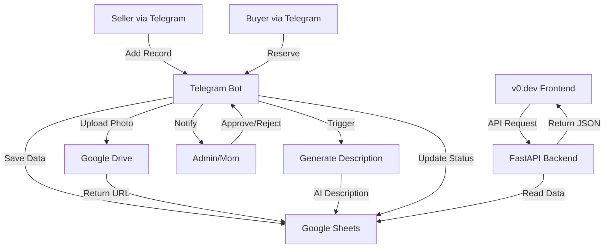
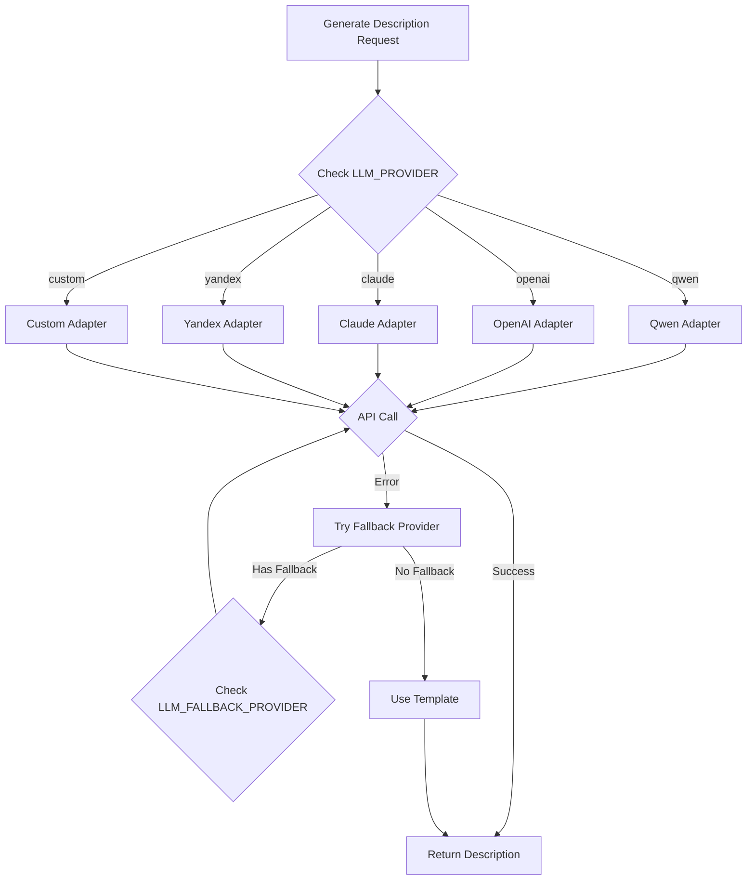
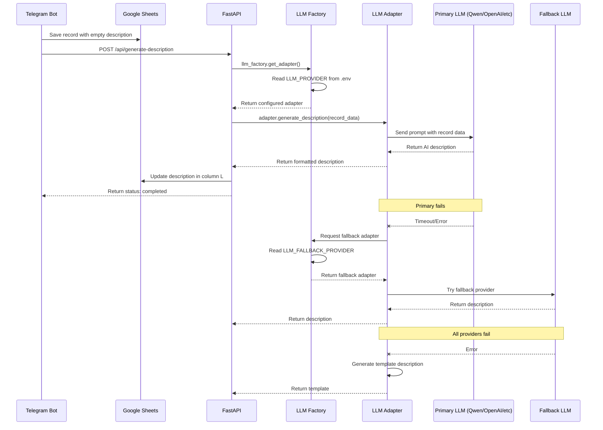
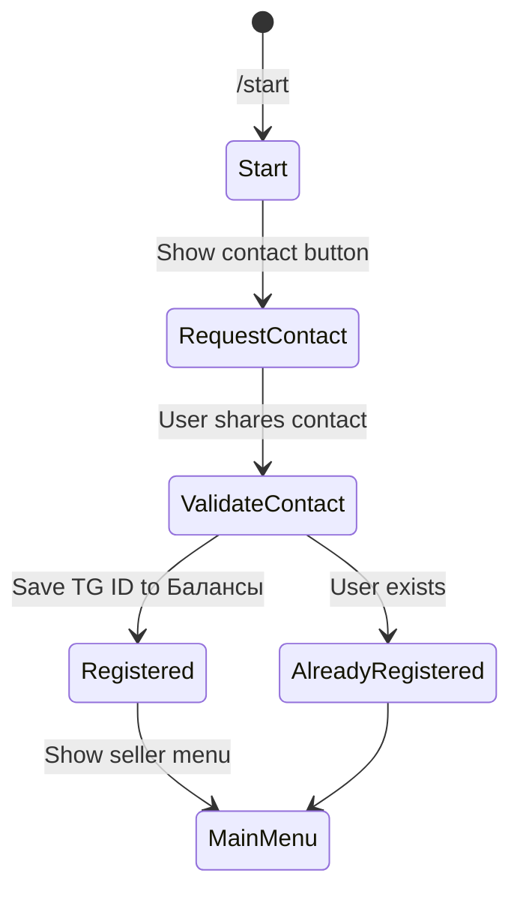
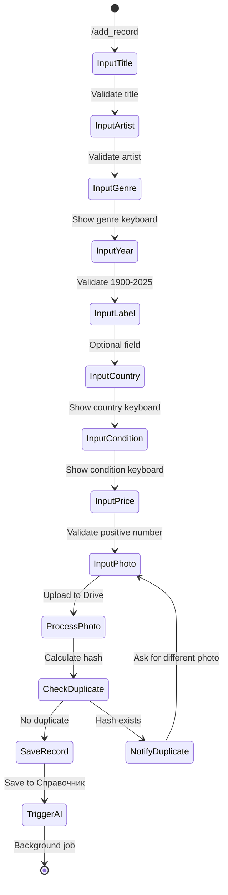
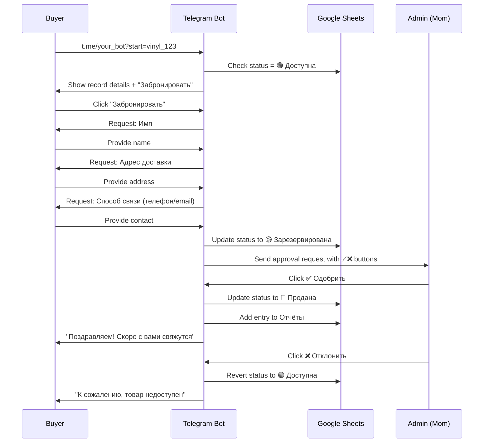

# Vinyl Marketplace MVP - Design Document

## Project Overview

An autonomous vinyl records marketplace system deployable on VPS via FileZilla and launchable with a single terminal command. The system operates without SQL databases, web panels, or manual configuration, using Google Sheets as the primary data store, FastAPI for backend API, and Telegram bot for data entry and administration.

## System Architecture

### Core Components

| Component | Technology | Purpose | Communication Method |
|-----------|-----------|---------|---------------------|
| Data Storage | Google Sheets | Single source of truth for all data | Google Sheets API via gspread |
| Backend API | FastAPI (Python 3.12) | REST API for frontend integration | HTTP/JSON |
| Administration Interface | Telegram Bot | Data entry, user management, purchase approval | Telegram Bot API |
| AI Description Generator | Qwen Max API | Generate expert-style record descriptions | HTTP REST API |
| Photo Storage | Google Drive | Image hosting with public URL generation | Google Drive API |
| Cache Layer | aiocache | API response caching (TTL: 600s) | In-memory |

### System Interaction Flow



## Data Model

### Google Sheets Structure

#### Sheet 1: Справочник (Main Catalog)

| Column | Field Name | Data Type | Validation Rules | Example |
|--------|-----------|-----------|------------------|---------|
| A | Название | Text | Required, max 200 chars | "Wish You Were Here" |
| B | Исполнитель | Text | Required, max 100 chars | "Pink Floyd" |
| C | Жанр | Text | Required, predefined list | "Progressive Rock" |
| D | Год | Integer | Required, 1900-2025 | 1975 |
| E | Лейбл | Text | Optional, max 100 chars | "Harvest Records" |
| F | Страна | Text | Required, ISO country codes | "UK" |
| G | Состояние | Text | Required, predefined list | "Near Mint" |
| H | Цена | Decimal | Required, positive number | 4500.00 |
| I | ФОТО_URL | URL | Auto-generated from Google Drive | https://drive.google.com/... |
| J | Продавец (TG ID) | Integer | Auto-filled from Telegram user | 123456789 |
| K | Статус | Emoji + Text | Auto-managed state | 🟢 Доступна |
| L | Описание | Text | AI-generated or template | Expert description text |

**Status Values:**
- 🟢 Доступна (Available)
- 🟡 Зарезервирована (Reserved)
- 🔴 Продана (Sold)

**Condition Predefined Values:**
- Mint (M)
- Near Mint (NM)
- Very Good Plus (VG+)
- Very Good (VG)
- Good Plus (G+)
- Good (G)

**Exclusion Criteria for API:**
Records containing these terms in condition field are excluded from public API:
- битая (broken)
- повреждённая (damaged)
- без конверта (no sleeve)

#### Sheet 2: Балансы (Balances)

| Column | Field Name | Purpose |
|--------|-----------|---------|
| A | TG ID | User identifier |
| B | Имя | User display name |
| C | Добавлено записей | Count of records added |
| D | Продано записей | Count of records sold |
| E | Дата регистрации | Registration timestamp |

#### Sheet 3: Отчёты (Reports)

| Column | Field Name | Purpose |
|--------|-----------|---------|
| A | Дата | Transaction date |
| B | Record ID | Reference to catalog row |
| C | Действие | Action type (Добавлена/Продана/Отменена) |
| D | Продавец TG ID | Seller identifier |
| E | Покупатель TG ID | Buyer identifier |
| F | Сумма | Transaction amount |

#### Sheet 4: photo_hashes

| Column | Field Name | Purpose |
|--------|-----------|---------|
| A | Photo Hash | Perceptual hash of uploaded image |
| B | Record ID | Reference to catalog row |
| C | Upload Date | Timestamp |

**Purpose:** Prevent duplicate photo uploads and detect similar records.

## API Design

### FastAPI Endpoints

#### GET /api/records

**Purpose:** Retrieve filtered and sorted vinyl records catalog.

**Query Parameters:**

| Parameter | Type | Required | Default | Description |
|-----------|------|----------|---------|-------------|
| genre | string | No | null | Filter by genre |
| year_min | integer | No | null | Minimum year |
| year_max | integer | No | null | Maximum year |
| condition | string | No | null | Filter by condition |
| country | string | No | null | Filter by country code |
| price_min | decimal | No | null | Minimum price |
| price_max | decimal | No | null | Maximum price |
| limit | integer | No | 50 | Results per page |
| offset | integer | No | 0 | Pagination offset |

**Response Format:**

```
{
  "total": 150,
  "records": [
    {
      "id": "row_123",
      "title": "Wish You Were Here",
      "artist": "Pink Floyd",
      "genre": "Progressive Rock",
      "year": 1975,
      "label": "Harvest Records",
      "country": "UK",
      "condition": "Near Mint",
      "price": 4500.00,
      "photo_url": "https://drive.google.com/...",
      "status": "🟢 Доступна",
      "description": "AI-generated expert description..."
    }
  ]
}
```

**Business Logic - Smart Filtering:**

Priority scoring system for result ordering:

| Criteria | Score Boost |
|----------|-------------|
| Contains "оригинал" (original) in description | +50 |
| Contains "пресс 1960-х" (1960s pressing) | +40 |
| Condition = "Mint" or "Near Mint" | +30 |
| Country = "СССР" (USSR) | +25 |
| Year < 1970 | +20 |
| Has AI-generated description | +10 |

Records are sorted by total score (descending), then by date added (newest first).

**Caching Strategy:**
- Cache key: MD5 hash of query parameters
- TTL: 600 seconds
- Cache invalidation: On any POST operation to catalog

#### POST /api/generate-description

**Purpose:** Asynchronously generate AI-powered description for a vinyl record.

**Request Body:**

```
{
  "record_id": "row_123",
  "title": "Wish You Were Here",
  "artist": "Pink Floyd",
  "year": 1975,
  "genre": "Progressive Rock",
  "label": "Harvest Records",
  "country": "UK"
}
```

**Response:**

```
{
  "status": "processing" | "completed" | "failed",
  "description": "Generated text or fallback template",
  "generated_at": "2025-12-05T22:34:01Z"
}
```

**LLM Provider Abstraction:**

The system uses a provider-agnostic abstraction layer that allows switching between different LLM providers (Qwen Max, OpenAI, Claude, etc.) by changing configuration only.

**Supported Providers Configuration:**

| Provider | ENV Variable | Required Settings |
|----------|--------------|------------------|
| Qwen Max (default) | LLM_PROVIDER=qwen | QWEN_API_KEY, QWEN_API_ENDPOINT, QWEN_MODEL |
| OpenAI GPT | LLM_PROVIDER=openai | OPENAI_API_KEY, OPENAI_MODEL |
| Anthropic Claude | LLM_PROVIDER=claude | CLAUDE_API_KEY, CLAUDE_MODEL |
| YandexGPT | LLM_PROVIDER=yandex | YANDEX_API_KEY, YANDEX_FOLDER_ID |
| Custom endpoint | LLM_PROVIDER=custom | CUSTOM_LLM_ENDPOINT, CUSTOM_API_KEY |

**Provider Adapter Interface:**

Each provider adapter must implement:

| Method | Input | Output | Purpose |
|--------|-------|--------|----------|
| generate_description | record_data (dict) | description (string) | Generate description text |
| validate_config | provider_settings (dict) | is_valid (boolean) | Check API credentials |
| estimate_cost | prompt_length (int) | cost_estimate (float) | Calculate request cost |
| get_timeout | - | timeout_seconds (int) | Provider-specific timeout |

**Universal Prompt Template:**

```
Роль: Ты — музыковед Полина Костина, эксперт по виниловым пластинкам с 15-летним стажем.

Задача: Напиши описание виниловой пластинки для коллекционеров и меломанов. Описание должно быть:
- Тёплым и эмоциональным, но профессиональным
- С историческим контекстом эпохи и лейбла
- С упоминанием музыкальной значимости
- С деталями о редкости и особенностях pressing'а
- Длина: 150-250 слов

Данные пластинки:
Название: {title}
Исполнитель: {artist}
Год: {year}
Жанр: {genre}
Лейбл: {label}
Страна: {country}

Не используй шаблонные фразы. Пиши так, будто рассказываешь другу о находке на барахолке.
```

**Provider-Specific Parameters:**

| Provider | Model Parameter | Temperature | Max Tokens | Notes |
|----------|----------------|-------------|------------|-------|
| Qwen Max | qwen-max | 0.7 | 500 | Best Russian support |
| OpenAI | gpt-4o-mini | 0.7 | 500 | Faster, cheaper |
| Claude | claude-3-haiku | 0.7 | 500 | Good quality/cost ratio |
| YandexGPT | yandexgpt/latest | 0.6 | 500 | Local Russian provider |

**Fallback Template (if all LLM providers unavailable):**

```
"{title}" от {artist} ({year}) — редкая находка для ценителей {genre}. Издание лейбла {label}, пресс {country}.
```

**Provider Switching Logic:**



**Environment Configuration Example:**

```
# Primary LLM Provider
LLM_PROVIDER=qwen
QWEN_API_KEY=sk-xxxxx
QWEN_API_ENDPOINT=https://dashscope.aliyuncs.com/api/v1/services/aigc/text-generation/generation
QWEN_MODEL=qwen-max

# Fallback LLM Provider (optional)
LLM_FALLBACK_PROVIDER=openai
OPENAI_API_KEY=sk-xxxxx
OPENAI_MODEL=gpt-4o-mini

# LLM Settings
LLM_TEMPERATURE=0.7
LLM_MAX_TOKENS=500
LLM_TIMEOUT=30
LLM_RETRY_ATTEMPTS=3
```

**Integration Flow:**



### LLM Factory Design Pattern

**Factory Responsibility:**

The `llm_factory.py` module implements the Factory pattern to dynamically instantiate LLM adapters based on environment configuration.

**Factory Interface:**

| Method | Parameters | Returns | Purpose |
|--------|-----------|---------|----------|
| get_adapter | provider_name (optional) | LLMAdapter instance | Creates adapter based on LLM_PROVIDER or parameter |
| get_fallback_adapter | - | LLMAdapter instance or None | Creates fallback adapter from LLM_FALLBACK_PROVIDER |
| validate_provider | provider_name | boolean | Checks if provider is supported |
| list_available_providers | - | list of strings | Returns names of all available providers |

**Factory Implementation Logic:**

```
Function: get_adapter(provider_name=None)
  1. If provider_name is None:
      provider_name = os.getenv('LLM_PROVIDER', 'qwen')
  
  2. Normalize provider_name to lowercase
  
  3. Match provider_name:
      - 'qwen' -> return QwenAdapter()
      - 'openai' -> return OpenAIAdapter()
      - 'claude' -> return ClaudeAdapter()
      - 'yandex' -> return YandexAdapter()
      - 'custom' -> return CustomAdapter()
      - else -> raise UnsupportedProviderError
  
  4. Validate adapter configuration:
      If not adapter.validate_config():
          Log warning
          Try get_fallback_adapter()
  
  5. Return adapter
```

**Base Adapter Abstract Class:**

All provider adapters inherit from `BaseLLMAdapter` and must implement:

| Abstract Method | Signature | Purpose |
|----------------|-----------|----------|
| generate_description | (record_data: dict) -> str | Generate vinyl description |
| validate_config | () -> bool | Verify API credentials exist |
| get_timeout | () -> int | Return provider-specific timeout |
| estimate_cost | (prompt_length: int) -> float | Calculate API call cost |
| _build_prompt | (record_data: dict) -> str | Build provider-specific prompt format |
| _call_api | (prompt: str) -> str | Make actual API call |

**Adapter Instantiation Pattern:**

Each adapter reads configuration from environment variables during initialization:

```
Class QwenAdapter(BaseLLMAdapter):
  Constructor:
    self.api_key = os.getenv('QWEN_API_KEY')
    self.endpoint = os.getenv('QWEN_API_ENDPOINT')
    self.model = os.getenv('QWEN_MODEL', 'qwen-max')
    self.temperature = float(os.getenv('LLM_TEMPERATURE', '0.7'))
    self.max_tokens = int(os.getenv('LLM_MAX_TOKENS', '500'))
    self.timeout = int(os.getenv('LLM_TIMEOUT', '30'))
```

**Usage in FastAPI Endpoint:**

```
Endpoint: POST /api/generate-description

Logic:
  1. Receive record_data from request
  
  2. Get LLM adapter:
     adapter = llm_factory.get_adapter()
  
  3. Generate description:
     Try:
         description = adapter.generate_description(record_data)
     Except TimeoutError:
         Log error
         Try fallback:
             fallback_adapter = llm_factory.get_fallback_adapter()
             If fallback_adapter exists:
                 description = fallback_adapter.generate_description(record_data)
             Else:
                 description = generate_template_description(record_data)
     Except APIError:
         Same fallback logic
  
  4. Update Google Sheets with description
  
  5. Return response
```

**Configuration-Driven Provider Selection:**

**Example 1: Use Qwen with OpenAI fallback**
```
LLM_PROVIDER=qwen
LLM_FALLBACK_PROVIDER=openai
QWEN_API_KEY=sk-xxx
OPENAI_API_KEY=sk-yyy
```

**Example 2: Use OpenAI only**
```
LLM_PROVIDER=openai
OPENAI_API_KEY=sk-xxx
```

**Example 3: Use YandexGPT with no fallback**
```
LLM_PROVIDER=yandex
YANDEX_API_KEY=xxx
YANDEX_FOLDER_ID=yyy
```

**No hardcoded provider logic in application code** — all provider selection happens through factory reading .env configuration.

## Telegram Bot Design

### User Flows

#### Flow 1: Seller Registration



#### Flow 2: Add Record



**Step-by-Step Input Validation:**

| Step | Field | Validation Rule | Error Message |
|------|-------|----------------|---------------|
| 1 | Название | Length 3-200 chars | "Название должно быть от 3 до 200 символов" |
| 2 | Исполнитель | Length 2-100 chars | "Имя исполнителя: от 2 до 100 символов" |
| 3 | Жанр | From predefined list | Show keyboard with options |
| 4 | Год | Integer 1900-2025 | "Введите год от 1900 до 2025" |
| 5 | Лейбл | Optional, max 100 chars | Skip button available |
| 6 | Страна | From ISO codes list | Show keyboard with options |
| 7 | Состояние | From condition list | Show keyboard with options |
| 8 | Цена | Positive decimal | "Цена должна быть больше 0" |
| 9 | Фото | Image file, max 10MB | "Загрузите фото в формате JPG/PNG" |

**Genre Keyboard Options:**
- Rock / Progressive Rock / Psychedelic Rock
- Jazz / Blues / Soul / Funk
- Classical / Opera
- Electronic / Disco
- Pop / Chanson
- Folk / World Music

**Country Keyboard (Top Options):**
- СССР / Россия
- USA / UK
- Germany / France
- Italy / Japan
- Poland / Czechoslovakia

#### Flow 3: Purchase/Reservation



**Admin Notification Format:**

```
🎵 Новая заявка на бронирование

📀 Пластинка: {title} — {artist}
💰 Цена: {price} руб.
📷 Фото: {photo_url}

👤 Покупатель:
Имя: {buyer_name}
Адрес: {buyer_address}
Контакт: {buyer_contact}
TG: @{buyer_username}

[✅ Одобрить] [❌ Отклонить]
```

### Bot Commands

| Command | Access Level | Description |
|---------|-------------|-------------|
| /start | All | Registration and main menu |
| /add_record | Sellers | Start adding new record |
| /my_records | Sellers | View own records list |
| /search | Buyers | Search catalog |
| /help | All | Show help information |
| /stats | Admin only | View system statistics |
| /cancel | All | Cancel current operation |

### Duplicate Detection Strategy

**Photo Hash Calculation:**
- Use perceptual hashing (pHash) algorithm
- Hash size: 64-bit
- Tolerance threshold: Hamming distance ≤ 5

**Check Process:**
1. User uploads photo
2. Calculate pHash
3. Compare with all hashes in photo_hashes sheet
4. If similar hash found (distance ≤ 5):
   - Show existing record details
   - Ask: "Похожая пластинка уже добавлена. Это дубликат? [Да/Нет]"
   - If "Да": Cancel current operation
   - If "Нет": Allow to continue
5. If no match: Save hash and proceed

## Photo Management

### Google Drive Integration

**Upload Flow:**


**Folder Structure:**

```
Vinyl Marketplace Photos/
├── 2025-12/
│   ├── record_001.jpg
│   ├── record_002.jpg
│   └── ...
```

**File Naming Convention:**
```
record_{row_id}_{timestamp}.jpg
```
Example: `record_123_1733432041.jpg`

**Permissions:**
- Folder visibility: Anyone with link can view
- Service account has write access
- No user authentication required for viewing

**URL Format:**
```
https://drive.google.com/uc?export=view&id={file_id}
```

## Deployment Architecture

### File Structure

```
vinyl-marketplace/
├── main.py                 # FastAPI application
├── vinyl_bot.py           # Telegram bot application
├── requirements.txt       # Python dependencies
├── .env                   # Environment variables (NOT in version control)
├── .env.example          # Template for environment variables
├── credentials.json      # Google Service Account key (NOT in version control)
├── README.md             # Deployment instructions
└── utils/
    ├── __init__.py       # Package initializer
    ├── sheets_client.py  # Google Sheets helper
    ├── drive_client.py   # Google Drive helper
    ├── photo_hash.py     # Image hashing utilities
    └── llm/
        ├── __init__.py
        ├── base_adapter.py      # Abstract base class for LLM providers
        ├── qwen_adapter.py      # Qwen Max implementation
        ├── openai_adapter.py    # OpenAI GPT implementation
        ├── claude_adapter.py    # Anthropic Claude implementation
        ├── yandex_adapter.py    # YandexGPT implementation
        ├── custom_adapter.py    # Custom endpoint implementation
        └── factory.py           # Provider factory and fallback logic
```

### Environment Variables

**.env.example:**

```
# Telegram Bot Configuration
TELEGRAM_BOT_TOKEN=your_bot_token_here
ADMIN_TELEGRAM_ID=123456789

# Google Sheets Configuration
GOOGLE_CREDENTIALS_FILE=credentials.json
SPREADSHEET_URL=https://docs.google.com/spreadsheets/d/YOUR_SHEET_ID

# LLM Provider Configuration
LLM_PROVIDER=qwen
LLM_FALLBACK_PROVIDER=openai
LLM_TEMPERATURE=0.7
LLM_MAX_TOKENS=500
LLM_TIMEOUT=30
LLM_RETRY_ATTEMPTS=3

# Qwen Max API Configuration
QWEN_API_KEY=your_qwen_api_key_here
QWEN_API_ENDPOINT=https://dashscope.aliyuncs.com/api/v1/services/aigc/text-generation/generation
QWEN_MODEL=qwen-max

# OpenAI API Configuration (optional, for fallback)
OPENAI_API_KEY=your_openai_key_here
OPENAI_MODEL=gpt-4o-mini

# Claude API Configuration (optional)
CLAUDE_API_KEY=your_claude_key_here
CLAUDE_MODEL=claude-3-haiku-20240307

# YandexGPT API Configuration (optional)
YANDEX_API_KEY=your_yandex_key_here
YANDEX_FOLDER_ID=your_folder_id_here

# Custom LLM Endpoint (optional)
CUSTOM_LLM_ENDPOINT=https://your-llm-api.com/v1/generate
CUSTOM_API_KEY=your_custom_key_here

# Google Drive Configuration
DRIVE_FOLDER_ID=your_drive_folder_id_here

# FastAPI Configuration
API_HOST=0.0.0.0
API_PORT=8000

# Cache Configuration
CACHE_TTL=600
```

### Dependencies (requirements.txt)

| Package | Version | Purpose |
|---------|---------|----------|
| fastapi | >=0.104.0 | Web framework |
| uvicorn | >=0.24.0 | ASGI server |
| python-telegram-bot | >=20.7 | Telegram bot framework |
| gspread | >=5.12.0 | Google Sheets API |
| google-auth | >=2.23.0 | Google authentication |
| google-auth-oauthlib | >=1.1.0 | OAuth library |
| google-auth-httplib2 | >=0.1.1 | HTTP client for Google API |
| google-api-python-client | >=2.108.0 | Google Drive API |
| aiocache | >=0.12.2 | Async caching |
| aiohttp | >=3.9.0 | Async HTTP client |
| python-dotenv | >=1.0.0 | Environment variables |
| pillow | >=10.1.0 | Image processing |
| imagehash | >=4.3.1 | Perceptual hashing |
| pydantic | >=2.5.0 | Data validation |
| httpx | >=0.25.0 | HTTP client for LLM APIs |
| openai | >=1.3.0 | OpenAI API client (optional) |
| anthropic | >=0.7.0 | Claude API client (optional) |

### Deployment Process

**Step 1: Prepare Google Cloud Setup**

1. Create Google Cloud project
2. Enable Google Sheets API
3. Enable Google Drive API
4. Create Service Account
5. Download credentials.json
6. Share Google Sheet with service account email
7. Share Google Drive folder with service account email

**Step 2: Prepare Telegram Bot**

1. Create bot via @BotFather
2. Obtain bot token
3. Set bot commands via BotFather
4. Get admin Telegram ID

**Step 3: Upload Files via FileZilla**

Connection settings:
- Protocol: SFTP
- Host: VPS IP address
- Port: 22
- User: VPS username
- Password/Key: VPS credentials

Upload all files to: `/home/{user}/vinyl-marketplace/`

**Step 4: Terminal Setup Commands**

Single command deployment:

```
cd /home/{user}/vinyl-marketplace && 
python3.12 -m venv venv && 
source venv/bin/activate && 
pip install --upgrade pip && 
pip install -r requirements.txt && 
cp .env.example .env && 
nano .env
```

After editing .env, launch with:

```
nohup uvicorn main:app --host 0.0.0.0 --port 8000 &
nohup python vinyl_bot.py &
```

**Process Management:**

View running processes:
```
ps aux | grep "main.py\|vinyl_bot.py"
```

Stop processes:
```
pkill -f "main.py"
pkill -f "vinyl_bot.py"
```

**Step 5: Verification**

Check API health:
```
curl http://localhost:8000/api/records
```

Check bot status:
- Send /start to bot in Telegram
- Should receive registration prompt

### System Requirements

| Resource | Minimum | Recommended |
|----------|---------|-------------|
| CPU | 1 core | 2 cores |
| RAM | 512 MB | 1 GB |
| Storage | 5 GB | 10 GB |
| Python | 3.12+ | 3.12+ |
| Network | 10 Mbps | 50 Mbps |
| OS | Ubuntu 20.04+ | Ubuntu 22.04+ |

## Scalability Strategy

### Adaptation for Other Products

**To transform this system for different product categories (e.g., handicrafts, books, vintage items):**

| Component | Required Changes |
|-----------|-----------------|
| Google Sheets columns | Replace vinyl-specific fields (Лейбл, Состояние) with category-specific attributes |
| API filtering logic | Modify exclusion criteria and priority scoring rules |
| AI prompt template | Replace "музыковед Полина Костина" persona with appropriate expert role |
| Telegram bot keyboards | Update predefined options (genres → categories, conditions → states) |
| Photo hash checking | No changes needed |
| Admin approval flow | No changes needed |

**Example: Handicrafts Marketplace**

Changes needed:
- Columns: Название → Тип изделия, Исполнитель → Мастер, Жанр → Категория
- AI prompt: "Ты — эксперт по рукоделию Анна Иванова..."
- Filtering: Priority for "ручная работа", "эксклюзив", "натуральные материалы"

### Growth Handling

**Current system limitations:**

| Metric | Limit | Mitigation Strategy |
|--------|-------|---------------------|
| Google Sheets rows | ~50,000 records | Archive old sold records to separate sheet monthly |
| API cache memory | ~100 MB | Implement Redis if memory exceeds limit |
| Concurrent users | ~50 simultaneous | Increase VPS resources or add load balancer |
| Photo storage | Google Drive quota (15 GB free) | Upgrade to paid Google Workspace or implement image compression |

**Horizontal scaling path:**

1. Current: Single VPS, in-memory cache
2. Stage 2 (500+ records): Add Redis, separate bot and API servers
3. Stage 3 (5000+ records): Multiple API instances behind nginx, dedicated photo CDN
4. Stage 4 (50,000+ records): Migrate to PostgreSQL, keep Sheets for admin interface only

## Security Considerations

### Data Protection

| Aspect | Implementation |
|--------|---------------|
| API authentication | Not required for GET /api/records (public catalog) |
| Telegram bot authentication | User TG ID verification, admin whitelist |
| Google credentials | Service account with minimal permissions (read/write only target sheet) |
| Environment variables | Never commit .env to version control, use .env.example |
| Admin actions | Only whitelisted ADMIN_TELEGRAM_ID can approve purchases |

### Privacy Compliance

**User data collected:**

| Data Type | Storage Location | Retention Policy |
|-----------|-----------------|------------------|
| Telegram ID | Балансы sheet | Permanent (anonymized on request) |
| Telegram username | Отчёты sheet | Permanent (anonymized on request) |
| Buyer contact info | Отчёты sheet | 30 days after sale completion |
| Photo uploads | Google Drive | Deleted when record deleted |

**GDPR/Privacy measures:**

- Bot shows privacy notice on /start
- Users can request data deletion via /delete_my_data
- Buyer contact info auto-deleted after 30 days
- No tracking, analytics, or third-party data sharing

## Error Handling Strategy

### Graceful Degradation

**Scenario 1: Google Sheets API unavailable**

- FastAPI: Return cached data with warning header
- Telegram bot: Queue operations, notify admin, retry every 60s

**Scenario 2: Qwen Max API failure**

- Use fallback template description
- Log failed generation attempts
- Retry after 5 minutes (max 3 attempts)
- Admin receives notification if all retries fail

**Scenario 3: Google Drive upload failure**

- Bot asks user to retry photo upload
- If persistent: Accept record without photo, allow admin to add later
- Log error for debugging

**Scenario 4: Duplicate photo detection failure**

- Proceed without duplicate check
- Log warning for manual review

### User-Facing Error Messages

**Telegram Bot Messages:**

| Error | User Message (Russian) |
|-------|----------------------|
| Network timeout | "⏳ Сервер временно недоступен. Попробуйте через минуту" |
| Invalid input | "❌ Неверный формат. {specific_instruction}" |
| Duplicate record | "⚠️ Похожая пластинка уже есть. Проверьте?" |
| Photo too large | "📸 Фото слишком большое. Максимум 10 МБ" |
| System error | "🔧 Техническая ошибка. Администратор уведомлён" |

**API Error Responses:**

HTTP status codes:
- 200: Success
- 400: Invalid request parameters
- 404: Record not found
- 500: Internal server error (with generic message)
- 503: Service temporarily unavailable (Google Sheets down)

## Monitoring and Maintenance

### Health Checks

**Automated monitoring endpoints:**

- GET /health → Returns system status
- GET /metrics → Returns operational metrics

**Metrics to track:**

| Metric | Target | Alert Threshold |
|--------|--------|----------------|
| API response time | < 500ms | > 2000ms |
| Cache hit rate | > 80% | < 50% |
| Google Sheets API calls/min | < 60 | > 90 (rate limit warning) |
| Failed AI generations | < 5% | > 20% |
| Pending approvals | N/A | > 10 (notify admin) |

### Operational Tasks

**Daily (automated):**
- Log rotation
- Cache statistics review

**Weekly (admin):**
- Review pending reservations
- Check for abandoned records (photos without description)

**Monthly (admin):**
- Archive sold records to history sheet
- Review and clean duplicate photo hashes
- Update genre/country keyboards if needed

**Quarterly:**
- Backup Google Sheets
- Review VPS resource usage
- Update dependencies if security patches available

## Future Enhancement Opportunities

### Potential Features (Out of MVP Scope)

| Feature | Complexity | Benefit | Implementation Path |
|---------|-----------|---------|---------------------|
| Payment integration (YooKassa/Stripe) | High | Automated payments | Add webhook handler in FastAPI |
| Wishlist for buyers | Low | User engagement | Add sheet + bot commands |
| Seller ratings | Medium | Trust system | Add ratings sheet + display in catalog |
| Automatic price suggestions | Medium | Help sellers | Analyze sold records, suggest price range |
| Email notifications | Low | Better communication | Add SMTP client |
| Multi-language support | Medium | International sales | i18n in bot + API |
| Mobile app (React Native) | High | Better UX | Consume existing FastAPI |

### Integration Points

**For v0.dev frontend:**

- API base URL: `http://{vps_ip}:8000`
- Authentication: None required for GET endpoints
- WebSocket: Not implemented (use polling for updates)
- Image optimization: Frontend should lazy-load from Google Drive URLs

**For payment system:**

- Reserve additional columns in Справочник: Платёжный_ID, Платёжный_Статус
- Add webhook endpoint: POST /api/payment-webhook
- Update bot to send payment links instead of manual approval

## Success Criteria

### MVP Launch Readiness

System is ready for production when:

1. Seller can add record via Telegram in < 3 minutes
2. AI description generates within 30 seconds (or fallback instantly)
3. Buyer can reserve record and admin receives notification within 10 seconds
4. API returns catalog in < 500ms with cache
5. No manual intervention required except admin approval
6. System recovers from Google Sheets API timeout automatically
7. Photo duplicates detected with 95%+ accuracy
8. Zero SQL/database installation required
9. Deployment from FileZilla to running system in < 10 minutes
10. README allows non-technical admin to restart services

### Business Validation Metrics

MVP is successful if within first month:

- 10+ records added by sellers
- 3+ successful purchases completed
- Admin (mom) operates independently without technical support
- Zero system crashes requiring developer intervention
- 80%+ of records have AI-generated descriptions (not fallback templates)

## Technical Constraints and Trade-offs

### Deliberate Limitations

| Limitation | Reason | Future Mitigation |
|------------|--------|-------------------|
| No real-time updates | Google Sheets polling, no WebSocket | Add Redis Pub/Sub for frontend |
| No transactional guarantees | Sheets API not ACID-compliant | Add PostgreSQL for critical operations |
| Rate limits (60 req/min to Sheets) | Google API quota | Implement request queuing |
| Single admin approval flow | MVP simplicity | Add role-based access control |
| No payment processing | Regulatory complexity | Integrate payment gateway post-MVP |
| Russian-only interface | Target audience | Add i18n framework |

### Technology Choices Rationale

**Why Google Sheets instead of database:**
- Zero infrastructure setup
- Non-technical admin can view/edit data directly
- Built-in collaboration and audit trail
- Free tier sufficient for MVP scale
- Familiar interface for business users

**Why Telegram bot instead of web admin:**
- Users already on Telegram (high engagement)
- No need to build authentication system
- Push notifications built-in
- Photo upload simpler than web forms
- Mobile-first experience without app development

**Why Qwen Max instead of OpenAI:**
- Lower cost per request
- Good Russian language support
- Suitable for domain-specific prompts
- Fallback template ensures system works without AI

**Why FastAPI instead of Django:**
- Lighter weight for simple CRUD API
- Async support for external API calls
- Auto-generated OpenAPI docs
- Faster startup and lower memory footprint
- No ORM complexity needed- Faster startup and lower memory footprint
